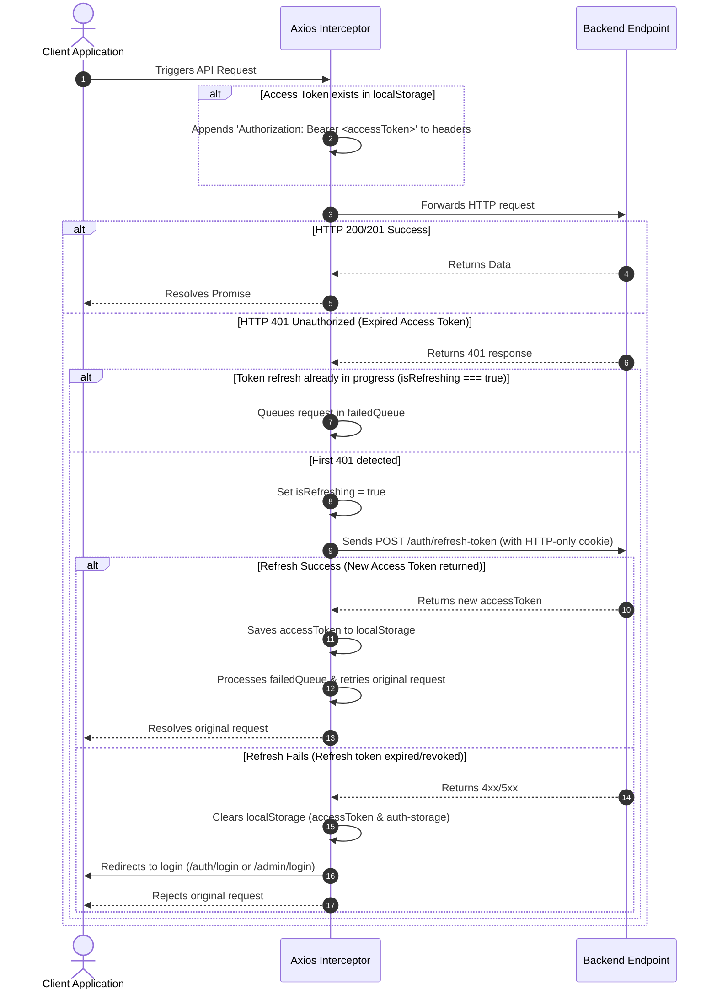

# Sports Booking & Social Matchmaking Platform - Frontend Client

This directory contains the frontend client application for the Sports Booking & Social Matchmaking Platform. It is a modern, high-performance Single Page Application (SPA) built using **React 19**, **TypeScript**, and **Vite**, styled with **Tailwind CSS v4** and **Radix UI Primitives**, and designed for a dark-mode-first aesthetic.

The application serves three distinct user roles:
1. **Players**: Search venues, book subfields, make payments, manage bookings, and participate in social matches.
2. **Owners**: Manage sports complexes, configure subfields, customize peak/off-peak pricing slots, view business analytics, and manage payouts.
3. **Administrators**: Moderate users, approve new venues, trace booking/payment history, and process payout batches.

---

## Table of Contents
1. [Key Features](#key-features)
2. [Tech Stack](#tech-stack)
3. [Prerequisites](#prerequisites)
4. [Getting Started](#getting-started)
5. [Architecture & Directory Structure](#architecture--directory-structure)
6. [Data Flow & Core Lifecycles](#data-flow--core-lifecycles)
7. [Environment Variables](#environment-variables)
8. [Available Scripts](#available-scripts)
9. [Testing](#testing)
10. [Deployment & Containerization](#deployment--containerization)
11. [Troubleshooting](#troubleshooting)

---

## Key Features

*   **🏢 Venue Discovery & Search**: Smart filter bars for sports categories (Football, Badminton, Pickleball, Tennis, Basketball, Volleyball), location districts, star ratings, and price parameters, with real-time query debouncing.
*   **📅 Interactive Booking Wizard**: Step-by-step scheduling layout featuring timeline hour grids, visual peak/off-peak slot tags, and options for single or recurring (Weekly/Monthly) bookings.
*   **🤝 Social Matchmaking Portal**: Hub for players to discover public matches, request to join games, filter matches by skill tier, and manage participant applications.
*   **🔌 Real-Time Sockets**: In-app alert banners and notifications driven by Socket.IO client, mapping real-time events based on user roles (Player/Owner/Admin).
*   **💳 Payment Integration**: Redirect gateways for VNPay sandbox checkouts and Stripe payment sessions, handling success/fail returns.
*   **📊 Rich Analytical Dashboards**: Graphic visualizations using Recharts to present venue revenues, slot occupancy rates, subfield booking frequencies, and payout batch logs.
*   **🌓 Unified Dark Theme**: Tailored theme config wrapping Radix primitives, paired with Sonner toast feedback and smooth CSS micro-animations.

---

## Tech Stack

*   **Core Framework**: React 19.1 (Vite SPA template)
*   **Language**: TypeScript (strict type checking)
*   **Styling & UI**: Tailwind CSS v4, Radix UI Primitives (Avatar, Checkbox, Dialog, Dropdown Menu, Popover, Scroll Area, Select, Tabs), Lucide React (icons)
*   **State Management**: Zustand 5.0 (with persistence middleware)
*   **API Client**: Axios (with custom token-refresh interceptors)
*   **Websockets**: Socket.IO Client (`socket.io-client` 4.8)
*   **Data Validation & Forms**: Zod 4.1, React Hook Form 7.66
*   **Date Operations**: `date-fns` 4.1, `date-fns-tz` 3.2
*   **Analytics Charts**: Recharts 2.15

---

## Prerequisites

Before starting, ensure you have the following installed on your machine:
*   [Node.js](https://nodejs.org/) v20.x or v22.x (Recommended: v22 LTS to match the production container build environment)
*   `npm` (or `yarn` / `pnpm`)
*   A running instance of the Backend API (either hosted remotely or running locally on port 3000)

---

## Getting Started

### 1. Navigate to the Frontend Directory
From the root of the project monorepo:
```bash
cd apps/frontend
```

### 2. Install Dependencies
Install all required Node modules using `npm`:
```bash
npm install
```

### 3. Setup Environment Configuration
Copy the example environment template:
```bash
cp .env.example .env
```
Open `.env` and configure the following parameters:
```env
VITE_API_URL=http://localhost:3000/api/v1
VITE_SOCKET_URL=http://localhost:3000
VITE_STRIPE_PUBLIC_KEY=pk_test_your_stripe_test_key
```

### 4. Launch the Local Development Server
```bash
npm run dev
```
The application will start, typically exposing the server at [http://localhost:5173](http://localhost:5173).

> [!NOTE]
> If running inside a containerized setup (Docker Compose), the development command uses the `--host` flag to allow internal port routing (`npm run dev -- --host` on port `5173`).

---

## Architecture & Directory Structure

The frontend application follows a modular, feature-oriented structure aligned with role separation:

```text
apps/frontend/
├── public/                 # Static assets (logos, fallback images)
├── src/
│   ├── assets/             # Global media assets (CSS fonts, illustrations)
│   ├── components/         # Reusable UI widgets
│   │   ├── ui/             # Radix primitives styled with Tailwind CSS
│   │   └── dashboard/      # Layout elements for owner and admin areas
│   ├── constants.ts        # Central translations, color maps, and static dropdown lists
│   ├── context/            # React Contexts (e.g., SidebarConfigProvider)
│   ├── hooks/              # Custom React hooks (divided by role / domain)
│   │   ├── admin/          # Admin table columns, users, and payout hooks
│   │   ├── owner/          # Owner complex forms, product grids, wallet hooks
│   │   └── player/         # Booking wizard, search, timeline, and matchmaking hooks
│   ├── layouts/            # Global structural wrappers
│   │   ├── AdminLayout.tsx # Admin dashboard shell
│   │   ├── AuthLayout.tsx  # Authorization page grid
│   │   ├── MainLayout.tsx  # Public homepage and Player portal navbar/footer
│   │   └── OwnerLayout.tsx # Venue Owner dashboard shell
│   ├── lib/                # Library client instances
│   │   ├── axios.ts        # Authenticated HTTP client with token refresh logic
│   │   └── utils.ts        # CSS merge helper (clsx + tailwind-merge)
│   ├── pages/              # View pages routed by React Router Dom
│   │   ├── admin/          # Admin panels (users, bookings, payments, payouts)
│   │   ├── auth/           # Login, Register, Verify Email, Forgot/Reset Password
│   │   ├── owner/          # Owner panels (dashboard, complexes, subfields, wallet, products)
│   │   ├── player/         # Player views (booking review, match manager, history)
│   │   └── public/         # Guest views (home, search, details, legal terms, contact)
│   ├── routes/             # Client-side router configuration
│   │   ├── routes.tsx      # Routing tree mapping all paths
│   │   └── ProtectedRoute.tsx # Route guard checking user authentication and roles
│   ├── services/           # Service class layer triggering backend REST endpoints
│   ├── store/              # Zustand global state managers
│   │   ├── admin/          # Admin CRUD data stores
│   │   ├── owner/          # Owner complex, subfield, and product stores
│   │   ├── useAuthStore.ts # Auth session state, email verification, and roles
│   │   ├── useMatchStore.ts # Public/player social match listings and applications
│   │   ├── useNotificationStore.ts # WS connection and live notifications
│   │   └── useThemeStore.ts # Persistent system theme controller (light/dark)
│   ├── types/              # Strict TypeScript model definitions
│   ├── utils/              # Pure functions (calculators, date formatters, parsers)
│   └── validations/        # Zod form validation schemas
├── Dockerfile              # Multi-stage production container build (Nginx runner)
├── Dockerfile.dev          # Dev environment container config (Vite hot-reloading)
├── vite.config.ts          # Vite bundler, plugin, and paths mapping configuration
└── package.json            # Script targets and dependencies
```

---

## Data Flow & Core Lifecycles

### 1. Client-Server Communication Flow
```text
React Pages/Components 
    └── Custom React Hooks (e.g. useOwnerBookings)
          └── Zustand Store (e.g. useBookingStore)
                └── Service Class API Call (e.g. ownerService.getBookings)
                      └── Axios Client (Auth/Token Interceptors)
                            └── Backend HTTP Endpoint
```

### 2. Axios Authentication Interceptor Lifecycle
The Axios client in `src/lib/axios.ts` intercepts outgoing requests and incoming responses to seamlessly handle JWT authentication:



### 3. Real-Time WebSocket Notification Flow
Real-time alerts are synchronized by the WebSocket gateway through `useNotificationStore.ts`:
1. On successful login and role routing, `connectSocket(targetRole)` is invoked.
2. The store instantiates a Socket.IO client instance, passing the client JWT via the socket `auth.token` parameter.
3. The client listens to the `new_notification` channel.
4. When an event fires:
    * The system validates if `notif.target_role` matches the active viewport role.
    * The notification is prepended to the Zustand state.
    * An interactive banner is shown to the user using `toast.info()`.
    * If `notif.type === "MATCH"`, a global window custom event (`"match_status_changed"`) is dispatched to prompt surrounding components to sync.

---

## Environment Variables

The frontend application uses **Vite environment variables** prefixed with `VITE_`.

| Variable Name | Required | Default Value | Description |
| :--- | :---: | :--- | :--- |
| `VITE_API_URL` | **Yes** | `http://localhost:3000/api/v1` | The base URL for triggering backend API REST endpoints. |
| `VITE_SOCKET_URL` | **Yes** | `http://localhost:3000` | The endpoint host for the Socket.IO WS connection. |
| `VITE_STRIPE_PUBLIC_KEY`| No | - | Stripe publishable credential for handling checkout redirections. |
| `PEXELS_API_KEY` | No | - | Not used at runtime on the frontend (read by backend seeding script). |

---

## Available Scripts

Manage the frontend using the following commands:

| Command | Description |
| :--- | :--- |
| `npm run dev` | Boots up the local Vite development server with Hot Module Replacement (HMR). |
| `npm run build` | Compiles TypeScript declarations and builds the optimized production static build to the `/dist` directory. |
| `npm run preview` | Runs a local web server to preview the production-ready build output locally. |
| `npm run lint` | Inspects frontend code patterns and reports issues using ESLint configurations. |

---

## Testing

Currently, a frontend unit/integration testing suite is not configured (there are no active devDependencies like `vitest` or `@testing-library/react` declared in `package.json`).

### Suggested Testing Setup (Future Integration)
To configure testing for component validation, add the following packages:
```bash
npm install -D vitest @testing-library/react @testing-library/jest-dom jsdom
```
And define a test target script in `package.json`:
```json
"scripts": {
  "test": "vitest"
}
```

---

## Deployment & Containerization

The frontend client is packaged using a multi-stage Docker build, designed to serve static bundles securely and efficiently.

### 1. Dockerfile Breakdown
*   **Stage 1 (Builder)**:
    *   Base image: `node:22-alpine`
    *   Action: Copies `package*.json`, runs `npm ci` to install dependencies, copies source code, sets the build-time environment variables (`VITE_API_URL` and `VITE_SOCKET_URL`), and runs `npm run build` to generate the static files under `/app/dist`.
*   **Stage 2 (Production Runner)**:
    *   Base image: `nginx:alpine`
    *   Action: Copies the static files from the builder stage into Nginx's default public directory (`/usr/share/nginx/html`).
    *   Health check: Configured to query Nginx status every 30 seconds:
        ```bash
        HEALTHCHECK --interval=30s --timeout=10s --start-period=5s --retries=3 \
          CMD wget --quiet --tries=1 --spider http://127.0.0.1/health || exit 1
        ```
    *   Nginx configuration (`nginx.conf`) is hot-mounted via volumes in `docker-compose.prod.yml` to support SSL termination and proxy passes on port 80.

### 2. Local Docker Development
For local Docker Compose running, the `Dockerfile.dev` runs a lightweight node dev server exposing port `5173` and mounting root folders to support HMR changes in real time.

---

## Troubleshooting

### 1. Vite Development Server Cache Collisions
*   **Symptom**: Unexplained runtime errors, missing imports, or failure to apply styling shifts after library updates.
*   **Solution**: Wipe Vite's optimization cache and restart:
    ```bash
    rm -rf node_modules/.vite
    npm run dev
    ```

### 2. Endless Login Redirection Loop
*   **Symptom**: Accessing owner/admin panels immediately redirects you to the login page, even after a successful authentication message.
*   **Cause**: This occurs when the cookies refresh session (`/auth/refresh-token`) fails or expires, but the client store still believes it is authenticated.
*   **Solution**: Wipe client storage to clean auth states:
    ```bash
    localStorage.removeItem("accessToken");
    localStorage.removeItem("auth-storage");
    ```
    Then reload the tab and log in again.

### 3. Sockets Failing to Connect or Deliver Notifications
*   **Symptom**: Notifications are not displaying, and socket connection requests return 4xx/5xx in the network inspector.
*   **Solution**: 
    1. Verify that `VITE_SOCKET_URL` in `.env` matches your active backend gateway origin.
    2. Check the browser inspector to verify that the `accessToken` is present in `localStorage` when socket initiation occurs.

### 4. CORS/Network Connection Refused
*   **Symptom**: API calls fail with `ERR_CONNECTION_REFUSED` or return CORS policy errors.
*   **Solution**: Verify that `VITE_API_URL` points to the exact port where Nginx or the backend is listening. Ensure the backend has your frontend port (`http://localhost:5173` or your public domain) white-listed under allowed CORS origins.
