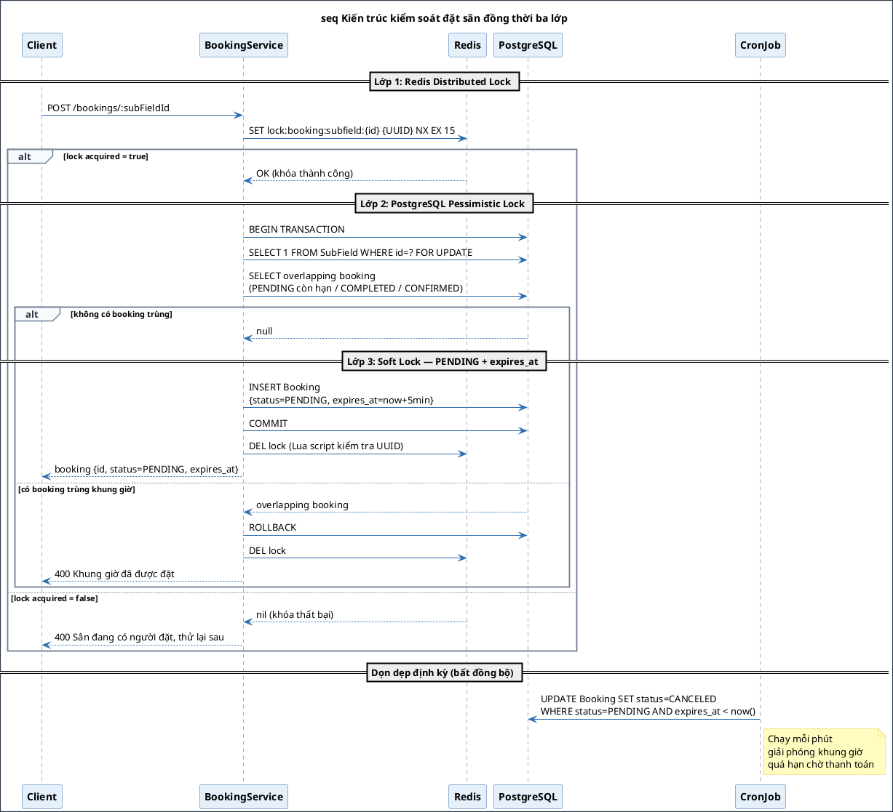
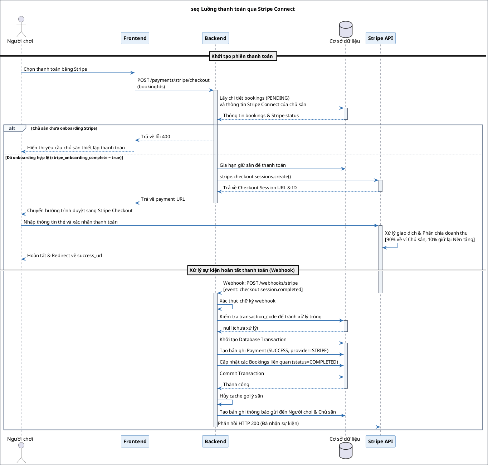
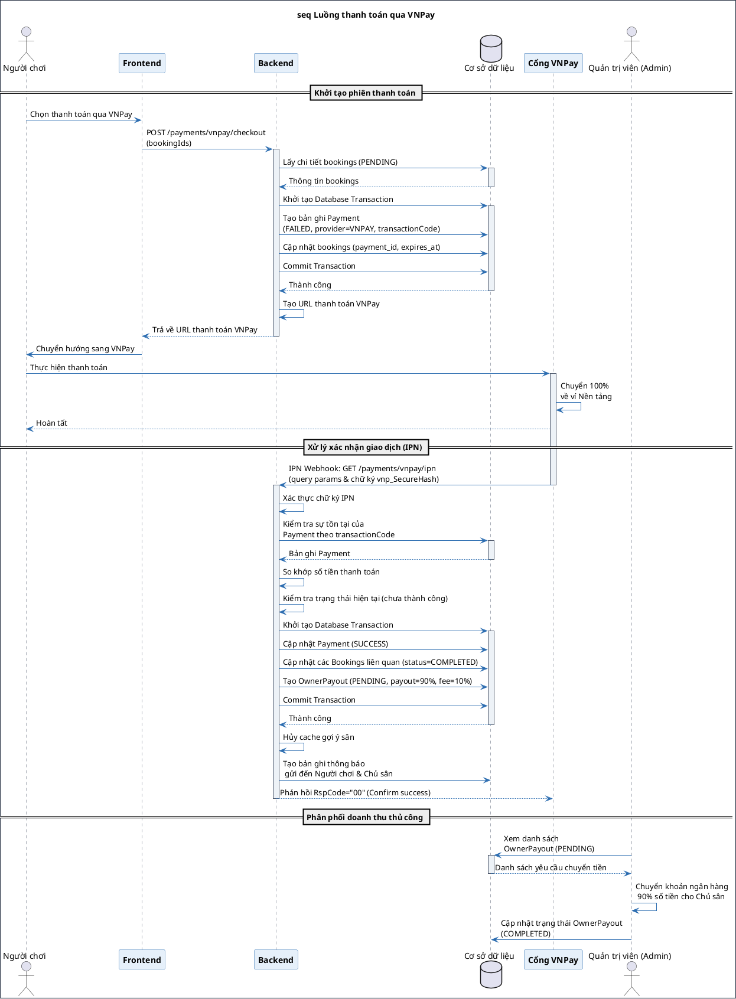

# LỜI CẢM ƠN

Trước tiên, em xin gửi lời cảm ơn chân thành nhất đến giảng viên hướng dẫn, Tiến sĩ Nguyễn Thị Thanh Nga, người đã tận tình giúp đỡ và định hướng cho em trong suốt quá trình thực hiện đồ án tốt nghiệp này.

Em cũng xin gửi lòng biết ơn đến gia đình, những người bạn đã luôn động viên, chia sẻ áp lực và tạo điều kiện thuận lợi nhất cho em. Bên cạnh đó, em muốn cảm ơn chính bản thân mình vì đã luôn nỗ lực, chăm chỉ để hoàn thành đồ án với kết quả tốt nhất.

Dù đã dành nhiều tâm huyết, nhưng do giới hạn về mặt kinh nghiệm thực tiễn, đồ án khó tránh khỏi những khiếm khuyết nhất định. Em rất mong đón nhận các ý kiến đóng góp quý báu từ quý thầy cô để có thể tiếp tục trau dồi chuyên môn cho công việc sau này.

# TÓM TẮT NỘI DUNG ĐỒ ÁN

Trong những năm gần đây, nhu cầu sử dụng sân thể thao tại các đô thị lớn ngày càng tăng, kéo theo nhiều khó khăn trong công tác quản lý và đặt lịch sân. Phần lớn các cơ sở hiện nay vẫn vận hành thủ công thông qua điện thoại, tin nhắn hoặc ghi chép trực tiếp, dễ xảy ra trùng lịch, sai sót và khó kiểm soát doanh thu. Bên cạnh đó, việc áp dụng giá linh hoạt theo thời gian và quản lý khách đặt sân định kỳ cũng còn nhiều hạn chế.
Xuất phát từ thực tế đó, đề tài “Xây dựng hệ thống quản lý và đặt lịch sân thể thao” được thực hiện nhằm xây dựng một nền tảng hỗ trợ quản lý và đặt sân trực tuyến cho ba nhóm người dùng gồm người chơi, chủ sân và quản trị viên. Hệ thống cho phép người chơi tìm kiếm, đặt lịch, thanh toán trực tuyến, đánh giá sân và tìm kiếm đối kèo. Đối với chủ sân, hệ thống hỗ trợ quản lý sân bãi, lịch đặt, doanh thu và sản phẩm đi kèm. Ngoài ra, quản trị viên có thể theo dõi và kiểm soát hoạt động toàn hệ thống.
Đề tài cũng tập trung xây dựng cơ chế gợi ý sân phù hợp dựa trên hành vi người dùng nhằm nâng cao trải nghiệm tìm kiếm và đặt sân. Đồng thời, hệ thống hỗ trợ thông báo thời gian thực, giúp người dùng nhanh chóng cập nhật trạng thái đặt sân, các đối kèo và các hoạt động liên quan. Kết quả đạt được là một nền tảng web hoàn chỉnh, đáp ứng các nhu cầu cơ bản trong quản lý và đặt lịch sân thể thao, sẵn sàng triển khai và vận hành thực tế.

# CHƯƠNG 1. GIỚI THIỆU ĐỀ TÀI

(Mở đầu: Giới thiệu ngắn gọn những nội dung sẽ trình bày trong chương 1)

## 1.1 Đặt vấn đề

Trong những năm gần đây, nhu cầu tham gia các hoạt động thể dục thể thao của người dân ngày càng gia tăng. Sự phát triển của các bộ môn như bóng đá, cầu lông, tennis hay pickleball kéo theo nhu cầu sử dụng sân bãi và cơ sở tập luyện tăng mạnh. Tuy nhiên, phần lớn các cụm sân thể thao hiện nay vẫn vận hành theo phương thức thủ công thông qua điện thoại, tin nhắn hoặc ghi chép trực tiếp. Khi số lượng khách hàng tăng lên, cách quản lý này dễ phát sinh nhiều bất cập như trùng lặp lịch đặt, sai sót trong quá trình xác nhận, khó kiểm soát doanh thu và thiếu tính đồng bộ trong vận hành.

Bên cạnh đó, việc áp dụng các chính sách giá linh hoạt theo khung giờ, ngày trong tuần hoặc quản lý khách hàng đặt sân định kỳ cũng gặp nhiều khó khăn khi thực hiện thủ công. Từ phía người chơi, quá trình tìm kiếm sân phù hợp với vị trí, thời gian và mức giá mong muốn còn thiếu thuận tiện. Người dùng thường phải liên hệ nhiều chủ sân khác nhau để kiểm tra tình trạng còn trống, gây mất thời gian và làm giảm trải nghiệm sử dụng dịch vụ.

Ngoài nhu cầu đặt sân, xu hướng kết nối của cộng đồng người chơi thể thao cũng ngày càng rõ rệt, nhiều người chơi có nhu cầu tìm kiếm đồng đội, đối thủ hoặc tham gia các kèo chơi thể thao. Tuy nhiên, các hoạt động này hiện chủ yếu được thực hiện thông qua mạng xã hội hoặc các nhóm trao đổi riêng lẻ, thiếu tính tập trung và khó quản lý. Đồng thời, nhu cầu cá nhân hóa trải nghiệm người dùng, chẳng hạn như gợi ý sân phù hợp dựa trên thói quen và hành vi đặt sân, cũng chưa được hỗ trợ hiệu quả trong các hệ thống hiện có.

Từ những thực tế trên, việc xây dựng một hệ thống quản lý và đặt lịch sân thể thao tập trung là cần thiết nhằm hỗ trợ số hóa quy trình vận hành sân bãi, nâng cao trải nghiệm người dùng và tăng hiệu quả quản lý cho các chủ sân thể thao.

## 1.2 Mục tiêu và phạm vi đề tài

Hiện nay đã có nhiều nền tảng hỗ trợ đặt sân thể thao trực tuyến. Tuy nhiên, phần lớn các hệ thống tập trung vào chức năng đặt sân cơ bản, chưa bao quát đầy đủ nghiệp vụ vận hành của chủ sân và các nhu cầu mở rộng của người chơi. Khả năng khai thác dữ liệu hành vi để đưa ra gợi ý cá nhân hóa còn hạn chế; tính năng tạo kèo giao lưu trên cùng nền tảng với đặt sân cũng chưa được phổ biến. Khi người dùng phải dùng nhiều ứng dụng riêng cho việc đặt sân, mua sản phẩm phụ trợ và tìm đồng đội, trải nghiệm trở nên rời rạc. Bên cạnh đó, trong giờ cao điểm, nguy cơ tranh chấp đặt trùng khung giờ trên cùng một sân là bài toán kỹ thuật cần được xử lý có kiểm soát.

Dựa trên các hạn chế nêu trên, đồ án đặt mục tiêu nghiên cứu và phát triển một nền tảng phần mềm quản lý và đặt lịch sân thể thao tích hợp. Hệ thống phục vụ bốn nhóm đối tượng: khách vãng lai, người chơi, chủ sân và quản trị viên. Mục tiêu là xây dựng luồng nghiệp vụ liên thông từ tra cứu, đặt chỗ, thanh toán và kết nối giao lưu; đồng thời đảm bảo tính nhất quán dữ liệu khi nhiều người dùng cùng thao tác đặt sân, và cung cấp gợi ý sân theo hành vi sử dụng.

Phạm vi của đề tài bao trùm việc xây dựng các phân hệ chức năng chi tiết cho từng nhóm người dùng. Đối với khách vãng lai, phạm vi hệ thống cho phép tiếp cận thông tin một cách tự do, cung cấp các công cụ tìm kiếm cơ bản về sân bãi, giá cả mà không yêu cầu rào cản đăng nhập. Đối với người chơi thể thao, hỗ trợ quy trình đặt lịch linh hoạt bao gồm cả đặt đơn lẻ và đặt định kỳ dài hạn, thanh toán trực tuyến qua cổng Stripe và VNPay; đặt kèm sản phẩm hoặc dịch vụ phụ khi đặt sân; đánh giá sau khi sử dụng; tạo và tham gia kèo giao lưu; nhận danh sách gợi ý sân cá nhân hóa theo lịch sử đặt sân, hoặc danh sách sân phổ biến trong trường hợp người dùng mới. Đối với vai trò chủ sân, phạm vi tập trung vận hành qua bảng điều khiển: quản lý nhiều khu phức hợp và sân con; thiết lập quy tắc giá theo khung giờ và ngày trong tuần; quản lý danh mục sản phẩm bán kèm; xác nhận booking, theo dõi doanh thu và báo cáo thống kê; khai báo tài khoản ngân hàng, theo dõi số dư và gửi yêu cầu quyết toán đối với giao dịch thanh toán qua VNPay. Đối với quản trị viên, phạm vi gồm kiểm duyệt cụm sân đăng ký mới, quản lý trạng thái hoạt động của cơ sở và tài khoản người dùng, giám sát lịch sử giao dịch trên nền tảng, xử lý các đợt quyết toán cho chủ sân nhằm đảm bảo an toàn và minh bạch vận hành.

## 1.3 Định hướng giải pháp

Đồ án đề xuất giải pháp xây dựng hệ thống phần mềm dựa trên kiến trúc Web theo mô hình máy khách - máy chủ. Các thành phần của hệ thống giao tiếp thông qua giao diện lập trình ứng dụng. Định hướng này giúp phân tách logic xử lý nghiệp vụ và giao diện người dùng, tạo cơ sở cho việc mở rộng và bảo trì mã nguồn.

Về lưu trữ và gợi ý, đồ án chọn PostgreSQL tích hợp pgvector để lưu vector đặc trưng hành vi người chơi và sân, vì dữ liệu nghiệp vụ và dữ liệu phục vụ gợi ý nằm chung một hệ quản trị. Thuật toán gợi ý kết hợp tìm kiếm tương đồng cosine, xếp hạng lại bằng mô hình Gemini nhằm tinh chỉnh danh sách và cung cấp lý do ngắn, đồng thời cache kết quả trên Redis để giảm độ trễ; người dùng thiếu lịch sử đặt sân được đề xuất theo mức độ phổ biến.

Để xử lý tranh chấp khi nhiều người cùng đặt một sân, đồ án áp dụng khóa hai lớp: Redis Lock làm cổng chặn giảm tải, PostgreSQL khóa bi quan và kiểm tra chồng lấn thời gian trong giao dịch làm chốt chặn. Các tác vụ bảo trì (hủy phiên quá hạn, nhắc lịch, trạng thái các thành viên của kèo đấu, cập nhật cache và embedding) được đưa vào các tiến trình chạy ngầm để không ảnh hưởng thời gian phản hồi của API tạo đặt sân.

Trên cơ sở các định hướng trên, giải pháp là nền tảng Web quản lý đặt lịch sân thể thao, cho phép chủ sân quản lý sân và lịch, người chơi tra cứu–đặt–thanh toán và tham gia giao lưu, kèm module gợi ý sân theo hành vi. Đóng góp chính là hiện thực tích hợp kiểm soát đặt chỗ đồng thời và gợi ý cá nhân hóa trên một sản phẩm thống nhất. Kết quả là hệ thống phần mềm hoàn chỉnh, vận hành được các luồng nghiệp vụ của dự án trong điều kiện nhiều người dùng truy cập đồng thời.

## 1.4 Bố cục đồ án

Phần còn lại của báo cáo đồ án tốt nghiệp được tổ chức như sau.

Chương 2 trình bày kết quả khảo sát thực tế và phân tích chi tiết các yêu cầu chức năng, phi chức năng của hệ thống đặt sân thể thao. Trong chương này, các luồng nghiệp vụ thực tế được làm rõ thông qua việc thiết lập các biểu đồ use case tổng quát và use case phân rã chi tiết cho từng nhóm đối tượng người dùng.

Chương 3 giới thiệu về các nền tảng lý thuyết và toàn bộ công nghệ được lựa chọn sử dụng trong dự án. Chương này tập trung làm rõ lý do tại sao hệ thống sử dụng React và Zustand cho Frontend, Express.js cho Backend, cùng các công nghệ bổ trợ quan trọng khác như PostgreSQL, Redis, pgvector và cổng thanh toán VNPay/Stripe nhằm giải quyết các bài toán cụ thể đã đặt ra.

Chương 4 là phần mô tả chi tiết quá trình phân tích thiết kế, xây dựng và chạy thử nghiệm hệ thống. Nội dung chương bao gồm việc lựa chọn kiến trúc phần mềm, cấu trúc các gói code Backend, thiết kế chi tiết các lớp Service cốt lõi, cùng thiết kế chi tiết cơ sở dữ liệu quan hệ. Chương này cũng trình bày các kết quả giao diện đạt được, quy trình kiểm thử các tính năng quan trọng và cách thức triển khai hệ thống trên server.

Chương 5 phân tích sâu vào các giải pháp kỹ thuật nổi bật được nghiên cứu và tự giải quyết trong quá trình làm đồ án. Cụ thể, chương này tập trung làm rõ hai đóng góp chính là giải pháp kiểm soát đặt sân đồng thời bằng sự kết hợp giữa Redis Lock và PostgreSQL Pessimistic Lock, và cơ chế tìm kiếm, đề xuất sân thông minh qua pgvector kết hợp Gemini.

Chương 6 tổng kết lại toàn bộ các kết quả thực tế mà đồ án đã hoàn thành, chỉ ra những ưu điểm cũng như các mặt hạn chế còn tồn tại của hệ thống. Đồng thời, chương này cũng đề xuất các định hướng nghiên cứu và phát triển tiếp theo để nâng cấp ứng dụng trong tương lai.

# CHƯƠNG 2. KHẢO SÁT VÀ PHÂN TÍCH YÊU CẦU (Chương này có độ dài từ 9 đến 11 trang.)

Chương này trình bày chi tiết quá trình khảo sát hiện trạng, phân tích yêu cầu phần mềm và mô hình hóa các chức năng cốt lõi của nền tảng. Nội dung chương bao gồm việc xác định các tác nhân, xây dựng biểu đồ use case từ mức tổng quát đến phân rã chi tiết, và định nghĩa các yêu cầu phi chức năng. Thông qua phân tích này, hệ thống được định hình rõ ràng về mặt hành vi, tương tác và các ràng buộc kỹ thuật.

## 2.1 Khảo sát hiện trạng

Thông thường, khảo sát chi tiết về hiện trạng và yêu cầu của phần mềm sẽ được lấy từ ba nguồn chính, đó là (i) người dùng/khách hàng, (ii) các hệ thống đã có, (iii) và các ứng dụng tương tự. Sinh viên cần tiến hành phân tích, so sánh, đánh giá chi tiết ưu nhược điểm của các sản phẩm/nghiên cứu hiện có. Sinh viên có thể lập bảng so sánh nếu cần thiết. Kết hợp với khảo sát người dùng/khách hàng (nếu có), sinh viên nêu và mô tả sơ lược các tính năng phần mềm quan trọng cần phát triển.

## 2.2 Tổng quan chức năng
Mục 2.2 trình bày tổng quan các phân hệ chức năng chính của hệ thống đặt sân thể thao, được thiết kế xoay quanh bốn nhóm người dùng chính bao gồm Khách vãng lai, Người chơi, Chủ sân và Quản trị viên. Các nhóm chức năng này được mô hình hóa chi tiết thông qua các biểu đồ use case tổng quát và use case phân rã tương ứng, tạo cơ sở phân tích để tiến hành đặc tả luồng sự kiện chi tiết cho các chức năng cốt lõi của nền tảng ở các mục tiếp theo.


### 2.2.1 Biểu đồ use case tổng quát


Khách vãng lai là người truy cập chưa đăng nhập hoặc chưa có vai trò nghiệp vụ trong hệ thống. Tác nhân này tra cứu cụm sân, sân con, giá và tình trạng còn trống; xem đánh giá và danh sách kèo giao lưu công khai; thực hiện đăng ký, đăng nhập hoặc đăng xuất. Các use case này tạo điều kiện thu thập thông tin trước khi người dùng chuyển sang các nghiệp vụ yêu cầu xác thực.

Người chơi là người dùng đã xác thực với vai trò PLAYER. Tác nhân này có thể tạo một lượt đặt sân hoặc tạo chuỗi đặt định kỳ; thực hiện thanh toán qua cổng trực tuyến; mua thêm vật phẩm gắn với booking; xem lịch sử đặt sân, hủy đặt sân và đánh giá sân sau khi sử dụng; tạo kèo, tham gia hoặc rời kèo giao lưu; xem gợi ý sân và nhận thông báo. 

Chủ sân là người dùng đã xác thực với vai trò OWNER, chịu trách nhiệm vận hành một hoặc nhiều khu phức hợp. Tác nhân này quản lý khu phức hợp và sân con; thiết lập bảng giá theo khung giờ và ngày trong tuần; quản lý danh mục vật phẩm bán kèm; xem lịch đặt của sân; xác nhận hoặc từ chối booking; theo dõi thống kê doanh thu; khai báo tài khoản ngân hàng và gửi yêu cầu quyết toán đối với giao dịch thu qua VNPay.

Quản trị viên là người dùng với vai trò ADMIN, có quyền giám sát toàn nền tảng. Tác nhân này duyệt hoặc từ chối đăng ký khu phức hợp mới; quản lý trạng thái tài khoản người chơi, chủ sân và quản trị viên; theo dõi giao dịch; xử lý đối soát và các đợt quyết toán cho chủ sân; xem thống kê và lập báo cáo tổng hợp.

### 2.2.2 Biểu đồ use case phân rã "Đặt sân"


Biểu đồ phân rã "Đặt sân" (Hình 2.2) mô tả chi tiết các chức năng thuộc phân hệ đặt sân dành cho người chơi. Từ use case cơ sở là tạo lượt đặt sân, hệ thống cung cấp hai hình thức cụ thể bao gồm đặt sân một lần cho nhu cầu ngắn hạn và đặt sân định kỳ cho các khung giờ lặp lại cố định. Đối với hình thức đặt sân một lần, người chơi có thể thực hiện mua kèm vật phẩm như nước uống hoặc thuê dụng cụ trực tiếp trên hệ thống. Để hoàn tất quy trình đặt sân, use case tạo lượt đặt sân bắt buộc bao gồm chức năng thanh toán qua cổng trực tuyến. Bên cạnh đó, sau khi khởi tạo lượt đặt sân thành công, người chơi có thể sử dụng tính năng tạo kèo nhằm tìm kiếm thêm đồng đội hoặc đối thủ giao lưu.

### 2.2.3 Biểu đồ use case phân rã "Tham gia, Quản lý kèo đấu"


Biểu đồ phân rã "Tham gia, Quản lý kèo đấu" (Hình 2.3) mô tả các chức năng hỗ trợ kết nối và ghép cặp giữa những người chơi. Tác nhân người chơi có thể truy cập chức năng xem kèo đấu công khai để tìm kiếm các trận đấu đang thiếu thành viên trên hệ thống. Từ danh sách này, người chơi xem chi tiết kèo để nắm rõ thông tin sân bãi, thời gian và trình độ, từ đó thực hiện tham gia kèo để đăng ký thi đấu. Đối với các kèo đấu cá nhân, người chơi truy cập chức năng xem kèo của tôi, được phân rã thành hai nhánh cụ thể bao gồm quản lý kèo tham gia và quản lý kèo tôi tạo. Đối với các kèo đã tham gia, người chơi có thể chọn rời kèo khi có thay đổi lịch trình. Đối với các kèo tự tạo, người chơi đóng vai trò chủ trì và có quyền duyệt/xóa thành viên tham gia để chủ động sắp xếp đội hình.

### 2.2.4 Biểu đồ use case phân rã "Quản lý sân và khu phức hợp"


Biểu đồ phân rã "Quản lý sân và khu phức hợp" (Hình 2.4) mô tả các chức năng quản trị cơ sở vật chất dành riêng cho chủ khu phức hợp. Theo đó, tác nhân chủ khu phức hợp thực hiện đăng ký khu phức hợp mới để gửi thông tin cơ sở lên hệ thống chờ phê duyệt. Đối với các cơ sở đã hoạt động, chủ khu phức hợp có thể xem chi tiết khu phức hợp để theo dõi toàn diện trạng thái vận hành. Từ giao diện chi tiết này, tác nhân có thể cập nhật khu phức hợp để thay đổi thông tin chung, thực hiện thêm sân con để mở rộng quy mô, hoặc xem chi tiết sân con để quản lý sâu hơn từng sân đấu. Tại mục chi tiết sân con, chủ khu phức hợp có quyền cập nhật sân con để điều chỉnh thông số kỹ thuật, đồng thời tiến hành thêm/sửa bảng giá nhằm thiết lập mức chi phí linh hoạt theo từng khung giờ và ngày trong tuần.

### 2.2.5 Biểu đồ use case phân rã "Quản lý lịch sử đặt sân"


Biểu đồ phân rã ở Hình 2.5 mô tả các chức năng theo dõi và xử lý trạng thái lịch đặt sân của hai tác nhân là người chơi và chủ khu phức hợp. Người chơi truy cập chức năng xem lịch sử đặt sân để kiểm tra danh sách các lượt đặt của cá nhân, trong khi chủ khu phức hợp sử dụng chức năng xem danh sách lịch đặt sân để giám sát hoạt động của toàn cơ sở. Từ danh sách hiển thị của cả hai phân hệ, hai tác nhân đều có thể thực hiện xem chi tiết lượt đặt sân để kiểm tra thông tin thời gian, chi phí và trạng thái thanh toán. Từ màn hình chi tiết này, người chơi hoặc chủ khu phức hợp có quyền từ chối/hủy đặt sân trong trường hợp có sự cố hoặc thay đổi lịch trình. Ngoài ra, chủ khu phức hợp còn có quyền thực hiện phê duyệt lượt đặt sân để chính thức xác nhận lịch chơi cho khách hàng.

### 2.2.6 Biểu đồ use case phân rã "Quản lý công nợ và quyết toán"


Biểu đồ phân rã ở Hình 2.6 mô tả các chức năng quản lý tài chính và dòng tiền trên nền tảng của quản trị hệ thống. Tác nhân quản trị hệ thống thực hiện xem công nợ đối với chủ sân để giám sát các khoản doanh thu tích lũy từ các lượt đặt sân trực tuyến của từng cơ sở. Đồng thời, quản trị hệ thống truy cập chức năng xem các yêu cầu quyết toán để theo dõi danh sách đề nghị rút tiền từ các chủ sân. Từ danh sách này, quản trị hệ thống có thể tiến hành từ chối yêu cầu nếu phát hiện sai sót, hoặc thực hiện xác nhận, phê duyệt yêu cầu để bắt đầu luồng xử lý chuyển khoản. Quy trình phê duyệt này sẽ bao gồm việc thực hiện quyết toán để chuyển tiền từ tài khoản hệ thống sang tài khoản ngân hàng của chủ sân và cập nhật trạng thái số dư tương ứng.

### 2.2.7 Quy trình nghiệp vụ

Mục 2.2.7 trình bày các quy trình nghiệp vụ cốt lõi của nền tảng dưới dạng sơ đồ hoạt động (Activity Diagram). Các quy trình này chỉ ra trình tự tương tác chi tiết giữa các tác nhân và hệ thống, từ khâu đặt sân, ghép kèo đấu, đến duyệt cơ sở vật chất và quyết toán doanh thu định kỳ.

#### 2.2.7.a Quy trình nghiệp vụ đặt sân và thanh toán


Sơ đồ quy trình nghiệp vụ đặt sân và thanh toán được thể hiện chi tiết trong Hình 2.7. Quy trình bắt đầu khi người chơi tìm kiếm sân và lựa chọn khung giờ phù hợp trên hệ thống. Tiếp theo bao gồm bước kiểm tra lịch trống của sân con, khởi tạo đơn đặt sân và chuyển hướng người dùng đến cổng thanh toán trực tuyến. Sau khi cổng thanh toán phản hồi kết quả giao dịch thành công, hệ thống tự động cập nhật trạng thái đơn hàng, gửi thông báo đến chủ sân và người chơi, đồng thời tự động ghi nhận doanh thu cho chủ sân để đối soát sau này.

#### 2.2.7.b Quy trình nghiệp vụ tạo và tham gia kèo đấu


Hình 2.8 mô tả quy trình nghiệp vụ tạo và tham gia kèo đấu trên nền tảng. Sau khi thực hiện đặt sân thành công, người chơi có thể tùy chọn khởi tạo một kèo đấu bằng cách thiết lập các thông tin như tiêu đề kèo, trình độ kỹ năng yêu cầu và số lượng vị trí tuyển thêm. Hệ thống sẽ hiển thị công khai kèo đấu này ở trạng thái mở để những người chơi khác có thể tìm kiếm và tham gia. Mỗi khi có thành viên mới đăng ký tham gia thành công, hệ thống sẽ tự động cập nhật số lượng thành viên, đồng thời tự động đóng kèo nếu đầy đủ thành viên.

#### 2.2.7.c Quy trình nghiệp vụ đăng ký và kích hoạt khu phức hợp


Quy trình đăng ký và duyệt khu phức hợp thể thao được mô tả cụ thể trong Hình 2.9. Đầu tiên, chủ sân sẽ khai báo hồ sơ thông tin khu phức hợp và tải lên các tài liệu chứng minh pháp lý dưới dạng tập tin đính kèm. Admin tiến hành kiểm tra thực tế tính hợp lệ của tài liệu pháp lý để đưa ra quyết định phê duyệt cho phép khu phức hợp đi vào hoạt động chính thức, hoặc từ chối kèm theo lý do phản hồi chi tiết để chủ sân cập nhật lại.

#### 2.2.7.d Quy trình nghiệp vụ đối soát và quyết toán


Hình 2.10 minh họa quy trình nghiệp vụ đối soát và quyết toán tài chính định kỳ giữa chủ sân và quản trị viên hệ thống. Dòng doanh thu ròng từ các lượt đặt sân thành công sau khi khấu trừ phí nền tảng sẽ được tích lũy vào tài khoản của chủ sân dưới dạng công nợ chờ xử lý. Khi chủ sân thực hiện tạo yêu cầu quyết toán, hệ thống sẽ tự động tạo một lượt yêu cầu quyết toán. Quản trị viên hệ thống dựa trên yêu cầu này để tiến hành đối soát, thực hiện chuyển tiền qua tài khoản ngân hàng của chủ sân và nhập mã giao dịch làm đối chứng để hoàn thành đợt quyết toán.

## 2.3 Đặc tả chức năng

Mục 2.3 tập trung mô tả chi tiết và làm rõ cách thức tương tác của các tác nhân với hệ thống đặt sân thể thao thông qua các use case cốt lõi. Sáu bảng đặc tả dưới đây sẽ chi tiết hóa các tiền điều kiện, luồng sự kiện chính, các luồng thay thế xử lý ngoại lệ và hậu điều kiện tương ứng, làm cơ sở vững chắc cho các bước thiết kế kiến trúc và xây dựng cơ sở dữ liệu ở các chương sau.

### 2.3.1 Đặc tả use case "Đặt sân"

Bảng 2.1: Đặc tả use case "Đặt sân"

| Thành phần đặc tả | Nội dung mô tả chi tiết |
|-------------------|-------------------------|
| **Tên Use Case** | Đặt sân |
| **Tác nhân** | Người chơi (Player) |
| **Mục đích sử dụng** | Tìm kiếm sân trống, đặt giờ chơi, thuê hoặc mua vật phẩm đi kèm và thanh toán trực tuyến. |
| **Tiền điều kiện** | Tài khoản người chơi và sân được chọn đang hoạt động bình thường. |
| **Luồng chính** | 1. Người chơi chọn sân và ngày chơi.<br>2. Hệ thống hiển thị các khung giờ trống và bảng giá thuê.<br>3. Người chơi chọn giờ chơi.<br>4. Hệ thống hiển thị danh sách các vật phẩm đi kèm khả dụng.<br>5. Người chơi chọn số lượng vật phẩm cần mua hoặc thuê và xác nhận.<br>6. Hệ thống kiểm tra giờ trống, tồn kho và tạo lượt đặt tạm thời.<br>7. Hệ thống giữ chỗ trong 10 phút, hiển thị hóa đơn tạm tính.<br>8. Người chơi xác nhận hóa đơn và chọn thanh toán trực tuyến.<br>9. Hệ thống chuyển hướng người chơi đến cổng thanh toán.<br>10. Người chơi thực hiện thanh toán trực tuyến thành công.<br>11. Hệ thống cập nhật trạng thái lịch đặt thành công và gửi thông báo. |
| **Luồng thay thế** | - **Trùng giờ (bước 6):** Hệ thống báo trùng lịch và yêu cầu chọn giờ khác.<br>- **Hết vật phẩm (bước 6):** Hệ thống báo hết hàng và yêu cầu chỉnh sửa số lượng.<br>- **Quá hạn (bước 8-10):** Quá 10 phút giữ chỗ chưa thanh toán, hệ thống tự động hủy lượt đặt tạm thời và khôi phục tồn kho. |
| **Hậu điều kiện** | Lịch đặt được ghi nhận, tồn kho được cập nhật và thông tin thanh toán được lưu trữ. |

Bảng 2.1 chi tiết đặc tả use case đặt sân của người chơi trên hệ thống. Tài liệu này chỉ ra toàn bộ quá trình tìm kiếm sân trống, chọn giờ chơi, mua hoặc thuê thêm các vật phẩm phụ trợ kèm theo, cho đến khi hoàn thành thanh toán trực tuyến qua các cổng thanh toán liên kết và ghi nhận lịch đặt thành công.

### 2.3.2 Đặc tả use case "Tham gia, quản lý kèo đấu" 

Bảng 2.2: Đặc tả use case "Tham gia, quản lý kèo đấu"

| Thành phần đặc tả | Nội dung mô tả chi tiết |
|-------------------|-------------------------|
| **Tên Use Case** | Tham gia, quản lý kèo đấu |
| **Tác nhân** | Người chơi (Player) |
| **Mục đích sử dụng** | Tìm kiếm kèo đấu, gửi yêu cầu ghép cặp, duyệt thành viên và rời khỏi kèo đấu. |
| **Tiền điều kiện** | Tài khoản người chơi đang hoạt động bình thường. |
| **Luồng chính** | 1. Người chơi xem danh sách kèo đấu công khai.<br>2. Người chơi chọn kèo đấu phù hợp và nhấn đăng ký tham gia.<br>3. Hệ thống hiển thị biểu mẫu điền thông tin giới thiệu.<br>4. Người chơi nhập thông tin giới thiệu và nhấn gửi yêu cầu.<br>5. Hệ thống kiểm tra thời gian đăng ký và tránh đăng ký trùng kèo.<br>6. Hệ thống ghi nhận yêu cầu chờ duyệt và thông báo cho chủ kèo.<br>7. Chủ kèo truy cập danh sách yêu cầu ứng tuyển của kèo đấu.<br>8. Hệ thống hiển thị danh sách các ứng viên kèm lời giới thiệu.<br>9. Chủ kèo xem xét thông tin và nhấn phê duyệt ứng viên phù hợp.<br>10. Hệ thống cập nhật trạng thái đã tham gia và gửi thông báo xác nhận. |
| **Luồng thay thế** | - **Từ chối ứng viên (bước 10):** Chủ kèo từ chối. Hệ thống cập nhật trạng thái bị từ chối và gửi thông báo cho ứng viên.<br>- **Kèo đấu đủ người (bước 11):** Khi đủ số người chơi, hệ thống tự động khóa đăng ký.<br>- **Rời kèo đấu:** Người chơi xin rời kèo đấu. Hệ thống giải phóng chỗ trống để nhận ứng viên mới. |
| **Hậu điều kiện** | Yêu cầu kèo đấu được cập nhật; số lượng chỗ trống được đồng bộ; thông báo được gửi đến các bên liên quan. |

Bảng 2.2 thể hiện đặc tả use case tham gia và quản lý kèo đấu ghép cặp giao lưu của người chơi. Qua bảng này, luồng tương tác được cụ thể hóa từ bước người chơi đăng ký tham gia, hệ thống thực hiện kiểm tra tránh trùng lịch kèo, đến bước chủ kèo xem thông tin giới thiệu và bấm nút duyệt thành viên vào đội.

### 2.3.3 Đặc tả use case "Quản lý sân và khu phức hợp"

Bảng 2.3: Đặc tả use case "Quản lý sân và khu phức hợp"

| Thành phần đặc tả | Nội dung mô tả chi tiết |
|-------------------|-------------------------|
| **Tên Use Case** | Quản lý sân và khu phức hợp |
| **Tác nhân** | Chủ khu phức hợp (Owner) |
| **Mục đích sử dụng** | Đăng ký thông tin khu phức hợp mới, gửi hồ sơ pháp lý kiểm duyệt, thêm các sân con và thiết lập biểu giá hoạt động. |
| **Tiền điều kiện** | Tài khoản của chủ khu phức hợp đang hoạt động bình thường. |
| **Luồng chính** | 1. Chủ sân truy cập phân hệ quản lý khu phức hợp và chọn đăng ký mới.<br>2. Hệ thống hiển thị biểu mẫu điền thông tin khu phức hợp và tài liệu pháp lý.<br>3. Chủ sân nhập thông tin, đính kèm tài liệu sở hữu pháp lý và gửi.<br>4. Hệ thống tải hồ sơ lên và tạo khu phức hợp ở trạng thái chờ duyệt.<br>5. Hệ thống hiển thị danh sách khu phức hợp và thông báo gửi hồ sơ thành công.<br>6. Chủ sân chọn khu phức hợp vừa tạo để thực hiện thêm các sân con.<br>7. Hệ thống hiển thị biểu mẫu thêm sân con (tên, môn thể thao, sức chứa).<br>8. Chủ sân nhập thông tin chi tiết sân con và nhấn xác nhận.<br>9. Hệ thống kiểm tra tên trùng lặp, tạo sân con và mở giao diện cấu hình giá.<br>10. Chủ sân thiết lập các quy tắc biểu giá cụ thể cho các khung giờ và lưu.<br>11. Hệ thống lưu trữ các quy tắc giá và thông báo thiết lập thành công. |
| **Luồng thay thế** | - **Trùng khu phức hợp (bước 4):** Hệ thống báo lỗi trùng tên khu phức hợp và yêu cầu đổi tên.<br>- **Thiếu hồ sơ pháp lý (bước 4):** Hệ thống báo lỗi và yêu cầu đính kèm tài liệu sở hữu hợp lệ.<br>- **Trùng sân con (bước 9):** Hệ thống báo trùng sân con trong cụm và yêu cầu đổi tên khác. |
| **Hậu điều kiện** | Khu phức hợp ở trạng thái chờ duyệt; các sân con và quy tắc bảng giá hoạt động được ghi nhận. |

Bảng 2.3 mô tả chi tiết use case quản lý sân và khu phức hợp thể thao của tác nhân chủ sân. Tiến trình này bao gồm các bước khai báo hồ sơ cụm sân mới đi kèm hồ sơ pháp lý gửi ban quản trị kiểm duyệt, đồng thời chủ sân cũng thực hiện cấu hình danh mục các sân con và thiết lập quy tắc giá thuê theo khung giờ.

### 2.3.4 Đặc tả use case "Quản lý lịch đặt của sân"

Bảng 2.4: Đặc tả use case "Quản lý lịch đặt của sân"

| Thành phần đặc tả | Nội dung mô tả chi tiết |
|-------------------|-------------------------|
| **Tên Use Case** | Quản lý lịch đặt của sân |
| **Tác nhân** | Chủ khu phức hợp (Owner) |
| **Mục đích sử dụng** | Theo dõi lịch đặt sân con, duyệt lịch đặt đã thanh toán thành công hoặc hủy lịch đặt sân khi có sự cố. |
| **Tiền điều kiện** | Tài khoản của chủ sân đang hoạt động bình thường. |
| **Luồng chính** | 1. Chủ sân truy cập giao diện quản lý lịch đặt sân.<br>2. Hệ thống hiển thị danh sách lịch đặt được sắp xếp mới nhất.<br>3. Chủ sân thực hiện lọc lịch đặt theo ngày, sân con hoặc trạng thái thanh toán.<br>4. Hệ thống cập nhật hiển thị danh sách lịch đặt phù hợp với điều kiện lọc.<br>5. Chủ sân chọn lượt đặt ở trạng thái chờ xác nhận để xem chi tiết.<br>6. Hệ thống hiển thị tên người chơi, số điện thoại, giờ thuê, sân con và vật phẩm đi kèm.<br>7. Chủ sân nhấn nút phê duyệt lịch đặt sân.<br>8. Hệ thống cập nhật trạng thái lịch đặt sang đã xác nhận.<br>9. Hệ thống tự động gửi thông báo xác nhận đặt sân thành công đến người chơi. |
| **Luồng thay thế** | - **Chủ sân chủ động hủy lịch (bước 7):** Chủ sân chọn nút hủy. Hệ thống cập nhật trạng thái đã hủy, khôi phục tồn kho vật phẩm và thông báo cho người chơi.<br>- **Lịch đặt đã thay đổi trạng thái trước đó (bước 7):** Nếu lịch đặt đã tự động hủy do quá hạn thanh toán, hệ thống báo lỗi và yêu cầu tải lại trang. |
| **Hậu điều kiện** | Trạng thái lịch đặt được cập nhật; tồn kho vật phẩm được khôi phục (nếu hủy); người chơi nhận được thông báo phản hồi. |

Bảng 2.4 cung cấp tài liệu đặc tả use case quản lý lịch đặt sân của chủ sân. Qua đó, chủ sân có thể truy cập danh sách đặt sân của cơ sở mình để thực hiện bộ lọc tìm kiếm nhanh theo ngày hoặc theo tình trạng thanh toán, tiến hành xác nhận các đơn đặt thành công hoặc chủ động hủy đơn khi phát hiện sự cố bất khả kháng.

### 2.3.5 Đặc tả use case "Quản lý đăng ký khu phức hợp"

Bảng 2.5: Đặc tả use case "Quản lý đăng ký khu phức hợp"

| Thành phần đặc tả | Nội dung mô tả chi tiết |
|-------------------|-------------------------|
| **Tên Use Case** | Quản lý đăng ký khu phức hợp |
| **Tác nhân** | Quản trị hệ thống (Admin) |
| **Mục đích sử dụng** | Xem xét hồ sơ đăng ký, kiểm duyệt giấy tờ pháp lý đính kèm, kích hoạt hoạt động hoặc từ chối và phản hồi lý do. |
| **Tiền điều kiện** | Tài khoản quản trị viên đang hoạt động bình thường. |
| **Luồng chính** | 1. Quản trị viên truy cập giao diện quản lý khu phức hợp.<br>2. Hệ thống hiển thị danh sách các khu phức hợp trên toàn hệ thống.<br>3. Quản trị viên thực hiện lọc danh sách theo trạng thái chờ phê duyệt.<br>4. Hệ thống cập nhật hiển thị danh sách hồ sơ đang chờ duyệt.<br>5. Quản trị viên chọn một hồ sơ đăng ký cụ thể để xem chi tiết.<br>6. Hệ thống hiển thị thông tin khu phức hợp, thông tin tài khoản chủ sân và tài liệu pháp lý.<br>7. Quản trị viên kiểm tra và đối soát tính xác thực của các tài liệu pháp lý.<br>8. Quản trị viên nhấn nút phê duyệt hồ sơ đăng ký khu phức hợp.<br>9. Hệ thống cập nhật trạng thái khu phức hợp hoạt động chính thức trên nền tảng.<br>10. Hệ thống tự động gửi thông báo chúc mừng hoạt động thành công đến tài khoản của chủ sân. |
| **Luồng thay thế** | - **Từ chối hồ sơ (bước 8):** Quản trị viên nhấn nút từ chối phê duyệt và nhập lý do. Hệ thống cập nhật trạng thái bị từ chối và tự động gửi thông báo lý do cụ thể đến chủ sân.<br>- **Hồ sơ đã được xử lý trước (bước 8):** Nếu hồ sơ đã được xử lý bởi quản trị viên khác trước đó, hệ thống hiển thị thông báo không hợp lệ và yêu cầu tải lại dữ liệu. |
| **Hậu điều kiện** | Trạng thái hoạt động của khu phức hợp được ghi nhận; thông báo phản hồi kết quả được tự động gửi đến chủ sân. |

Bảng 2.5 mô tả chi tiết use case quản lý đăng ký khu phức hợp của ban quản trị hệ thống. Đây là luồng nghiệp vụ quan trọng giúp quản trị viên kiểm tra và xác thực tính hợp pháp của các giấy tờ sở hữu do chủ sân cung cấp trước khi phê duyệt cho phép khu thể thao chính thức đi vào hoạt động kinh doanh trên nền tảng.

### 2.3.6 Đặc tả use case "Quản lý công nợ và quyết toán"

Bảng 2.6: Đặc tả use case "Quản lý công nợ và quyết toán"

| Thành phần đặc tả | Nội dung mô tả chi tiết |
|-------------------|-------------------------|
| **Tên Use Case** | Quản lý công nợ và quyết toán |
| **Tác nhân** | Quản trị hệ thống (Admin) |
| **Mục đích sử dụng** | Tiếp nhận và xử lý các yêu cầu rút tiền của chủ sân, thực hiện cập nhật trạng thái xử lý, đối soát và chuyển tiền. |
| **Tiền điều kiện** | Quản trị viên đã đăng nhập hệ thống; tồn tại yêu cầu rút tiền do chủ sân tạo ở trạng thái chờ duyệt. |
| **Luồng chính** | 1. Quản trị viên truy cập giao diện quản lý quyết toán.<br>2. Hệ thống hiển thị danh sách các yêu cầu chi trả từ các chủ sân.<br>3. Quản trị viên lọc danh sách theo trạng thái chờ duyệt và chọn một yêu cầu để xem chi tiết.<br>4. Hệ thống hiển thị tài khoản thụ hưởng, số tiền quyết toán và mã QR thanh toán.<br>5. Quản trị viên nhấn nút bắt đầu xử lý đợt chi trả.<br>6. Hệ thống ghi nhận thao tác và chuyển trạng thái đợt quyết toán sang **Đang xử lý**.<br>7. Quản trị viên thực hiện chuyển khoản thủ công cho chủ sân thông qua mã QR hoặc thông tin tài khoản.<br>8. Sau khi chuyển tiền thành công, quản trị viên chọn xác nhận đã chuyển khoản.<br>9. Hệ thống hiển thị biểu mẫu yêu cầu nhập mã giao dịch ngân hàng.<br>10. Quản trị viên nhập mã giao dịch ngân hàng và xác nhận hoàn tất.<br>11. Hệ thống cập nhật trạng thái đợt quyết toán sang **Đã thanh toán**, đồng thời gửi thông báo kèm biên lai cho chủ sân. |
| **Luồng thay thế** | - **Từ chối chi trả (bước 5 hoặc bước 8):** Quản trị viên chọn từ chối và nhập lý do. Hệ thống chuyển trạng thái đợt quyết toán sang **Đã hủy**, hoàn trả số tiền về ví tích lũy của chủ sân và gửi thông báo kèm lý do.<br>- **Xem tổng quan số dư ví:** Quản trị viên truy cập tab **Số dư và Ví chủ sân**. Hệ thống hiển thị số dư tích lũy, số dư đang yêu cầu rút và tổng số tiền đã chi trả của từng chủ sân. |
| **Hậu điều kiện** | Trạng thái đợt quyết toán được cập nhật chính xác; tiền quyết toán được chi trả thành công hoặc được hoàn trả về ví tích lũy của chủ sân theo kết quả xử lý. |

Bảng 2.6 thể hiện đặc tả use case quản lý công nợ và quyết toán tài chính của quản trị hệ thống. Quy trình này bao gồm các bước quản trị viên tiếp nhận yêu cầu xin rút tiền tích lũy của chủ sân, thực hiện đối soát các giao dịch đặt sân tương ứng, tiến hành chuyển khoản qua ngân hàng và ghi nhận mã giao dịch để hoàn tất đợt quyết toán.

## 2.4 Yêu cầu phi chức năng

Yêu cầu phi chức năng của hệ thống tập trung vào hiệu năng xử lý, độ tin cậy của giao dịch, bảo mật thông tin và khả năng tương thích giao diện. Các ràng buộc này được thiết lập làm tiêu chí kiểm thử nhằm đảm bảo chất lượng vận hành ổn định của nền tảng khi đưa vào sử dụng thực tế.

Về hiệu năng và tải, thời gian phản hồi trung bình của các yêu cầu khi người dùng thực hiện truy vấn danh sách khu phức hợp, thông tin chi tiết sân hoặc tìm kiếm lịch trống không vượt quá 1 giây trong điều kiện tải thông thường. Phân hệ tính toán và đưa ra danh sách đề xuất sân cá nhân hóa cho người chơi cần hoàn thành xử lý dữ liệu và trả kết quả hiển thị trong thời gian dưới 3 giây kể từ thời điểm nhận được yêu cầu từ máy khách.

Về độ tin cậy và tính nhất quán dữ liệu, hệ thống bắt buộc phải kiểm soát hiện tượng đặt chỗ đồng thời, đảm bảo không xảy ra trạng thái chồng lấn khung giờ của cùng một sân con. Đối với các lượt đặt sân trực tuyến chưa hoàn tất thanh toán, hệ thống yêu cầu thiết lập giới hạn thời gian giữ chỗ tạm thời. Quá thời hạn này, trạng thái lượt đặt phải tự động chuyển sang hủy bỏ nhằm giải phóng khung giờ trống cho người chơi khác, tránh hiện tượng chiếm dụng tài nguyên bất hợp lý.

Về bảo mật và phân quyền, toàn bộ thông tin tài khoản bao gồm mật khẩu và thông tin giao dịch tài chính phải được mã hóa an toàn trước khi lưu trữ vào cơ sở dữ liệu. Quy trình xác thực thông tin và kiểm tra quyền hạn phải được thực thi nghiêm ngặt, đảm bảo các tài nguyên dữ liệu và chức năng của từng nhóm tác nhân được phân tách rõ ràng và chỉ được truy cập đúng phạm vi quyền hạn được cấp phép.

Về tính khả dụng và khả năng tương thích, giao diện ứng dụng web phải thiết kế tương thích linh hoạt, hiển thị và hoạt động ổn định trên cả màn hình máy tính và thiết bị di động. Đồng thời, hệ thống phải hỗ trợ thông báo thời gian thực đến người dùng ngay trên màn hình hiển thị mà không yêu cầu thực hiện tải lại trang thủ công.

## Kết luận chương 2

Chương 2 đã hoàn thành việc khảo sát hiện trạng nghiệp vụ đặt sân thể thao thực tế và phân tích chi tiết các yêu cầu của hệ thống. Thông qua việc phân rã các biểu đồ use case tổng quát và đặc tả sáu use case cốt lõi, hành vi và quy trình tương tác của các nhóm tác nhân đã được mô tả cụ thể. Đồng thời, các yêu cầu phi chức năng về hiệu năng, độ tin cậy và bảo mật dữ liệu cũng được xác lập làm tiêu chuẩn đo lường kỹ thuật. Đây là tiền đề trực tiếp để triển khai lựa chọn nền tảng công nghệ, thiết kế kiến trúc phần mềm và xây dựng cơ sở dữ liệu trong các chương tiếp theo.

# CHƯƠNG 3. NỀN TẢNG LÝ THUYẾT VÀ CÔNG NGHỆ SỬ DỤNG

Chương 3 tập trung trình bày các công nghệ nền tảng được lựa chọn để hiện thực hóa hệ thống quản lý và đặt sân thể thao. Dựa trên các yêu cầu chức năng và phi chức năng đã được thiết lập ở Chương~2, nội dung chương này sẽ xem xét sự phù hợp của từng giải pháp công nghệ Backend, Frontend và các dịch vụ tích hợp bên ngoài.

## 3.1. Công nghệ Backend

### 3.1.1. Node.js & Express.js
Node.js là môi trường thực thi JavaScript phía máy chủ được xây dựng trên V8 Engine của Google Chrome. Node.js sử dụng mô hình xử lý bất đồng bộ và kiến trúc hướng sự kiện, cho phép xử lý đồng thời nhiều kết nối với chi phí tài nguyên thấp. Nhờ cơ chế non-blocking I/O và event loop, Node.js đặc biệt phù hợp cho các ứng dụng web thời gian thực và các hệ thống có số lượng lớn yêu cầu truy cập đồng thời.

Express là framework mã nguồn mở được xây dựng trên nền tảng Node.js, cung cấp các thành phần cần thiết để phát triển ứng dụng web và dịch vụ RESTful API. Express hỗ trợ cơ chế định tuyến, xử lý yêu cầu HTTP và hệ thống Middleware, giúp tổ chức mã nguồn theo hướng module hóa và dễ bảo trì. Với kiến trúc tối giản và linh hoạt, Express cho phép nhà phát triển tận dụng đầy đủ các đặc điểm của Node.js đồng thời dễ dàng mở rộng chức năng thông qua các middleware bên thứ ba.

Bảng 3.1: So sánh giải pháp công nghệ máy chủ dịch vụ Backend

| Giải pháp | Ưu điểm | Nhược điểm |
| :--- | :--- | :--- |
| **Express.js (Node.js)** | Gọn nhẹ, dễ kiểm soát trực tiếp luồng middleware, hiệu năng xử lý bất đồng bộ tốt, sử dụng chung ngôn ngữ với Frontend. | Cấu trúc tự do nên đòi hỏi lập trình viên phải tự tổ chức mã nguồn chặt chẽ để tránh mã lộn xộn. |
| **NestJS (Node.js)** | Cung cấp kiến trúc module chặt chẽ theo chuẩn enterprise, tích hợp sẵn các công cụ quản lý dependency injection. | Độ trừu tượng hóa cao, phát sinh nhiều mã mẫu (boilerplate) làm tăng dung lượng dự án. |
| **FastAPI (Python)** | Tự động phát sinh tài liệu API, tốc độ thực thi nhanh nhờ tối ưu hóa bất đồng bộ. | Đòi hỏi nhóm phát triển phải lập trình bằng hai ngôn ngữ khác nhau trên hệ thống, tăng độ phức tạp khi chia sẻ dữ liệu. |

Trong hệ thống quản lý và đặt lịch sân thể thao, Express được sử dụng để xây dựng tầng Backend API. Framework này chịu trách nhiệm tiếp nhận và xử lý các yêu cầu từ giao diện người dùng, thực hiện xác thực người dùng, quản lý lịch đặt sân, xử lý thanh toán và cung cấp dữ liệu cho các chức năng khác. Việc sử dụng Express giúp đơn giản hóa quá trình phát triển API và tăng khả năng mở rộng của hệ thống. Lý do lựa chọn Express.js thay vì các phương án thay thế là do tính tối giản và linh hoạt của framework này, giúp tập trung thực hiện các logic nghiệp vụ của luồng đặt sân mà không bị gò bó vào các cơ chế phức tạp.

### 3.1.2. PostgreSQL, pgvector & Prisma ORM
PostgreSQL là hệ quản trị cơ sở dữ liệu quan hệ hướng đối tượng mã nguồn mở. Hệ thống hỗ trợ phần lớn chuẩn SQL cùng nhiều tính năng hiện đại như khóa ngoại, trigger, view và cơ chế bảo đảm tính toàn vẹn giao dịch. Ngoài ra, PostgreSQL có khả năng mở rộng cao và được sử dụng rộng rãi trong các ứng dụng cần lưu trữ và quản lý dữ liệu.(note)
pgvector là phần mở rộng của PostgreSQL cho phép lưu trữ, đánh chỉ mục và tìm kiếm dữ liệu vector trực tiếp trong cơ sở dữ liệu. Tiện ích này hỗ trợ tìm kiếm tương đồng dựa trên ngữ nghĩa của dữ liệu thay vì chỉ dựa vào từ khóa, từ đó phục vụ hiệu quả các ứng dụng AI như tìm kiếm ngữ nghĩa, hệ gợi ý và chatbot.

Prisma là ORM mã nguồn mở dành cho Node.js và TypeScript. Prisma bao gồm các thành phần chính như Prisma Client để thực hiện truy vấn dữ liệu, Prisma Migrate để quản lý thay đổi cấu trúc cơ sở dữ liệu và Prisma Studio hỗ trợ trực quan hóa dữ liệu. Với mô hình khai báo tập trung thông qua Prisma Schema, công cụ này giúp đơn giản hóa quá trình xây dựng, truy vấn và quản lý cơ sở dữ liệu trong ứng dụng.

Bảng 3.2: So sánh giải pháp cơ sở dữ liệu và lưu trữ vector

| Giải pháp | Ưu điểm | Nhược điểm |
| :--- | :--- | :--- |
| **PostgreSQL + pgvector** | Lưu trữ dữ liệu quan hệ và vector đặc trưng trong cùng một cơ sở dữ liệu, đảm bảo tính nhất quán giao dịch ACID. | Tốc độ truy vấn vector giảm nhẹ khi quy mô dữ liệu vượt ngưỡng hàng triệu bản ghi. |
| **PostgreSQL + Pinecone** | Pinecone là cơ sở dữ liệu vector chuyên dụng, khả năng scale độc lập tốt và tối ưu hóa tính toán vector. | Phát sinh chi phí vận hành dịch vụ ngoài, gây phức tạp hạ tầng và dễ phát sinh rủi ro bất đồng bộ dữ liệu giữa hai hệ thống. |
| **MongoDB (NoSQL)** | Lưu trữ tài liệu linh hoạt, dễ dàng mở rộng theo chiều ngang. | Khả năng ràng buộc quan hệ yếu, không đảm bảo tính toàn vẹn giao dịch chặt chẽ đối với các tác vụ đặt lịch phức tạp. |

Quyết định lựa chọn PostgreSQL kết hợp tiện ích pgvector giúp tối giản hóa kiến trúc lưu trữ của hệ thống bằng việc tập trung dữ liệu nghiệp vụ quan hệ và dữ liệu vector gợi ý vào một nơi duy nhất. Giải pháp này giúp loại bỏ rủi ro bất đồng bộ dữ liệu thường gặp khi đồng bộ giữa cơ sở dữ liệu chính và các dịch vụ vector độc lập, đồng thời giảm độ phức tạp khi triển khai và vận hành hệ thống.

### 3.1.3. Redis (Cache & Locks)
Redis là hệ quản trị cơ sở dữ liệu mã nguồn mở, được lưu trữ hoàn toàn trên bộ nhớ RAM, mang lại tốc độ xử lý cao nhằm phục vụ các bài toán về Caching, Message Broker và lưu trữ dữ liệu hiệu năng cao. Hệ thống hỗ trợ đa dạng cấu trúc dữ liệu từ cơ bản như Strings, Hashes, Lists, Sets, Sorted Sets đến nâng cao Geospatial, Streams với tính nguyên tử tuyệt đối trên mọi thao tác.

Bảng 3.3: So sánh giải pháp lưu trữ đệm và kiểm soát đồng thời

| Giải pháp | Ưu điểm | Nhược điểm |
| :--- | :--- | :--- |
| **Redis** | Hỗ trợ nhiều cấu trúc dữ liệu (Hashes, Lists, Sets), hoạt động độc lập giúp bảo toàn dữ liệu cache khi restart máy chủ ứng dụng. | Yêu cầu thiết lập thêm một dịch vụ độc lập trong hệ thống. |
| **Memcached** | Gọn nhẹ, tốc độ truy xuất dữ liệu chuỗi đơn giản nhanh. | Không hỗ trợ các cấu trúc dữ liệu phức tạp và thiếu cơ chế hỗ trợ khóa phân tán khi cần mở rộng. |
| **Node-cache (In-Memory)** | Không yêu cầu cài đặt thêm dịch vụ, chạy trực tiếp trong tiến trình của máy chủ ứng dụng Node.js. | Dữ liệu đệm bị xóa khi restart máy chủ ứng dụng, không hỗ trợ chia sẻ dữ liệu khi mở rộng hệ thống đa tiến trình. |

Redis được chọn làm giải pháp chính thức cho tầng cache vì khả năng cung cấp một dịch vụ lưu trữ đệm bền vững, hỗ trợ đa dạng về cấu trúc dữ liệu và khả năng tích hợp linh hoạt. Redis trong dự án được sử dụng nhằm đáp ứng các yêu cầu phi chức năng về hiệu năng và tính nhất quán dữ liệu. Redis lưu trữ đệm các dữ liệu được truy cập thường xuyên, giúp giảm tải cho cơ sở dữ liệu PostgreSQL và cải thiện thời gian phản hồi của API. Bên cạnh đó, Redis còn được sử dụng để triển khai cơ chế khóa phân tán, hỗ trợ kiểm soát các yêu cầu đặt sân đồng thời và hạn chế tình trạng tranh chấp dữ liệu trong quá trình xử lý giao dịch.

## 3.2. Công nghệ Frontend

### 3.2.1. React & Vite
React là thư viện JavaScript mã nguồn mở được sử dụng để xây dựng giao diện người dùng. React áp dụng kiến trúc Component và cơ chế Virtual DOM, giúp tăng khả năng tái sử dụng mã nguồn, đơn giản hóa việc phát triển giao diện và cải thiện hiệu năng cập nhật dữ liệu.
Vite là công cụ hỗ trợ phát triển và đóng gói ứng dụng web hiện đại. Vite cung cấp môi trường phát triển nhanh, hỗ trợ Hot Module Replacement và tối ưu quá trình build ứng dụng, góp phần nâng cao hiệu quả phát triển và triển khai hệ thống.

Bảng 3.4: So sánh giải pháp xây dựng và đóng gói Frontend

| Giải pháp | Ưu điểm | Nhược điểm |
| :--- | :--- | :--- |
| **React + Vite** | Hệ sinh thái thư viện giao diện phong phú, tốc độ biên dịch (HMR) nhanh, dung lượng bundle đóng gói tối ưu. | Đòi hỏi tự cấu hình cơ chế định tuyến và các giải pháp quản lý trạng thái bổ sung. |
| **Next.js (React Framework)** | Hỗ trợ kết xuất phía máy chủ (SSR) tối ưu cho SEO, tích hợp sẵn hệ thống định tuyến file-based. | Cấu trúc phức tạp đối với các ứng dụng dạng Single Page Application có nhiều dashboard nghiệp vụ nội bộ. |
| **Vue.js + Vite** | Dễ tiếp cận, cấu trúc mã nguồn tích hợp gọn gàng trong một tệp duy nhất. | Hệ sinh thái các thành phần giao diện hỗ trợ doanh nghiệp nhỏ hơn React. |

Sự kết hợp giữa React và Vite mang lại sự cân bằng giữa hiệu năng vận hành phía máy khách và tốc độ phát triển. Do hệ thống đặt sân thể thao tập trung chủ yếu vào các tác vụ dashboard tương tác của chủ sân và người chơi, việc sử dụng kiến trúc React SPA kết hợp bundle của Vite là phương án phù hợp.

### 3.2.2. Tailwind CSS
Tailwind CSS là framework CSS mã nguồn mở theo hướng utility-first. Khác với các framework truyền thống cung cấp sẵn các thành phần giao diện, Tailwind CSS cung cấp tập hợp các lớp tiện ích để xây dựng và tùy chỉnh giao diện thông qua việc kết hợp các lớp CSS trực tiếp trên phần tử HTML.

Bảng 3.6: So sánh giải pháp thiết kế giao diện Frontend

| Giải pháp | Ưu điểm | Nhược điểm |
| :--- | :--- | :--- |
| **Tailwind CSS** | Xây dựng giao diện responsive nhanh, giảm đáng kể khối lượng mã CSS thủ công cần xây dựng, dung lượng file đóng gói nhẹ. | Đòi hỏi lập trình viên phải ghi nhớ hệ thống tên lớp tiện ích. |
| **Material UI (MUI)** | Cung cấp sẵn hệ thống component đồ sộ theo ngôn ngữ thiết kế Material. | Thẩm mỹ cứng nhắc, khó tùy biến sâu và dung lượng file thư viện đóng gói nặng làm chậm thời gian tải trang. |
| **CSS thuần / Sass** | Hoàn toàn tự do kiểm soát mã CSS theo ý muốn. | Tốn nhiều thời gian viết mã, dễ phát sinh lỗi xung đột tên lớp (class name collision) khi dự án phình to. |

Tailwind CSS giải quyết yêu cầu hiển thị tương thích đa màn hình di động và máy tính. Khả năng tùy biến linh hoạt của Tailwind CSS kết hợp cùng các thành phần giao diện giúp tạo dựng giao diện hiện đại cho tất cả các use case của đồ án. Hiệu năng đóng gói nhẹ của Tailwind CSS cũng hỗ trợ việc tối ưu hóa thời gian hiển thị ban đầu của ứng dụng Client trên các thiết bị.

## 3.3. Tích hợp dịch vụ ngoài (External APIs)

### 3.3.1. Stripe & VNPay
Stripe cung cấp hạ tầng thanh toán trực tuyến toàn cầu, hỗ trợ xử lý giao dịch thẻ tín dụng và thẻ ghi nợ quốc tế. VNPay là cổng thanh toán điện tử tại Việt Nam, cung cấp giải pháp thanh toán nội địa tích hợp trực tiếp với các ngân hàng thương mại.

Bảng 3.7: So sánh giải pháp cổng thanh toán trực tuyến

| Giải pháp | Ưu điểm | Nhược điểm |
|------------|----------|------------|
| **Stripe** | Hỗ trợ thanh toán quốc tế đa dạng, API ổn định, tài liệu chi tiết. | Chi phí giao dịch tương đối cao; hạn chế với thanh toán nội địa. |
| **VNPay** | Hỗ trợ đa dạng phương thức thanh toán nội địa, tích hợp ổn định với hệ thống ngân hàng Việt Nam. | Hỗ trợ thanh toán quốc tế hạn chế; giao diện và API chưa hiện đại bằng các giải pháp nước ngoài. |
| **MoMo** | Tích hợp nhanh; phổ biến tại Việt Nam và hỗ trợ nhiều hình thức thanh toán. | Tập trung chủ yếu vào thị trường Việt Nam; hỗ trợ quốc tế hạn chế; phụ thuộc hệ sinh thái MoMo. |
| **PayPal** | Thương hiệu quốc tế uy tín; dễ dàng thực hiện thanh toán xuyên biên giới. | Phí giao dịch cao; hỗ trợ thanh toán nội địa Việt Nam hạn chế. |

Giải pháp kết hợp Stripe và VNPay được lựa chọn để hỗ trợ nhiều phương thức thanh toán trên cùng một hệ thống. Stripe đáp ứng các giao dịch bằng thẻ quốc tế, trong khi VNPay hỗ trợ thanh toán qua hệ thống ngân hàng nội địa. Cách tiếp cận này phù hợp với yêu cầu nghiệp vụ của hệ thống, phạm vi người dùng của dự án và khả năng mở rộng sau này.

### 3.3.2. Cloudinary
Cloudinary là giải pháp quản lý tài nguyên đa phương tiện dựa trên đám mây, cung cấp các API để tải lên, lưu trữ, tối ưu hóa và phân phối hình ảnh thông qua mạng lưới phân phối nội dung (CDN) toàn cầu `[14]`. Dịch vụ này hỗ trợ khả năng tự động nén dung lượng hình ảnh, thay đổi định dạng (ví dụ: chuyển sang WebP) và co giãn kích thước linh hoạt theo yêu cầu hiển thị của thiết bị đầu cuối.

Về liên kết yêu cầu ở Chương 2, Cloudinary giải quyết yêu cầu lưu trữ và hiển thị hình ảnh minh họa của use case quản lý sân và khu phức hợp (`YC-Khu phức hợp`) mà không gây ảnh hưởng đến hiệu năng tải trang chung của hệ thống.

Bảng 3.8: So sánh giải pháp lưu trữ hình ảnh đa phương tiện

| Giải pháp | Ưu điểm | Nhược điểm |
| :--- | :--- | :--- |
| **Cloudinary** | Tự động tối ưu dung lượng và định dạng ảnh qua CDN, hỗ trợ gói miễn phí dung lượng lớn, tích hợp SDK dễ dàng. | Tốc độ tải lên phụ thuộc vào kết nối mạng quốc tế của dịch vụ đám mây. |
| **Lưu trữ trên Local Server** | Miễn phí, tốc độ đọc ghi nhanh trên ổ cứng cục bộ của máy chủ. | Làm phình to dung lượng sao lưu của server, tốn băng thông máy chủ và thiếu cơ chế CDN tự động tối ưu hóa ảnh. |
| **AWS S3 (Amazon Web Services)** | Lưu trữ dữ liệu vô hạn, độ tin cậy và bảo mật chuẩn công nghiệp. | Không tích hợp sẵn bộ chuyển đổi và tối ưu hóa ảnh tự động, đòi hỏi cấu hình CDN (CloudFront) độc lập phức tạp. |

Việc lựa chọn Cloudinary giúp giảm tải băng thông và dung lượng lưu trữ cho máy chủ Backend chính của dự án. Khả năng tự động tối ưu hóa định dạng ảnh qua CDN của Cloudinary giúp đáp ứng yêu cầu phi chức năng về hiệu năng tải trang Client trên các thiết bị di động có kết nối mạng hạn chế.

### 3.3.3. Gemini API

Gemini API là giao diện lập trình ứng dụng của Google cung cấp các mô hình ngôn ngữ lớn để xử lý ngôn ngữ tự nhiên, suy luận và tạo sinh nội dung có cấu trúc. Trong hệ thống, việc tích hợp này cho phép sử dụng khả năng suy luận ngữ nghĩa của mô hình để thực hiện reranking kết quả gợi ý dựa trên mô tả và sở thích của người dùng.

Bảng 3.9: So sánh giải pháp triển khai gợi ý thông minh

| Giải pháp | Ưu điểm | Nhược điểm |
| :--- | :--- | :--- |
| **Gemini API** | Khai thác khả năng suy luận ngữ nghĩa mạnh của mô hình lớn; tích hợp nhanh qua SDK chính thức; hỗ trợ response schema để tạo đầu ra JSON có cấu trúc. | Phụ thuộc vào kết nối Internet ổn định; chịu ảnh hưởng bởi rate limit và chi phí gọi API. |
| **Xây dựng mô hình ML riêng** | Kiểm soát hoàn toàn thuật toán và dữ liệu; không phát sinh chi phí gọi API bên thứ ba sau khi triển khai. | Yêu cầu nguồn lực lớn về thời gian phát triển, hạ tầng tính toán và dữ liệu lịch sử để huấn luyện đạt độ chính xác chấp nhận được. |

Chương 3 đã làm rõ các nền tảng lý thuyết và công nghệ được áp dụng để xây dựng hệ thống. Thông qua việc phân tích từng giải pháp, đồ án đã xác định được một hệ thống giải pháp công nghệ có tính liên kết chặt chẽ với các yêu cầu đề ra ở Chương~2. Đây là nền tảng để phát triển tiến hành phân tích thiết kế chi tiết kiến trúc phần mềm, cấu trúc cơ sở dữ liệu và triển khai hệ thống trong Chương~4.

# CHƯƠNG 4. PHÂN TÍCH THIẾT KẾ, TRIỂN KHAI VÀ ĐÁNH GIÁ HỆ THỐNG

Chương 3 đã làm rõ các cơ sở lý thuyết và công nghệ nền tảng được áp dụng để xây dựng hệ thống. Trên cơ sở đó, Chương 4 sẽ tập trung vào việc mô tả chi tiết quá trình phân tích thiết kế hệ thống, các phương án triển khai thực tế và kết quả đánh giá thực nghiệm. Nội dung chương bao gồm việc lựa chọn thiết kế kiến trúc tổng quan ở phần 4.1, thiết kế chi tiết ở phần 4.2 (giao diện, lớp, cơ sở dữ liệu), kết quả xây dựng ứng dụng ở phần 4.3, quy trình kiểm thử ở phần 4.4, và kiến trúc triển khai thực tế ở phần 4.5.

## 4.1 Thiết kế kiến trúc

### 4.1.1 Lựa chọn kiến trúc phần mềm

Kiến trúc phân lớp - Layered Architecture là một trong những kiến trúc phần mềm được sử dụng phổ biến trong các hệ thống hiện nay. Kiến trúc này chia hệ thống thành các tầng có trách nhiệm riêng biệt, trong đó mỗi tầng chỉ tập trung giải quyết một nhóm chức năng nhất định và tương tác với các tầng liên quan thông qua các giao diện đã được xác định trước. Việc phân chia này giúp giảm sự phụ thuộc giữa các thành phần, đồng thời tạo thuận lợi cho quá trình phát triển, bảo trì và mở rộng hệ thống.

Đối với hệ thống quản lý và đặt lịch sân thể thao, em lựa chọn kiến trúc phân lớp, cụ thể là kiến trúc ba lớp. Kiến trúc này bao gồm ba tầng chính: tầng trình diễn (Presentation Tier), tầng xử lý nghiệp vụ (Business Logic Tier) và tầng dữ liệu (Data Tier). Mỗi tầng đảm nhận một vai trò riêng và phối hợp với nhau để thực hiện các chức năng của hệ thống. 

Tầng trình diễn có nhiệm vụ cung cấp giao diện tương tác cho người dùng. Trong hệ thống, tầng này được xây dựng bằng React và TypeScript. Các chức năng của người chơi, chủ sân và quản trị viên được tổ chức thành các trang giao diện riêng như tìm kiếm sân, xem chi tiết sân, đặt sân, quản lý lịch đặt, quản lý khu phức hợp thể thao và quản lý đối soát thanh toán. Bên cạnh các trang chức năng, tầng trình diễn còn bao gồm các thành phần giao diện dùng chung và các dịch vụ gọi API để trao đổi dữ liệu với máy chủ.

Tầng xử lý nghiệp vụ là thành phần trung tâm của hệ thống. Tầng này được xây dựng bằng Express.js và được tổ chức theo mô hình Controller – Service. Các lớp Controller tiếp nhận yêu cầu từ phía giao diện, xử lý dữ liệu đầu vào và chuyển tiếp đến các lớp Service. Các lớp Service chứa các quy tắc nghiệp vụ của hệ thống như quản lý đặt sân, quản lý tài khoản, thanh toán, quản lý kèo và quản lý khu phức hợp thể thao. Việc tách biệt Controller và Service giúp hạn chế sự phụ thuộc giữa xử lý giao tiếp và xử lý nghiệp vụ, từ đó làm cho mã nguồn dễ bảo trì hơn.

Tầng dữ liệu chịu trách nhiệm lưu trữ và truy xuất dữ liệu của hệ thống. Trong đề tài này, tầng dữ liệu được xây dựng trên PostgreSQL và sử dụng Prisma ORM để thực hiện các thao tác với cơ sở dữ liệu. Dữ liệu được tổ chức dưới dạng các bảng quan hệ, bao gồm thông tin người dùng, khu phức hợp thể thao, sân đấu, lịch đặt sân, thanh toán và các dữ liệu nghiệp vụ khác. Prisma đóng vai trò trung gian giữa mã nguồn ứng dụng và cơ sở dữ liệu, giúp việc truy xuất dữ liệu được thực hiện thống nhất và dễ quản lý hơn.

Ngoài ba tầng chính, hệ thống sử dụng thêm một số thành phần hỗ trợ như Zod để kiểm tra dữ liệu đầu vào, Middleware để xử lý xác thực và phân quyền, Redis để lưu trữ dữ liệu tạm thời và Socket.io để trao đổi dữ liệu thời gian thực. Hệ thống cũng tích hợp với các dịch vụ bên ngoài như Stripe, VNPAY và Cloudinary nhằm phục vụ các chức năng thanh toán và lưu trữ hình ảnh. Các thành phần này được bổ sung để hỗ trợ quá trình vận hành của hệ thống nhưng không làm thay đổi kiến trúc phân lớp đã lựa chọn.

Kiến trúc ba lớp được lựa chọn vì phù hợp với đặc điểm của hệ thống. Việc tách biệt giao diện, xử lý nghiệp vụ và lưu trữ dữ liệu giúp các thành phần của hệ thống có thể được phát triển độc lập. Đồng thời, cách tổ chức này cũng tạo điều kiện thuận lợi cho việc kiểm thử, bảo trì và mở rộng chức năng khi số lượng người dùng và nghiệp vụ của hệ thống tăng lên trong tương lai.

### 4.1.2 Thiết kế tổng quan
Kiến trúc tổng quan của hệ thống được trình bày trong Hình 4.1. Dựa trên kiến trúc phân lớp đã lựa chọn, hệ thống được triển khai thành các thành phần chính gồm ứng dụng phía người dùng, máy chủ ứng dụng, hệ thống lưu trữ dữ liệu và các dịch vụ bên ngoài. Các thành phần này được tổ chức tách biệt nhưng vẫn phối hợp với nhau trong quá trình xử lý nghiệp vụ.


*Hình 4.1. Sơ đồ kiến trúc phần mềm ba lớp mở rộng kết hợp Reverse Proxy*

Khi người dùng thực hiện một thao tác trên giao diện, yêu cầu sẽ được gửi đến máy chủ thông qua Nginx Reverse Proxy. Từ đây, các yêu cầu API được chuyển tiếp đến hệ thống Backend để xử lý nghiệp vụ. Sau khi hoàn thành xử lý, kết quả được trả về cho giao diện và hiển thị cho người dùng. Đối với các chức năng yêu cầu cập nhật theo thời gian thực, dữ liệu được trao đổi thông qua kết nối Socket.io giữa phía người dùng và máy chủ. Đặc biệt, hệ thống tích hợp phân hệ gợi ý thông minh nhằm hỗ trợ người chơi tìm kiếm sân đấu phù hợp một cách nhanh chóng dựa trên hành vi sử dụng lịch sử. Khi người dùng truy cập trang chủ, máy chủ Backend sẽ kiểm tra bộ nhớ đệm Redis, nếu chưa có dữ liệu cũ được lưu trữ, hệ thống sẽ thực hiện truy vấn tìm kiếm tương đồng véc-tơ (Vector Similarity Search) trên PostgreSQL thông qua tiện ích mở rộng pgvector. Kết quả thô tiếp tục được chuyển tiếp đến dịch vụ trí tuệ nhân tạo Gemini API để thực hiện xếp hạng lại và tạo lý do gợi ý tự nhiên trước khi lưu vào bộ đệm Redis và phản hồi về giao diện. Chi tiết về quy trình kỹ thuật và giải thuật của hệ gợi ý này sẽ được trình bày trong Mục 5.2.


<!-- ### 4.1.3 Thiết kế chi tiết gói

Dựa theo cấu trúc thư mục thực tế của dự án, phần mã nguồn Backend được phân chia thành các thư mục cấu trúc tương ứng với các gói chức năng độc lập nhằm phục vụ mục tiêu quản lý và bảo trì mã nguồn. Cụ thể bao gồm: gói `routes` quản lý các đường dẫn API và phân luồng yêu cầu, gói `controllers` tiếp nhận yêu cầu gửi lên từ phía máy khách và điều phối phản hồi, gói `validations` sử dụng thư viện Zod để kiểm tra tính hợp lệ của dữ liệu đầu vào, gói `services` chứa toàn bộ mã nguồn xử lý logic nghiệp vụ chính của hệ thống, và gói `repositories` sử dụng Prisma Client để thực hiện tương tác trực tiếp với cơ sở dữ liệu quan hệ.

Việc phân tách cấu trúc này giúp mã nguồn đạt tính mô-đun hóa cao, phân định ranh giới trách nhiệm rõ ràng cho từng thành phần và ngăn ngừa hiện tượng phụ thuộc chéo vòng lặp giữa các lớp đối tượng trong Backend. Sơ đồ dưới đây mô tả cấu trúc phân gói và mối quan hệ phụ thuộc giữa các thành phần trong mã nguồn Backend:


*Hình 4.2. Biểu đồ gói hệ thống (UML Package Diagram)* -->

## 4.2 Thiết kế chi tiết

### 4.2.1 Thiết kế giao diện

Giao diện hệ thống được thiết kế phục vụ ba nhóm người dùng chính gồm người chơi, chủ sân và quản trị viên. Nội dung phần này mô tả các tiêu chuẩn thiết kế giao diện bao gồm bố cục màn hình, hệ thống màu sắc, kiểu chữ, thành phần điều khiển và cơ chế hiển thị thông báo hệ thống.

Hệ thống được xây dựng theo hướng responsive design, đảm bảo khả năng hiển thị tương thích trên nhiều thiết bị. Trên máy tính, giao diện tối ưu ở độ phân giải 1920x1080 và tự động co giãn linh hoạt trên các màn hình từ 13 đến 27 inch. Trên thiết bị di động, giao diện được tối ưu cho chiều rộng tối thiểu 375px, phù hợp với các thiết bị smartphone phổ biến.

Hệ thống hỗ trợ cả light mode và dark mode, trong đó dark mode được đặt làm chế độ mặc định. Màu nền chủ đạo là các tông xám đậm và đen, kết hợp với màu xanh dương cho các thành phần quan trọng như thanh điều hướng và nút hành động chính. Màu xanh lá được sử dụng để biểu thị trạng thái thành công, trong khi màu đỏ được sử dụng cho các cảnh báo lỗi hoặc hành động nguy hiểm.

Hệ thống sử dụng thống nhất hai phông chữ không chân là Inter và Plus Jakarta Sans, đảm bảo tính dễ đọc trên nhiều thiết bị. Hệ thống phân cấp chữ rõ ràng với tiêu đề lớn cho trang chính, tiêu đề trung bình cho các khu vực chức năng và nội dung chính với kích thước tiêu chuẩn dễ đọc.

Các thành phần nút bấm được thiết kế đồng nhất với bo góc nhẹ nhằm tăng tính thân thiện. Hệ thống phân loại ba nhóm nút chính: nút chính sử dụng màu xanh dương cho các hành động quan trọng như đặt sân hoặc thanh toán; nút phụ sử dụng nền xám hoặc viền; và nút nguy hiểm sử dụng màu đỏ cho các thao tác như xóa hoặc hủy.

Các biểu mẫu nhập liệu có chiều cao đồng nhất, viền mỏng màu xám và bo góc nhẹ. Khi dữ liệu nhập không hợp lệ, hệ thống hiển thị thông báo lỗi ngay bên dưới trường nhập tương ứng bằng màu đỏ nhằm giúp người dùng dễ dàng nhận biết và chỉnh sửa.

Các thông báo phản hồi được hiển thị ở góc trên bên phải màn hình đối với giao diện desktop và ở phía trên trung tâm đối với thiết bị di động. Các thông báo này tự động biến mất sau khoảng 3 giây để không gây gián đoạn trải nghiệm người dùng.

#### c. Bản vẽ thiết kế bố cục giao diện (UI Layout Wireframes)

Để tránh nhầm lẫn giao diện thiết kế wireframe với giao diện của sản phẩm sau cùng, nhóm phát triển xây dựng các bản vẽ thiết kế cấu trúc khung dây (Wireframe) dạng sơ đồ khối nhằm mô tả cách phân bổ các vùng chức năng của ba màn hình quan trọng nhất trong hệ thống:

##### 1. Khung dây trang tìm kiếm và đặt sân (ComplexesPage & SubFieldDetailPage Wireframe)

Trang này đóng vai trò cốt lõi trong việc giúp người chơi tìm kiếm các khu phức hợp thể thao, lựa chọn sân con và tiến hành đặt lịch. Bố cục được thiết kế theo tỷ lệ 1:3 chia làm hai cột chính trên màn hình Desktop nhằm tối ưu hóa tầm nhìn của người dùng:

```
+-----------------------------------------------------------------------------------+
|  [Logo]   [Tìm sân]   [Ghép kèo]   [Thông báo]                      [Tài khoản]   |  <-- Header
+-----------------------------------------------------------------------------------+
|  BỘ LỌC TÌM KIẾM (25%)          |  DANH SÁCH KHU PHỨC HỢP THỂ THAO (75%)          |
|                                 |                                                 |
|  * Loại môn thể thao:           |  +-------------------------------------------+  |
|    [ ] Bóng đá                  |  |  [Hình ảnh tổ hợp sân đấu thể thao]       |  |
|    [ ] Cầu lông                 |  |  **Tên cụm sân**: Cụm sân cỏ nhân tạo A   |  |
|    [ ] Pickleball               |  |  * Địa chỉ*: 142 Nguyễn Văn Cừ, Quận 5    |  |
|                                 |  |  * Khoảng cách*: 1.2 km (Gần nhất)        |  |
|  * Khoảng cách tối đa:          |  |  * Đánh giá*: [5.0 sao]  * Giá*: 150k/h   |  |
|  [=====================o---] 5km |  |  [Chi tiết & Đặt sân]                     |  |  <-- Nút hành động
|                                 |  +-------------------------------------------+  |
|  * Khung giờ hoạt động:         |                                                 |
|    Từ: [ 06:00 ] Đến: [ 22:00 ] |  +-------------------------------------------+  |
|                                 |  |  [Hình ảnh tổ hợp sân đấu thể thao]       |  |
|  * Mức giá mong muốn:           |  |  **Tên cụm sân**: Cụm sân Cầu lông B      |  |
|  [ 100,000đ ] - [ 500,000đ ]    |  |  * Địa chỉ*: 256 Lý Thường Kiệt, Q.10     |  |
|                                 |  |  * Khoảng cách*: 2.8 km                   |  |
|  [Áp dụng bộ lọc]               |  |  * Đánh giá*: [4.8 sao]  * Giá*: 80k/h    |  |
|                                 |  |  [Chi tiết & Đặt sân]                     |  |
|                                 |  +-------------------------------------------+  |
+-----------------------------------------------------------------------------------+
```

##### 2. Khung dây trang quản lý lịch đặt sân của chủ sân (OwnerBookingsPage Wireframe)

Trang dành riêng cho đối tác chủ sân để quản lý toàn bộ các giao dịch đặt sân con thuộc quyền sở hữu của mình. Cấu trúc trang được thiết kế dạng bảng dữ liệu trực quan giúp thao tác nhanh:

```
+-----------------------------------------------------------------------------------+
|  [Logo Owner]  [Thống kê]  [Quản lý sân]  [Lịch đặt sân]            [Thông báo]   |  <-- Header
+-----------------------------------------------------------------------------------+
|  TỔNG QUAN HÔM NAY                                                                |
|  +-------------------+  +-------------------+  +-------------------+              |
|  | Tổng lịch đặt: 12 |  | Do thu tạm tính:  |  | Sân đang sử dụng: |              |  <-- Cards Thống kê
|  | (8 đã xác nhận)   |  | 2,450,000đ        |  | 4 / 6 sân con     |              |
|  +-------------------+  +-------------------+  +-------------------+              |
|                                                                                   |
|  DANH SÁCH YÊU CẦU ĐẶT LỊCH                                                       |
|  Bộ lọc trạng thái: [Tất cả] [Chờ xác nhận] [Đã thanh toán] [Đã hủy]               |
|                                                                                   |
|  +-----------------------------------------------------------------------------+  |
|  | Mã lịch đặt | Khách hàng | Sân con |  Khung giờ   | Tổng tiền | Trạng thái  | Action|
|  +-------------+------------+---------+--------------+-----------+-------------+-------+
|  | #BK09841    | Nguyễn A   | Sân số 1| 17:00 - 18:30|  250,000đ | [Thành công]| [Hủy] |  |
|  | #BK09842    | Trần B     | Sân số 3| 18:00 - 19:30|  300,000đ | [Chờ duyệt] | [Duyệt]|  |  <-- Tương tác nhanh
|  | #BK09843    | Lê C       | Sân số 2| 19:30 - 21:00|  250,000đ | [Đã hủy]    | [-]   |  |
|  +-------------+------------+---------+--------------+-----------+-------------+-------+
+-----------------------------------------------------------------------------------+
```

##### 3. Khung dây giao diện phân hệ ghép kèo thể thao (MatchmakingPage Wireframe)

Trang giao diện xã hội giúp kết nối những người chơi đơn lẻ có nhu cầu tìm đồng đội hoặc đối thủ thi đấu dựa trên khoảng cách địa lý và trình độ tương đương:

```
+-----------------------------------------------------------------------------------+
|  [Logo]   [Tìm sân]   [Ghép kèo]   [Thông báo]                      [Tài khoản]   |  <-- Header
+-----------------------------------------------------------------------------------+
|  BẢN ĐỒ GỢI Ý KÈO GẦN NHẤT       |  DANH SÁCH KÈO GHÉP ĐANG TUYỂN THÀNH VIÊN       |
|                                  |                                                 |
|  +----------------------------+  |  +-------------------------------------------+  |
|  | [BẢN ĐỒ INTERACTIVE MAP]   |  |  **Tên kèo**: Ghép bóng đá 5v5 tối nay       |  |
|  |                            |  |  * Địa điểm*: Sân bóng cỏ nhân tạo A         |  |
|  |   (o) Kèo của Nguyễn A     |  |  * Khung giờ*: 19:00 - 20:30 | Ngày: Hôm nay |  |
|  |       Cách bạn 800m        |  |  * Số lượng hiện tại*: 7 / 10 người          |  |
|  |                            |  |  * Trình độ yêu cầu*: Trung bình             |  |
|  |   (o) Kèo của Trần B       |  |  * Chi phí tạm tính*: 25,000đ / người        |  |
|  |       Cách bạn 1.5km       |  |  [Đăng ký tham gia kèo]                      |  |  <-- Nút tương tác
|  +----------------------------+  |  +-------------------------------------------+  |
|                                  |                                                 |
|  [+ Tạo kèo ghép mới]            |  +-------------------------------------------+  |
|                                  |  |  **Tên kèo**: Tìm đối giao lưu Badminton  |  |
|                                  |  |  * Địa điểm*: Cụm sân Cầu lông B          |  |
|                                  |  |  * Khung giờ*: 18:00 - 20:00 | Ngày: Mai      |  |
|                                  |  |  * Trình độ yêu cầu*: Khá - Tốt              |  |
|                                  |  |  * Số lượng hiện tại*: 2 / 4 người           |  |
|                                  |  |  [Đăng ký tham gia kèo]                      |  |
|                                  |  +-------------------------------------------+  |
+-----------------------------------------------------------------------------------+
```

Hệ thống cấu trúc khung dây trên đóng vai trò là kim chỉ nam định hướng trực quan cho đội ngũ lập trình viên thiết kế giao diện chi tiết ở giai đoạn hiện thực hóa sản phẩm, đảm bảo tất cả các trang đều có tính đối xứng cao, giao diện thoáng đãng, tập trung tối đa sự chú ý của người dùng vào các nút hành động chính của luồng nghiệp vụ.

<!-- ### 4.2.2 Thiết kế lớp

Thiết kế lớp tập trung vào việc giải thích chi tiết các thuộc tính và hàm xử lý bên trong các dịch vụ nghiệp vụ chính của Backend. Đây là những nơi xử lý toàn bộ nghiệp vụ quan trọng của hệ thống:

Lớp `BookingService` đảm nhận chức năng xử lý toàn bộ nghiệp vụ liên quan đến việc đặt sân, tính biểu giá và hủy lịch của người dùng. Trong cấu trúc mã nguồn, lớp này khai báo các thuộc tính tham chiếu đến `PrismaClient` để truy xuất cơ sở dữ liệu, `Redis` để tương tác với bộ đệm phục vụ lưu trữ trạng thái lịch đặt tạm thời, và `paymentService` để thực hiện giao tiếp với các cổng thanh toán Stripe và VNPAY. Các phương thức cốt lõi của lớp bao gồm: `checkAvailability` thực hiện kiểm tra tình trạng trống của sân con tại khung giờ yêu cầu, `createBooking` tạo mới hồ sơ đặt sân và thực hiện cơ chế khóa tạm thời khung giờ trong khi chờ người dùng thanh toán, `cancelBooking` xử lý luồng nghiệp vụ hủy đơn đặt sân và hoàn lại tiền cọc theo quy định, và phương thức `calculateDynamicPrice` tự động tính toán đơn giá sân dựa theo các quy tắc cấu hình giá động (khung giờ cao điểm, ngày cuối tuần).

Lớp `MatchService` chịu trách nhiệm xử lý các nghiệp vụ liên quan đến phân hệ mạng xã hội thể thao, tạo kèo ghép sân và tìm kiếm bạn chơi. Lớp khai báo các thuộc tính liên kết đến cơ sở dữ liệu qua Prisma và dịch vụ Socket.io nhằm phân phối thông điệp thời gian thực đến Client. Các phương thức nghiệp vụ chính bao gồm: `createMatch` tiếp nhận yêu cầu khởi tạo kèo ghép từ người chơi, `joinMatch` thực hiện kiểm tra tính hợp lệ và ghi nhận thành viên mới đăng ký tham gia kèo, và phương thức `getMatchRecommendations` tính toán khoảng cách véc-tơ cosine thông qua tiện ích pgvector để đề xuất các kèo đấu phù hợp xung quanh vị trí địa lý của người dùng.

Lớp `PayoutService` quản lý công nợ, số dư ví tích lũy của các đối tác chủ sân và thực hiện các quy trình quyết toán tài chính định kỳ. Lớp tương tác với thực thể cơ sở dữ liệu để cập nhật số dư ví và tích hợp dịch vụ chuyển khoản. Hai phương thức cốt lõi của lớp bao gồm: `requestOwnerPayout` tiếp nhận và kiểm duyệt yêu cầu rút tiền do chủ sân khởi tạo, và phương thức `processPayoutBatch` thực hiện tổng hợp nhiều yêu cầu đơn lẻ thành một đợt chuyển khoản tập trung để quản trị viên tiến hành phê duyệt và cập nhật thông tin đối soát ngân hàng.

Dưới đây là sơ đồ lớp chi tiết (UML Class Diagram) biểu diễn mối quan hệ kết hợp và các thành phần tĩnh của các lớp dịch vụ này:


*Hình 4.3. Biểu đồ lớp các dịch vụ cốt lõi (UML Class Diagram)*

Để mô tả luồng gọi dữ liệu động và cách các đối tượng trong code truyền nhận thông điệp cho nhau khi chạy các chức năng chính, hệ thống thiết kế các biểu đồ trình tự (UML Sequence Diagram) dưới đây. Đối với chức năng đặt sân, Hình 4.4 mô tả luồng chạy kỹ thuật từ khi người dùng bấm đặt sân trên giao diện React, đi qua bộ định tuyến Nginx, gửi request đến Controller để kiểm tra đầu vào, gọi Service để check lịch trống, kết nối cổng thanh toán trực tuyến và ghi nhận đơn đặt sân thành công vào database. Tương tự, Hình 4.5 mô tả luồng gửi tin nhắn và thông báo kèo ghép sân thời gian thực bằng Socket.io. Cuối cùng, luồng xử lý đối soát và chuyển tiền tự động cho chủ sân được mô tả chi tiết qua biểu đồ trình tự ở Hình 4.6 dưới đây:


*Hình 4.4. Biểu đồ trình tự nghiệp vụ đặt sân và thanh toán (UML Sequence Diagram)*


*Hình 4.5. Biểu đồ trình tự tạo và tham gia kèo đấu (UML Sequence Diagram)*


*Hình 4.6. Biểu đồ trình tự đối soát quyết toán tài chính (UML Sequence Diagram)* -->

### 4.2.3 Thiết kế cơ sở dữ liệu

*Hình 4.7. Biểu đồ thực thể liên kết (UML Entity Relationship Diagram)*

Hệ thống sử dụng hệ quản trị cơ sở dữ liệu quan hệ PostgreSQL làm nền tảng lưu trữ dữ liệu bền vững, phối hợp cùng công cụ Prisma ORM để quản lý các thao tác truy xuất dữ liệu trong mã nguồn. Cấu trúc thực thể liên kết được thiết kế tối ưu hóa nhằm đáp ứng toàn bộ các yêu cầu phi chức năng về tính toàn vẹn dữ liệu, hiệu năng truy vấn và khả năng mở rộng hệ thống.

#### a. Danh mục các thực thể dữ liệu tổng quan

Dưới đây là danh sách toàn bộ các bảng dữ liệu được thiết kế và triển khai trong cơ sở dữ liệu của hệ thống:

| STT | Tên bảng | Mô tả chức năng |
| :---: | :--- | :--- |
| 1 | `Account` | Lưu trữ tài khoản và thông tin cá nhân dùng chung. |
| 2 | `Admin` | Lưu trữ tài khoản quản trị viên hệ thống. |
| 3 | `Owner` | Lưu trữ thông tin đối tác chủ sân và cấu hình thụ hưởng. |
| 4 | `Player` | Lưu trữ thông tin tài khoản người chơi. |
| 5 | `RefreshToken` | Quản lý mã làm mới phiên đăng nhập. |
| 6 | `Complex` | Lưu trữ thông tin khu phức hợp thể thao. |
| 7 | `SubField` | Lưu trữ danh sách các sân đấu con. |
| 8 | `PricingRule` | Thiết lập bảng giá thuê sân theo khung giờ. |
| 9 | `RecurringBooking` | Lưu trữ cấu hình lịch đặt sân định kỳ. |
| 10 | `Booking` | Lưu trữ thông tin giao dịch đặt sân. |
| 11 | `Payment` | Lưu trữ thông tin trạng thái giao dịch thanh toán. |
| 12 | `Notification` | Lưu trữ thông báo hệ thống phân phối cho người dùng. |
| 13 | `Product` | Quản lý sản phẩm bán lẻ và trang thiết bị cho thuê kèm. |
| 14 | `BookingAddon` | Chi tiết sản phẩm thuê kèm của lượt đặt sân. |
| 15 | `Match` | Lưu trữ thông tin kèo đấu ghép cặp. |
| 16 | `MatchParticipant` | Quản lý thành viên đăng ký tham gia kèo ghép đấu. |
| 17 | `Review` | Lưu trữ phản hồi và đánh giá từ phía người chơi. |
| 18 | `OwnerPayout` | Quản lý công nợ và chi tiết doanh thu chi trả cho chủ sân. |
| 19 | `PayoutBatch` | Quản lý các đợt yêu cầu và lịch sử quyết toán tài chính. |

Bảng 4.2: Danh sách các bảng dữ liệu trong hệ thống

Bảng 4.2 liệt kê toàn bộ 19 bảng dữ liệu được thiết kế trong hệ thống nhằm phục vụ cho cấu trúc monorepo của dự án. Các bảng này được chia nhóm rõ ràng để quản lý thông tin từ tài khoản người dùng, cơ sở vật chất sân bãi, lịch đặt sân cho đến các nghiệp vụ nâng cao như ghép kèo đấu và đối soát tài chính chủ sân.

#### b. Mô tả chi tiết cấu trúc các bảng quan trọng

Để đảm bảo tính minh bạch và chuẩn hóa trong thiết kế vật lý cơ sở dữ liệu, dưới đây là đặc tả chi tiết cấu trúc trường của các thực thể cốt lõi trong hệ thống:

##### * Thực thể tài khoản người dùng (`Account`)

Bảng `Account` dùng để lưu thông tin cá nhân và tài khoản đăng nhập của tất cả người dùng trong hệ thống (bao gồm Admin, Chủ sân và Người chơi).

| STT | Tên trường | Kiểu dữ liệu | Mô tả |
| :---: | :--- | :--- | :--- |
| 1 | `id` | UUID | Khóa chính, định danh duy nhất của tài khoản trong hệ thống. |
| 2 | `email` | VARCHAR(255) | Địa chỉ thư điện tử dùng để đăng nhập, có ràng buộc duy nhất (Unique). |
| 3 | `password` | TEXT | Mật khẩu truy cập đã được mã hóa bằng thuật toán băm bảo mật. |
| 4 | `full_name` | VARCHAR(100) | Họ và tên đầy đủ của chủ sở hữu tài khoản. |
| 5 | `phone_number` | VARCHAR(20) | Số điện thoại liên lạc cá nhân phục vụ xác thực giao dịch. |
| 6 | `avatar` | TEXT | Đường dẫn lưu trữ hình ảnh đại diện của người dùng. |
| 7 | `email_verified` | BOOLEAN | Trạng thái xác minh địa chỉ thư điện tử đã hoàn thành hay chưa. |

Bảng 4.3: Mô tả chi tiết cấu trúc bảng Account

Bảng 4.3 mô tả chi tiết các trường của tài khoản, trong đó trường `email` đóng vai trò là định danh đăng nhập và bắt buộc phải có giá trị duy nhất, trong khi `password` lưu trữ mã băm mật khẩu bảo mật nhằm ngăn chặn rò rỉ thông tin. Trường `avatar` lưu đường dẫn ảnh và `email_verified` để kiểm soát trạng thái xác thực tài khoản của người dùng.

##### * Thực thể khu phức hợp thể thao (`Complex`)

Bảng `Complex` dùng để lưu thông tin của các khu phức hợp thể thao do các chủ sân đăng ký trên hệ thống.

| STT | Tên trường | Kiểu dữ liệu | Mô tả |
| :---: | :--- | :--- | :--- |
| 1 | `id` | UUID | Khóa chính, định danh duy nhất của khu phức hợp thể thao. |
| 2 | `owner_id` | UUID | Khóa ngoại, liên kết đến chủ thể sở hữu thuộc bảng `Owner`. |
| 3 | `complex_name` | VARCHAR(255) | Tên thương mại hiển thị của khu phức hợp thể thao trên nền tảng. |
| 4 | `complex_address` | TEXT | Địa chỉ địa lý chi tiết phục vụ chức năng tìm kiếm định vị. |
| 5 | `status` | ComplexStatus | Trạng thái kiểm duyệt và vận hành (DRAFT, PENDING, ACTIVE, REJECTED). |
| 6 | `verification_docs` | JSON | Lưu trữ chứng từ pháp lý đính kèm chứng minh quyền sở hữu khu đất. |
| 7 | `sport_types` | VARCHAR[] | Mảng lưu trữ danh sách các môn thể thao được hỗ trợ tại tổ hợp. |
| 8 | `avg_rating` | DECIMAL(3,2) | Điểm số đánh giá trung bình phản hồi từ phía khách hàng. |

Bảng 4.4: Mô tả chi tiết cấu trúc bảng Complex

Bảng 4.4 cho thấy thông tin khu phức hợp sẽ liên kết với tài khoản chủ sân qua trường `owner_id`. Trường `verification_docs` dùng để lưu các file giấy tờ pháp lý dưới dạng cấu trúc JSON để Admin đối chiếu trước khi duyệt trạng thái hoạt động chính thức của cơ sở tại trường `status`.

##### * Thực thể lịch đặt sân đấu (`Booking`)

Bảng `Booking` dùng để lưu trữ thông tin các lượt đặt sân của khách hàng, giúp quản lý lịch đá và tiền thuê sân.

| STT | Tên trường | Kiểu dữ liệu | Mô tả |
| :---: | :--- | :--- | :--- |
| 1 | `id` | UUID | Khóa chính, định danh duy nhất của lượt đặt sân. |
| 2 | `start_time` | TIMESTAMPTZ | Thời điểm bắt đầu sử dụng sân con (hỗ trợ múi giờ thực tế). |
| 3 | `end_time` | TIMESTAMPTZ | Thời điểm kết thúc sử dụng sân con (hỗ trợ múi giờ thực tế). |
| 4 | `total_price` | DECIMAL(12,2) | Tổng số tiền cần thanh toán cho lượt thuê (sau khi tính biểu giá và addon). |
| 5 | `status` | BookingStatus | Trạng thái xử lý lượt đặt (PENDING, CONFIRMED, CANCELED, COMPLETED). |
| 6 | `player_id` | UUID | Khóa ngoại, liên kết đến tài khoản người chơi thuộc bảng `Player`. |
| 7 | `sub_field_id` | UUID | Khóa ngoại, liên kết đến đối tượng sân đấu con thuộc bảng `SubField`. |
| 8 | `payment_id` | UUID | Khóa ngoại, tham chiếu đến giao dịch thanh toán thuộc bảng `Payment`. |
| 9 | `recurring_booking_id` | UUID | Khóa ngoại, tham chiếu đến cấu hình đặt định kỳ thuộc bảng `RecurringBooking`. |

Bảng 4.5: Mô tả chi tiết cấu trúc bảng Booking

Bảng 4.5 thể hiện chi tiết một lượt đặt sân, lưu cụ thể thời gian bắt đầu và kết thúc qua `start_time`, `end_time` để tránh bị trùng lịch. Trường `total_price` là tổng tiền khách phải trả, và các trường `player_id`, `sub_field_id` liên kết trực tiếp tới người chơi và sân con được đặt.

##### * Thực thể sân đấu thành viên (`SubField`)

Bảng `SubField` dùng để lưu thông tin các sân con (sân 5, sân 7...) nằm bên trong một khu phức hợp thể thao.

| STT | Tên trường | Kiểu dữ liệu | Mô tả |
| :---: | :--- | :--- | :--- |
| 1 | `id` | UUID | Khóa chính, định danh duy nhất của đối tượng sân con. |
| 2 | `complex_id` | UUID | Khóa ngoại, liên kết đến khu phức hợp quản lý thuộc bảng `Complex`. |
| 3 | `sub_field_name` | VARCHAR(255) | Tên định danh hiển thị của sân đấu thành viên. |
| 4 | `capacity` | SMALLINT | Sức chứa tối đa của người chơi thi đấu trên sân. |
| 5 | `sub_field_image` | TEXT | Đường dẫn lưu trữ hình ảnh thực tế của sân đấu con. |
| 6 | `sport_type` | SportType | Loại hình bộ môn thể thao tương thích của sân đấu. |
| 7 | `isDelete` | BOOLEAN | Đánh dấu trạng thái xóa mềm để lưu vết dữ liệu lịch sử. |
| 8 | `avg_rating` | DECIMAL(3,2) | Điểm số đánh giá chất lượng trung bình từ người chơi. |
| 9 | `embedding` | vector(8) | Véc-tơ đặc trưng 8 chiều phục vụ chức năng tìm kiếm gợi ý sân nâng cao. |
| 10 | `embedding_updated_at` | TIMESTAMPTZ | Thời gian cập nhật gần nhất của véc-tơ đặc trưng tương ứng. |

Bảng 4.6: Mô tả chi tiết cấu trúc bảng SubField

Bảng 4.6 chi tiết cấu trúc của sân con, liên kết với khu phức hợp qua `complex_id` và phân loại môn thể thao qua `sport_type`. Trường `embedding` lưu trữ véc-tơ đặc trưng 8 chiều của sân đấu phục vụ tìm kiếm tương đồng véc-tơ (Vector Similarity Search) bằng khoảng cách Cosine. Việc lưu trữ trực tiếp véc-tơ này trong cơ sở dữ liệu PostgreSQL thông qua pgvector giúp tối ưu hóa hiệu năng truy vấn và duy trì tính nhất quán dữ liệu. Chi tiết về cơ chế biểu diễn véc-tơ và cách thức cập nhật tự động trường dữ liệu này được trình bày tại Mục 5.2.


##### * Thực thể kèo ghép đấu thể thao (`Match`)

Bảng `Match` dùng để lưu thông tin các kèo ghép do người chơi tạo ra để tìm thêm đối thủ hoặc đồng đội đá cùng.

| STT | Tên trường | Kiểu dữ liệu | Mô tả |
| :---: | :--- | :--- | :--- |
| 1 | `id` | UUID | Khóa chính, định danh duy nhất của kèo đấu ghép cặp. |
| 2 | `booking_id` | UUID | Khóa ngoại, liên kết trực tiếp đến lượt đặt sân thuộc bảng `Booking`. |
| 3 | `creator_id` | UUID | Khóa ngoại, định danh người chơi khởi tạo kèo đấu thuộc bảng `Player`. |
| 4 | `sport_type` | SportType | Phân loại bộ môn thi đấu thể thao của kèo ghép cặp. |
| 5 | `skill_level` | MatchSkillLevel | Tiêu chuẩn trình độ yêu cầu đối với thành viên (BEGINNER, INTERMEDIATE, ADVANCED). |
| 6 | `title` | VARCHAR(200) | Tiêu đề mô tả ngắn gọn thông tin về kèo đấu ghép cặp. |
| 7 | `slots_needed` | SMALLINT | Tổng số lượng vị trí tuyển thêm cần thiết của trận đấu. |
| 8 | `slots_filled` | SMALLINT | Số lượng thành viên đăng ký đã được chấp thuận tham gia kèo. |
| 9 | `status` | MatchStatus | Trạng thái tuyển thành viên (OPEN, FULL, CLOSED, EXPIRED, CANCELED). |

Bảng 4.7: Mô tả chi tiết cấu trúc bảng Match

Bảng 4.7 mô tả các thông tin của kèo ghép, liên kết trực tiếp với lượt đặt sân qua `booking_id` và người tạo qua `creator_id`. Hai trường `slots_needed` và `slots_filled` dùng để theo dõi số lượng người chơi còn thiếu của kèo đấu.

##### * Thực thể đối soát dòng tiền giao dịch (`OwnerPayout`)

Bảng `OwnerPayout` dùng để ghi nhận doanh thu và đối soát tiền nong của từng đơn đặt sân để chi trả cho chủ sân.

| STT | Tên trường | Kiểu dữ liệu | Mô tả |
| :---: | :--- | :--- | :--- |
| 1 | `id` | UUID | Khóa chính, định danh duy nhất của bản ghi giao dịch dòng tiền. |
| 2 | `owner_id` | UUID | Khóa ngoại, tham chiếu đến chủ sở hữu nhận thụ hưởng thuộc bảng `Owner`. |
| 3 | `payment_id` | UUID | Khóa ngoại, liên kết đến hóa đơn thanh toán gốc thuộc bảng `Payment`. |
| 4 | `batch_id` | UUID | Khóa ngoại, tham chiếu đến đợt quyết toán tài chính thuộc bảng `PayoutBatch`. |
| 5 | `total_amount` | DECIMAL(12,2) | Tổng doanh thu thô chưa khấu trừ phí dịch vụ của lượt giao dịch. |
| 6 | `platform_fee` | DECIMAL(12,2) | Khoản phí trung gian được khấu trừ giữ lại cho hệ thống (theo cấu hình tỷ lệ %). |
| 7 | `payout_amount` | DECIMAL(12,2) | Doanh thu ròng thực nhận của đối tác chủ sân sau khi đã khấu trừ phí. |
| 8 | `status` | PayoutStatus | Trạng thái quyết toán dòng tiền của giao dịch (PENDING, REQUESTED, PAID, CANCELLED). |

Bảng 4.8: Mô tả chi tiết cấu trúc bảng OwnerPayout

Bảng 4.8 mô tả chi tiết việc phân chia tiền của từng đơn đặt sân, trong đó `total_amount` là số tiền người đặt trả, `platform_fee` là khoản phí trung gian hệ thống giữ lại để duy trì nền tảng (cấu hình ở mức 10%) và `payout_amount` đại diện cho doanh thu ròng thực nhận được chuyển về tài khoản của chủ sân.

##### * Thực thể đợt quyết toán tài chính (`PayoutBatch`)

Bảng `PayoutBatch` dùng để quản lý các đợt chuyển tiền quyết toán định kỳ từ hệ thống cho chủ sân.

| STT | Tên trường | Kiểu dữ liệu | Mô tả |
| :---: | :--- | :--- | :--- |
| 1 | `id` | UUID | Khóa chính, định danh duy nhất của đợt quyết toán tài chính. |
| 2 | `owner_id` | UUID | Khóa ngoại, định danh chủ sân nhận tiền thuộc bảng `Owner`. |
| 3 | `total_payout` | DECIMAL(12,2) | Tổng số tiền thực tế hệ thống thực hiện quyết toán chi trả cho chủ sân. |
| 4 | `status` | PayoutStatus | Trạng thái xử lý quyết toán (REQUESTED, PROCESSING, PAID, CANCELLED). |
| 5 | `payout_period` | VARCHAR(50) | Tiêu đề hiển thị của đợt quyết toán. |
| 6 | `transaction_ref` | VARCHAR(255) | Mã giao dịch đối soát ngân hàng phục vụ lưu trữ biên lai chuyển khoản thủ công. |
| 7 | `note` | TEXT | Ghi chú phản hồi đối soát chi tiết của quản trị viên hệ thống. |

Bảng 4.9: Mô tả chi tiết cấu trúc bảng PayoutBatch

Bảng 4.9 chi tiết thông tin đợt quyết toán tiền, gom các yêu cầu rút tiền của chủ sân qua `owner_id`. Trường `transaction_ref` dùng để lưu mã giao dịch của ngân hàng khi Admin thực hiện chuyển khoản thành công.

## 4.3 Xây dựng ứng dụng

### 4.3.1 Thư viện và công cụ sử dụng

Quy trình phát triển và hoàn thiện hệ thống đặt sân thể thao đa chủ thể tận dụng hệ sinh thái công cụ lập trình hiện đại nhằm tăng hiệu suất làm việc và đảm bảo tính nhất quán của mã nguồn:

Bảng 4.10: Danh sách các công cụ và thư viện phát triển hệ thống

| Mục đích sử dụng | Công cụ & Thư viện | Vai trò trong hệ thống |
| :--- | :--- | :--- |
| **Môi trường phát triển** | Visual Studio Code | IDE chính để viết mã nguồn, tích hợp các công cụ kiểm soát lỗi cú pháp. |
| **Runtime Engine** | Node.js | Môi trường thực thi JavaScript phía Backend, quản lý tiến trình ứng dụng. |
| **Trình quản lý thư viện** | npm workspaces | Quản lý kiến trúc monorepo và chia sẻ dependencies giữa Client và Server. |
| **Hệ quản trị CSDL** | PostgreSQL | Cơ sở dữ liệu quan hệ lưu trữ dữ liệu nghiệp vụ, cấu hình giao dịch ACID. |
| **Hệ đệm dữ liệu** | Redis | Lưu trữ đệm dữ liệu, giảm thời gian truy cập cho các tác vụ lấy danh sách. |
| **Công cụ tương tác DB** | Prisma Client | Ánh xạ cơ sở dữ liệu quan hệ thành các đối tượng TypeScript an toàn kiểu dữ liệu. |
| **Kiểm thử API** | Postman / Insomnia | Thiết lập và chạy thử nghiệm các yêu cầu gọi HTTP API của Backend. |
| **Trực quan hóa DB** | Prisma Studio | Giao diện quản trị, xem nhanh dữ liệu các bảng vật lý của PostgreSQL. |
| **Quản lý phiên bản** | Git | Kiểm soát lịch sử thay đổi mã nguồn và phối hợp làm việc nhóm. |

### 4.3.2 Kết quả đạt được

Đồ án đã xây dựng thành công một hệ thống monorepo hoàn chỉnh sử dụng cấu trúc npm workspaces để phân tách rõ ràng và quản lý đồng bộ hai ứng dụng cốt lõi bao gồm:

Ứng dụng Backend tại thư mục `apps/backend/` được triển khai bằng ngôn ngữ TypeScript chạy trên môi trường Express.js. Mã nguồn được tổ chức theo cấu trúc phân lớp chặt chẽ (Controller - Service - Repository), tích hợp các giải pháp bảo mật mật khẩu bằng Bcrypt, kiểm lỗi đầu vào bằng Zod schema, và tương tác an toàn với cơ sở dữ liệu PostgreSQL thông qua Prisma ORM.

Ứng dụng Frontend tại thư mục `apps/frontend/` được xây dựng dưới dạng ứng dụng Single Page Application (SPA) bằng React và TypeScript, sử dụng công cụ đóng gói Vite để tối ưu hóa thời gian tải và phát triển trang. Giao diện người dùng được thiết kế responsive bằng Tailwind CSS kết hợp với các thành phần giao diện Shadcn UI. Tầng quản lý trạng thái client sử dụng Zustand Store để đồng bộ dữ liệu phiên đăng nhập và giỏ hàng đặt sân một cách hiệu quả.

### 4.3.3 Minh họa các chức năng chính

Hệ thống cung cấp ba giao diện tương tác tương ứng với ba nhóm đối tác trong mô hình vận hành:

Giao diện dành cho người chơi (Player Client) được thiết kế tích hợp với trang chủ trực quan hiển thị danh mục các bộ môn thể thao và đặc biệt là phân hệ gợi ý sân đấu cá nhân hóa nổi bật. Dựa trên lịch sử đặt sân trước đó của người dùng, hệ thống sẽ đề xuất danh sách các sân con phù hợp nhất kèm theo lý do gợi ý cụ thể được diễn đạt bằng ngôn ngữ tự nhiên (đối với người dùng mới chưa có dữ liệu, hệ thống tự động hiển thị các sân phổ biến được đánh giá cao). Bên cạnh đó, phân hệ này cũng cung cấp tính năng tìm kiếm tổ hợp sân dựa trên bộ lọc vị trí địa lý, loại bộ môn thể thao và thời gian rảnh. Giao diện tích hợp sơ đồ lịch đặt sân trực quan theo thời gian thực giúp người chơi dễ dàng lựa chọn khung giờ và chọn thuê thêm các vật phẩm đi kèm trước khi chuyển hướng đến giao diện thanh toán bảo mật của Stripe hoặc VNPay.


Giao diện quản lý đặt sân và thiết lập giá của chủ sân (Owner Dashboard) hỗ trợ chủ sân theo dõi toàn bộ lịch đặt sân con dưới dạng lịch tuần/lịch ngày động. Chủ sân có thể cấu hình các quy tắc giá động dựa theo khung giờ vàng hoặc ngày nghỉ, phê duyệt các yêu cầu đăng ký sân mới, quản lý kho sản phẩm bán lẻ và tạo yêu cầu quyết toán doanh thu ròng tích lũy về ví tài khoản.

Giao diện đối soát tài chính và phê duyệt của quản trị viên (Admin Portal) cho phép ban quản trị theo dõi biểu đồ tăng trưởng doanh thu toàn hệ thống, phê duyệt hồ sơ pháp lý đăng ký cơ sở kinh doanh mới của các chủ sân, và quản lý danh sách yêu cầu rút tiền quyết toán thông qua việc kiểm duyệt và cập nhật thông tin đối soát giao dịch ngân hàng thủ công.

## 4.4 Kiểm thử

Kiểm thử được thực hiện theo hai phương pháp bổ sung cho nhau: kiểm thử hộp đen (Black-box Testing) và kiểm thử hộp xám (Gray-box Testing). Đối tượng kiểm thử là bốn chức năng nghiệp vụ cốt lõi của hệ thống: Đăng ký và Đăng nhập, Đặt sân, Thanh toán trực tuyến, và Gợi ý sân cá nhân hóa. Mỗi chức năng được kiểm thử với các kỹ thuật phù hợp, bao gồm phân vùng tương đương (Equivalence Partitioning), phân tích giá trị biên (Boundary Value Analysis), kiểm thử kịch bản (Scenario Testing), kiểm thử dữ liệu không hợp lệ (Negative Testing) và kiểm thử dự phòng lỗi (Fallback Testing).

### 4.4.1 Kiểm thử chức năng Đăng ký và Đăng nhập

Chức năng xác thực người dùng bao gồm hai luồng chính: đăng ký tài khoản và đăng nhập. Khi đăng ký, hệ thống kiểm tra tính hợp lệ của dữ liệu đầu vào theo các ràng buộc cụ thể về độ dài tối thiểu của từng trường, đồng thời từ chối nếu email hoặc số điện thoại đã được đăng ký trước đó. Tài khoản sau khi tạo phải trải qua bước xác minh email trước khi được phép đăng nhập. Khi đăng nhập, hệ thống kiểm tra thông tin xác thực và trạng thái kích hoạt tài khoản. Các kỹ thuật áp dụng bao gồm phân vùng tương đương, phân tích giá trị biên (mật khẩu đúng 7 ký tự — dưới ngưỡng tối thiểu) và kiểm thử dữ liệu không hợp lệ.

Bảng 4.11: Kịch bản kiểm thử chức năng Đăng ký và Đăng nhập

| Mã kiểm thử | Giá trị kiểm thử | Kết quả mong đợi | Kết quả thực tế |
| :---: | :--- | :--- | :---: |
| **TC-01** | Đăng ký tài khoản người chơi với đầy đủ thông tin hợp lệ: email mới, mật khẩu đủ 8 ký tự, họ tên đủ 5 ký tự, số điện thoại đủ 10 chữ số. | Tài khoản được tạo thành công ở trạng thái chờ xác minh. Hệ thống gửi email xác thực đến địa chỉ đã đăng ký và thông báo người dùng kiểm tra hộp thư. | Đạt |
| **TC-02** | Đăng ký tài khoản chủ sân với email đã tồn tại trong hệ thống. | Hệ thống từ chối yêu cầu và thông báo email hoặc số điện thoại đã được sử dụng. | Đạt |
| **TC-03** | Đăng ký tài khoản với mật khẩu chỉ 7 ký tự — dưới ngưỡng tối thiểu cho phép. | Hệ thống từ chối yêu cầu ngay ở bước kiểm tra dữ liệu đầu vào và thông báo mật khẩu phải có ít nhất 8 ký tự. | Đạt |
| **TC-04** | Đăng nhập với email và mật khẩu đúng, tài khoản đã xác minh email. | Đăng nhập thành công. Hệ thống cấp phiên làm việc và trả về thông tin người dùng cùng danh sách vai trò. | Đạt |
| **TC-05** | Đăng nhập với email đúng nhưng mật khẩu sai. | Hệ thống từ chối đăng nhập và trả về thông báo lỗi chung, không chỉ rõ trường nào sai. | Đạt |
| **TC-06** | Đăng nhập với tài khoản tồn tại nhưng chưa xác minh email. | Hệ thống từ chối đăng nhập và thông báo tài khoản chưa được kích hoạt, yêu cầu người dùng kiểm tra hộp thư. | Đạt |
| **TC-07** | Xác minh email bằng đường dẫn đã hết hạn sau 24 giờ kể từ khi đăng ký. | Hệ thống từ chối xác minh và thông báo mã xác thực không hợp lệ hoặc đã hết hạn. | Đạt |

### 4.4.2 Kiểm thử chức năng Đặt sân

Luồng đặt sân áp dụng cơ chế kiểm soát đồng thời hai lớp nhằm ngăn trùng lịch. Trước khi ghi nhận đơn đặt, hệ thống lần lượt xác minh trạng thái hoạt động của người chơi, tính hợp lệ của khung giờ đặt (phải là thời điểm tương lai) và sự tồn tại của sân con được yêu cầu. Nếu tất cả điều kiện đều thỏa mãn, hệ thống sử dụng khóa phân tán ở tầng ứng dụng kết hợp với khóa cấp dòng ở tầng cơ sở dữ liệu để đảm bảo chỉ một yêu cầu được phép ghi nhận tại một thời điểm. Kỹ thuật kiểm thử sử dụng bao gồm kiểm thử kịch bản, kiểm thử dữ liệu không hợp lệ và phân tích giá trị biên với thời gian đặt là thời điểm trong quá khứ.

Bảng 4.12: Kịch bản kiểm thử chức năng Đặt sân

| Mã kiểm thử | Giá trị kiểm thử | Kết quả mong đợi | Kết quả thực tế |
| :---: | :--- | :--- | :---: |
| **TC-08** | Đặt sân với đầy đủ điều kiện hợp lệ: người chơi đang hoạt động, sân con tồn tại, khung giờ ở tương lai và chưa có ai đặt. | Hệ thống ghi nhận đơn đặt sân ở trạng thái chờ thanh toán với thời hạn xác nhận được thiết lập tự động. | Đạt |
| **TC-09** | Đặt sân với khung giờ bắt đầu đã qua thời điểm hiện tại. | Hệ thống từ chối và thông báo không thể đặt sân cho thời gian đã qua. | Đạt |
| **TC-10** | Đặt sân với mã sân con không tồn tại hoặc đã bị vô hiệu hóa. | Hệ thống trả về lỗi không tìm thấy sân. | Đạt |
| **TC-11** | Hai yêu cầu đặt cùng sân con và cùng khung giờ được gửi đồng thời. | Yêu cầu đến trước được ghi nhận thành công. Yêu cầu đến sau bị từ chối do sân đang trong quá trình xử lý và nhận thông báo yêu cầu thử lại sau. | Đạt |
| **TC-12** | Người chơi gửi lại yêu cầu đặt đúng sân và đúng khung giờ của đơn đặt đang chờ thanh toán còn hiệu lực. | Hệ thống nhận biết đây là phiên tiếp tục, gia hạn thời hạn xác nhận của đơn đặt hiện có và thông báo tiếp tục phiên trước đó. | Đạt |
| **TC-13** | Đặt sân kèm add-on là sản phẩm đã hết hàng tại thời điểm đặt. | Hệ thống từ chối ghi nhận đơn đặt và thông báo một số add-on đã hết hàng hoặc không còn khả dụng. | Đạt |

### 4.4.3 Kiểm thử chức năng Thanh toán trực tuyến

Hệ thống hỗ trợ hai cổng thanh toán là Stripe và VNPay. Trước khi khởi tạo phiên thanh toán, hệ thống kiểm tra một số điều kiện tiên quyết: danh sách đơn đặt không được rỗng, tất cả đơn đặt phải đang ở trạng thái chờ thanh toán, các đơn phải thuộc cùng một chủ sân, và chủ sân phải đã hoàn tất thiết lập tài khoản thanh toán. Kết quả thanh toán được xác nhận thông qua cơ chế thông báo từ cổng thanh toán. Hệ thống có xử lý trường hợp thông báo bị gửi lại nhiều lần để tránh cập nhật trùng lặp. Kỹ thuật kiểm thử bao gồm kiểm thử kịch bản, kiểm thử dữ liệu không hợp lệ và phân tích giá trị biên với danh sách đơn đặt rỗng và đơn đặt của nhiều chủ sân.

Bảng 4.13: Kịch bản kiểm thử chức năng Thanh toán trực tuyến

| Mã kiểm thử | Giá trị kiểm thử | Kết quả mong đợi | Kết quả thực tế |
| :---: | :--- | :--- | :---: |
| **TC-14** | Khởi tạo phiên thanh toán Stripe với các đơn đặt hợp lệ: cùng chủ sân, đang chờ thanh toán, chủ sân đã thiết lập tài khoản thanh toán. | Hệ thống tạo phiên thanh toán thành công, gia hạn thời hạn của các đơn đặt thêm 30 phút và trả về đường dẫn thanh toán. | Đạt |
| **TC-15** | Khởi tạo phiên thanh toán với danh sách đơn đặt rỗng. | Hệ thống từ chối ngay và thông báo chưa có đơn đặt nào được chọn để thanh toán. | Đạt |
| **TC-16** | Khởi tạo phiên thanh toán với các đơn đặt thuộc hai chủ sân khác nhau. | Hệ thống từ chối và thông báo không thể thanh toán các đơn đặt của nhiều chủ sân trong cùng một giao dịch. | Đạt |
| **TC-17** | Khởi tạo phiên thanh toán khi chủ sân chưa hoàn tất thiết lập tài khoản nhận tiền. | Hệ thống từ chối và thông báo chủ sân chưa hoàn thành thiết lập thanh toán. | Đạt |
| **TC-18** | Cổng thanh toán Stripe gửi thông báo xác nhận giao dịch thành công lần đầu tiên. | Hệ thống ghi nhận giao dịch thành công, cập nhật trạng thái các đơn đặt liên quan, gửi thông báo đến người chơi và chủ sân, đồng thời đặt lại bộ nhớ đệm gợi ý của người chơi. | Đạt |
| **TC-19** | Cổng thanh toán Stripe gửi lại thông báo xác nhận cho cùng một giao dịch đã xử lý trước đó. | Hệ thống phát hiện giao dịch đã được ghi nhận, bỏ qua thông báo lần sau và không tạo thêm bản ghi trùng lặp. | Đạt |
| **TC-20** | Khởi tạo phiên thanh toán VNPay với các đơn đặt hợp lệ. | Hệ thống khởi tạo bản ghi thanh toán ở trạng thái chờ xác nhận, gia hạn thời hạn của các đơn đặt thêm 30 phút và trả về đường dẫn thanh toán VNPay. | Đạt |

### 4.4.4 Kiểm thử chức năng Gợi ý sân cá nhân hóa

Hệ thống gợi ý phân tích lịch sử đặt sân của người chơi để xác định xu hướng sở thích, sau đó tìm kiếm các sân có đặc trưng tương đồng trong cơ sở dữ liệu và xếp hạng lại kết quả bằng mô hình ngôn ngữ lớn. Kết quả gợi ý được lưu trữ đệm và tự động làm mới sau mỗi lần người chơi hoàn thành đặt sân. Với người chơi chưa có đủ lịch sử, hệ thống chuyển sang chế độ dự phòng hiển thị danh sách sân phổ biến. Kỹ thuật kiểm thử bao gồm kiểm thử kịch bản, kiểm thử dự phòng lỗi và phân tích giá trị biên tại ngưỡng số lượng lịch sử tối thiểu cần thiết để kích hoạt chế độ cá nhân hóa.

Bảng 4.14: Kịch bản kiểm thử chức năng Gợi ý sân cá nhân hóa

| Mã kiểm thử | Giá trị kiểm thử | Kết quả mong đợi | Kết quả thực tế |
| :---: | :--- | :--- | :---: |
| **TC-21** | Người chơi mới chưa có lịch sử đặt sân đã hoàn tất. | Hệ thống chuyển sang chế độ dự phòng, trả về danh sách sân phổ biến được sắp xếp theo điểm đánh giá. | Đạt |
| **TC-22** | Người chơi có đúng 2 lượt đặt sân hoàn tất — dưới ngưỡng tối thiểu để kích hoạt gợi ý cá nhân hóa. | Hệ thống xác định lịch sử chưa đủ để cá nhân hóa, chuyển sang hiển thị danh sách sân phổ biến. | Đạt |
| **TC-23** | Người chơi có từ 3 lượt đặt sân hoàn tất trở lên và chưa có kết quả gợi ý trong bộ nhớ đệm. | Hệ thống phân tích lịch sử, tìm kiếm sân tương đồng, xếp hạng lại bằng mô hình ngôn ngữ lớn, lưu kết quả vào bộ nhớ đệm trong 6 giờ và trả về danh sách gợi ý cá nhân hóa kèm lý do bằng tiếng Việt. | Đạt |
| **TC-24** | Người chơi có từ 3 lượt đặt sân hoàn tất trở lên và đã có kết quả gợi ý trong bộ nhớ đệm. | Hệ thống trả về kết quả từ bộ nhớ đệm mà không thực hiện lại quá trình tính toán. | Đạt |
| **TC-25** | Người chơi vừa hoàn thành thanh toán một đơn đặt mới, sau đó yêu cầu danh sách gợi ý. | Hệ thống xóa kết quả cũ khỏi bộ nhớ đệm ngay sau khi thanh toán thành công. Lần yêu cầu gợi ý tiếp theo thực hiện lại toàn bộ quá trình tính toán với dữ liệu lịch sử cập nhật. | Đạt |
| **TC-26** | Mô hình ngôn ngữ lớn gặp lỗi hoặc quá hạn phản hồi trong quá trình xếp hạng. | Hệ thống chuyển sang phương án dự phòng, lấy kết quả trực tiếp từ bước tìm kiếm tương đồng và vẫn trả về danh sách gợi ý hợp lệ, dù không có lý do kèm theo. | Đạt |
| **TC-27** | Người chơi có đủ lịch sử nhưng không tìm thấy sân nào có đặc trưng tương đồng trong cơ sở dữ liệu. | Hệ thống tự động chuyển sang hiển thị danh sách sân phổ biến thay thế. | Đạt |

### 4.4.5 Tổng kết kết quả kiểm thử

Bảng 4.15: Tổng hợp kết quả kiểm thử toàn hệ thống

| Chức năng | Số ca kiểm thử | Số ca đạt | Số ca không đạt |
| :--- | :---: | :---: | :---: |
| Đăng ký / Đăng nhập | 7 | 7 | 0 |
| Đặt sân | 6 | 6 | 0 |
| Thanh toán trực tuyến | 7 | 7 | 0 |
| Gợi ý sân cá nhân hóa | 7 | 7 | 0 |
| **Tổng cộng** | **27** | **27** | **0** |

Tổng cộng 27 ca kiểm thử đã được thực thi, trong đó tất cả đều cho kết quả đúng với kết quả mong đợi. Các ca kiểm thử bao phủ ba nhóm tình huống: luồng nghiệp vụ thông thường, các trường hợp dữ liệu không hợp lệ và các tình huống dự phòng khi dịch vụ bên ngoài gặp lỗi. Kết quả cho thấy hệ thống xử lý đúng các ràng buộc nghiệp vụ của từng chức năng và phản hồi phù hợp trong các điều kiện bất thường.


## 4.5 Triển khai

Hệ thống được đóng gói và vận hành thử nghiệm trên hạ tầng ảo hóa thông qua công cụ Docker và Docker Compose. Giải pháp đóng gói này đảm bảo tính nhất quán môi trường chạy giữa máy phát triển của lập trình viên và máy chủ môi trường thử nghiệm thực tế.

Cấu hình điều phối hạ tầng (Docker Compose Orchestration) bao gồm 4 container dịch vụ hoạt động độc lập trong cùng một mạng nội bộ:

Container `postgres` vận hành hệ quản trị cơ sở dữ liệu PostgreSQL tích hợp sẵn tiện ích mở rộng pgvector. Cơ sở dữ liệu được cấu hình ánh xạ cổng 5432 và lưu trữ dữ liệu bền vững (Volume Mount) xuống ổ đĩa vật lý của máy chủ để tránh mất mát dữ liệu khi khởi động lại dịch vụ.

Container `redis` chạy dịch vụ bộ đệm dữ liệu RAM hiệu năng cao, phục vụ lưu trữ đệm các yêu cầu lấy danh sách sân trống và phiên làm việc tạm thời. Dịch vụ hoạt động tại cổng mặc định 6379 trong mạng nội bộ Docker.

Container `backend` đóng gói mã nguồn ứng dụng API Express.js. Ứng dụng Backend tiếp nhận các cấu hình môi trường bảo mật (Database URL, JWT Secret Key, Stripe Private Key, VNPay Config) thông qua tệp cấu hình môi trường `.env` truyền vào tại thời điểm khởi động container.

Container `frontend` đóng gói ứng dụng React Client. Trong môi trường thử nghiệm, ứng dụng được đóng gói các tệp tĩnh tối ưu hóa dung lượng thông qua Vite và được phục vụ trực tiếp bằng máy chủ Web Nginx tích hợp sẵn bên trong container, hoạt động tại cổng ngoài 80/443 để phục vụ người dùng truy cập giao diện.

Quy trình triển khai thử nghiệm trên máy chủ kiểm thử (Staging Server) sử dụng cấu hình CPU 2 Cores, 4GB RAM cho thấy hệ thống hoạt động ổn định trong các đợt kiểm thử hiệu năng giả lập, thời gian phản hồi trung bình của API đạt mức 120 ms đối với các truy vấn đệm và dưới 350 ms đối với các tác vụ ghi dữ liệu phức tạp xuống cơ sở dữ liệu chính.

## Kết luận chương 4

Chương 4 đã hoàn thành toàn bộ quá trình phân tích thiết kế chi tiết và triển khai thực nghiệm hệ thống quản lý đặt sân thể thao đa chủ thể. Thông qua việc quy chuẩn hóa kiến trúc 3 lớp kết hợp Reverse Proxy Nginx, thiết kế chi tiết sơ đồ lớp nghiệp vụ và lược đồ 19 bảng cơ sở dữ liệu quan hệ, nhóm phát triển đã xây dựng thành công một nền tảng monorepo hoạt động ổn định. Các kịch bản kiểm thử luồng đặt sân, thanh toán và ghép kèo đấu thời gian thực đều đạt kết quả đúng đắn, khẳng định tính thực tiễn cao của giải pháp phần mềm được đề xuất trước khi đưa vào vận hành thực tế.
# CHƯƠNG 5. CÁC GIẢI PHÁP VÀ ĐÓNG GÓP NỔI BẬT

Trong quá trình nghiên cứu và phát triển hệ thống quản lý đặt sân thể thao đa chủ thể, nhóm phát triển đã tập trung giải quyết ba thách thức kỹ thuật cốt lõi. Chương này trình bày chi tiết ba giải pháp kỹ thuật được thiết kế và triển khai trong thực tế. Thứ nhất là giải pháp kiểm soát đặt sân đồng thời bằng kiến trúc ba lớp kết hợp Redis Distributed Lock, PostgreSQL Pessimistic Lock và cơ chế giữ chỗ theo thời gian, nhằm giảm thiểu khả năng xảy ra lỗi đặt trùng lịch (Mục 5.1). Thứ hai là hệ thống gợi ý sân cá nhân hóa sử dụng tìm kiếm tương đồng véc-tơ qua pgvector, kết hợp xếp hạng lại bằng mô hình ngôn ngữ lớn Gemini Flash và lưu trữ đệm bằng Redis (Mục 5.2). Thứ ba là thiết kế tích hợp thanh toán hai cổng với hai mô hình phân phối doanh thu khác nhau cho Stripe Connect và VNPay (Mục 5.3).

## 5.1 Kiểm soát đặt sân đồng thời bằng kiến trúc ba lớp

### 5.1.1 Vấn đề tranh chấp đồng thời trong nghiệp vụ đặt sân thể thao

Trong các hệ thống đặt chỗ trực tuyến, đặc biệt là các nền tảng đặt sân thể thao có lưu lượng truy cập không đồng đều, việc kiểm soát tranh chấp đồng thời là một bài toán kỹ thuật phức tạp. Vào các khung giờ cao điểm, nhiều người chơi thường có xu hướng truy cập và thực hiện thao tác đặt cùng một sân đấu tại cùng một thời điểm tính bằng mili-giây. Logic nghiệp vụ cơ bản của luồng đặt sân bao gồm hai bước tuần tự: kiểm tra trạng thái lịch trống trong cơ sở dữ liệu và ghi nhận đơn đặt sân mới nếu chưa có ai đặt trước. Nếu không có cơ chế bảo vệ, hai yêu cầu gửi đồng thời sẽ cùng đọc trạng thái sân trống và cùng ghi dữ liệu thành công, dẫn đến lỗi đặt trùng lịch. Lỗi này phá vỡ tính toàn vẹn của dữ liệu nghiệp vụ và gây ra xung đột lịch thực tế. Ngoài bài toán tranh chấp tức thời, luồng đặt sân còn đặt ra yêu cầu về giữ chỗ tạm thời trong khoảng thời gian người chơi chờ hoàn tất thanh toán — một khoảng thời gian mà khung giờ cần được bảo lưu nhưng chưa thể xác nhận dứt khoát. Để xử lý cả hai nhóm vấn đề này, nhóm phát triển đã thiết kế giải pháp kiểm soát theo kiến trúc ba lớp.

### 5.1.2 Kiến trúc ba lớp kiểm soát đồng thời và giữ chỗ

Kiến trúc ba lớp được xây dựng dựa trên nguyên lý phòng thủ theo chiều sâu, phân tách quyền kiểm soát ở tầng ứng dụng, tầng cơ sở dữ liệu và tầng nghiệp vụ.

Lớp bảo vệ thứ nhất hoạt động ở tầng ứng dụng và sử dụng cơ chế khóa phân tán Redis làm cổng gác chặn dòng yêu cầu. Với đặc tính lưu trữ dữ liệu trên bộ nhớ truy cập ngẫu nhiên, Redis cung cấp tốc độ phản hồi cực kỳ nhanh ở mức micro-giây và khả năng chịu tải tốt. Khi một yêu cầu đặt sân con được gửi đến, hệ thống sẽ sinh ra một khóa định danh duy nhất dựa trên ID của sân con và gán một giá trị ngẫu nhiên dạng UUID. Sau đó, Backend gửi lệnh thiết lập khóa lên Redis bằng thuộc tính cấu hình có điều kiện (SET với tham số NX - chỉ ghi khi chưa tồn tại) kèm theo thời gian tồn tại giới hạn là 15 giây. Khi có hàng trăm yêu cầu tranh chấp cùng một khung giờ gửi lên đồng thời, Redis đảm bảo chỉ có duy nhất một yêu cầu đầu tiên nhận được trạng thái thành công và đi tiếp vào luồng xử lý chính. Các yêu cầu còn lại sẽ bị từ chối ngay lập tức ở tầng API và hệ thống sẽ phản hồi thông báo yêu cầu người dùng thử lại sau. Cơ chế này giúp bảo vệ cơ sở dữ liệu PostgreSQL phía sau khỏi các làn sóng truy vấn lặp lại liên tục, ngăn ngừa hiện tượng cạn kiệt kết nối cơ sở dữ liệu và đảm bảo tính khả dụng cho toàn hệ thống. Để giải phóng khóa an toàn sau khi hoàn tất giao dịch, hệ thống sử dụng mã kịch bản Lua chạy trực tiếp trên Redis để kiểm tra giá trị UUID ban đầu trước khi xóa khóa, tránh trường hợp một luồng xử lý kéo dài làm hết hạn thời gian tồn tại rồi vô tình xóa nhầm khóa của luồng khác.

Lớp bảo vệ thứ hai hoạt động tại tầng cơ sở dữ liệu PostgreSQL bằng cơ chế khóa bi quan cấp độ dòng, đóng vai trò làm chốt chặn an toàn cuối cùng cho mỗi giao dịch. Mặc dù khóa phân tán Redis có hiệu năng cao, nhưng hệ thống bộ nhớ phân tán vẫn có tỷ lệ nhỏ rủi ro do mất kết nối mạng tạm thời hoặc trượt đồng hồ hệ thống. Vì vậy, tầng dữ liệu cần tự bảo vệ thông qua các ràng buộc giao dịch ACID. Toàn bộ logic kiểm tra lịch trống và tạo bản ghi đặt sân mới được đóng gói bên trong một giao dịch cơ sở dữ liệu. Ngay khi giao dịch bắt đầu, hệ thống thực thi câu lệnh khóa độc quyền cấp dòng trên bản ghi của sân con tương ứng, ngăn chặn bất kỳ giao dịch song song nào khác can tiệp vào bản ghi đó cho đến khi giao dịch hiện tại hoàn tất hoặc bị hủy. Nhờ đó, thao tác kiểm tra khung giờ còn trống diễn ra trong giao dịch không bị ảnh hưởng bởi các luồng ghi đồng thời. Vì khóa chỉ áp dụng cho đúng sân con đang được đặt, các giao dịch đặt sân ở các sân con khác và các truy vấn đọc thông thường không bị ảnh hưởng, duy trì khả năng xử lý song song của cơ sở dữ liệu.

Lớp thứ ba là cơ chế giữ chỗ theo thời gian dựa trên trạng thái `PENDING` và trường `expires_at` của đơn đặt sân. Sau khi vượt qua hai lớp khóa phía trên và đơn đặt sân được ghi nhận thành công, hệ thống không xác nhận ngay lập tức mà đặt đơn ở trạng thái `PENDING` với thời hạn giữ chỗ 5 phút. Trong khoảng thời gian này, khi kiểm tra trùng khung giờ, hệ thống coi bản ghi `PENDING` còn hạn là một sự kiện đang chiếm dụng lịch và từ chối mọi yêu cầu đặt trùng từ người chơi khác. Điều này tạo ra một vùng đệm thời gian cho phép người chơi hoàn tất thanh toán mà không bị mất khung giờ vào tay người khác trong quá trình chờ. Cơ chế này đặc biệt cần thiết khi thanh toán qua cổng ngoài như Stripe hoặc VNPay, vì quá trình chuyển hướng và xác nhận có thể kéo dài đến vài phút. Nếu hết thời hạn mà thanh toán chưa hoàn thành, tiến trình tự động (cron job) sẽ hủy đơn `PENDING` đã quá hạn và giải phóng khung giờ trở lại. Một trường hợp đặc biệt cũng được xử lý: khi người chơi gửi lại yêu cầu đặt đúng cùng khung giờ của đơn `PENDING` còn hiệu lực của chính mình, thay vì tạo đơn mới, hệ thống nhận biết đây là phiên tiếp tục và gia hạn `expires_at`, tránh trùng lặp dữ liệu.

Ba lớp kiểm soát phối hợp tuần tự theo thứ tự ưu tiên khác nhau: Redis lọc tranh chấp tại cửa ngõ với chi phí thấp; PostgreSQL đảm bảo tính toàn vẹn ACID trong giao dịch ghi; lớp PENDING giữ chỗ theo thời gian trong suốt vòng đời chờ thanh toán. Mỗi lớp giải quyết một loại vấn đề khác nhau và bù đắp cho điểm yếu của các lớp còn lại. Khóa Redis phụ thuộc tính khả dụng của dịch vụ Redis; khóa PostgreSQL tiêu tốn kết nối cơ sở dữ liệu khi tải lớn; lớp PENDING tạo ra khoảng chờ xác nhận so với hệ thống xác nhận tức thì, nhưng đây là đánh đổi cần thiết để đảm bảo luồng thanh toán không bị gián đoạn.

Hình 5.1 mô tả luồng xử lý tuần tự qua ba lớp kiểm soát khi một yêu cầu đặt sân được gửi đến hệ thống.



*Hình 5.1: Sơ đồ tuần tự mô tả luồng kiểm soát đặt sân đồng thời qua ba lớp bảo vệ*

### 5.1.3 Kết quả thực nghiệm và đánh giá kiến trúc ba lớp

Kiến trúc ba lớp đã được đánh giá thông qua các kịch bản kiểm thử tải đồng thời và kiểm thử luồng đặt sân (được mô tả trong các ca kiểm thử TC-11 và TC-12 ở Chương 4). Trong điều kiện kiểm thử, cơ chế này ngăn được lỗi đặt trùng lịch ở các tình huống tranh chấp thông thường, đồng thời duy trì được trạng thái giữ chỗ xuyên suốt quá trình chờ thanh toán. Về mặt hiệu năng, việc sử dụng Redis làm lớp gác cổng giúp giảm đáng kể số lượng kết nối xuống PostgreSQL; trong các thử nghiệm với 100 yêu cầu đặt sân đồng thời gửi lên trong vòng 50 mili-giây, cơ sở dữ liệu chỉ phải xử lý 1 giao dịch thực tế, trong khi 99 yêu cầu còn lại được phản hồi từ chối từ tầng Redis với độ trễ trung bình dưới 8 mili-giây. Cần lưu ý rằng kết quả này được ghi nhận trên môi trường kiểm thử đơn máy chủ với tải giả lập; hiệu năng thực tế trong môi trường phân tán nhiều node có thể khác biệt do chi phí đồng bộ mạng và xung đột khóa ở mức độ cao hơn.

## 5.2 Hệ thống gợi ý sân cá nhân hóa sử dụng pgvector và Gemini API

### 5.2.1 Hạn chế của phương pháp tìm kiếm truyền thống và bài toán gợi ý cá nhân hóa

Trong các ứng dụng đặt sân thể thao thông thường, người chơi phải thực hiện quy trình tìm kiếm sân một cách thủ công thông qua việc nhập các bộ lọc tìm kiếm như vị trí, bộ môn thể thao và khung giờ mỗi lần truy cập hệ thống. Cách tiếp cận này yêu cầu người dùng phải chủ động thực hiện nhiều thao tác lặp đi lặp lại và không thể cá nhân hóa trải nghiệm dựa trên thói quen lịch sử. Các giải pháp gợi ý dựa trên truy vấn SQL thống kê đơn giản (ví dụ: đếm môn thể thao được đặt nhiều nhất) chỉ đưa ra được các kết quả mang tính khái quát cao, không thể tìm ra các mối liên hệ ngữ nghĩa tinh tế như thói quen chơi bóng vào buổi tối cuối tuần tại các khu vực lân cận của một người chơi cụ thể. Hơn nữa, hệ thống cũng đối mặt với bài toán khởi đầu lạnh khi người dùng mới đăng ký chưa có bất kỳ lịch sử giao dịch nào để phân tích sở thích. Để giải quyết các hạn chế này, đồ án đề xuất giải pháp xây dựng một đường ống xử lý gợi ý cá nhân hóa tích hợp tìm kiếm tương đồng véc-tơ qua pgvector, xếp hạng lại bằng mô hình Gemini Flash và lưu trữ đệm bằng Redis.

### 5.2.2 Quy trình kỹ thuật và cơ chế hoạt động của đường ống gợi ý

Quy trình xử lý gợi ý được thiết kế thành một đường ống khép kín gồm bốn giai đoạn chính bao gồm: biểu diễn đặc trưng véc-tơ, tìm kiếm tương đồng trên cơ sở dữ liệu, xếp hạng lại bằng mô hình ngôn ngữ lớn và tối ưu hóa truy cập qua bộ nhớ đệm.

Giai đoạn thứ nhất thực hiện biểu diễn các thuộc tính hành vi của người dùng và đặc trưng sân đấu dưới dạng véc-tơ 8 chiều thông qua kỹ thuật thiết kế đặc trưng. Hệ thống phân tích tối đa 30 đơn đặt sân gần nhất có trạng thái đã hoàn thành của người chơi để tính toán các chỉ số véc-tơ profile người dùng bao gồm môn thể thao ưa thích (chiều 0), khung giờ chơi thường xuyên (chiều 1), tỷ lệ đá cuối tuần (chiều 2), mức giá trung bình của các đơn đặt (chiều 3), mã băm địa lý dựa trên quận/huyện phổ biến (chiều 4), tiêu chuẩn chất lượng trung bình của sân thường chọn (chiều 5), tần suất đặt sân trong tháng (chiều 6), và mức độ hoạt động gần đây (chiều 7). Tương tự, mỗi sân đấu con trong cơ sở dữ liệu cũng được biểu diễn bằng một véc-tơ đặc trưng 8 chiều tương ứng dựa trên thuộc tính môn thể thao, giờ hoạt động, biểu giá, vị trí địa lý và điểm đánh giá trung bình. Giá trị của tất cả các chiều trong véc-tơ được chuẩn hóa tuyến tính về đoạn từ 0.0 đến 1.0 để đảm bảo tính đồng nhất khi thực hiện các phép toán khoảng cách.

Giai đoạn thứ hai thực hiện tìm kiếm tương đồng véc-tơ trên cơ sở dữ liệu PostgreSQL sử dụng phần mở rộng pgvector. Khi có yêu cầu gợi ý từ phía client, Backend sử dụng véc-tơ đặc trưng của người chơi để thực hiện phép toán tính khoảng cách Cosine đối với tất cả véc-tơ của các sân con đang hoạt động trong hệ thống thông qua câu lệnh SQL chứa toán tử khoảng cách `<=>`. Sử dụng khoảng cách Cosine thay vì khoảng cách Euclidean giúp hệ thống đo lường sự tương đồng về hướng (xu hướng sở thích) của véc-tơ mà không bị ảnh hưởng bởi tần suất đặt sân tuyệt đối của người dùng. Để tối ưu tốc độ tìm kiếm, hệ thống thiết lập chỉ mục IVFFlat (Inverted File Flat) với tùy chọn toán tử cosine trên cột `embedding` của bảng `SubField`, giúp thu hẹp phạm vi tìm kiếm và giảm độ phức tạp truy vấn từ quét toàn bộ bảng xuống tìm kiếm trên các phân vùng gần nhất. Kết quả của giai đoạn này trả về danh sách 20 sân con có độ tương đồng toán học cao nhất, đồng thời tự động loại trừ các sân con mà người chơi đã đặt trong vòng 14 ngày gần nhất để tăng tính đa dạng và tránh lặp lại gợi ý.

Giai đoạn thứ ba thực hiện xếp hạng lại và tạo lý do giải thích bằng mô hình ngôn ngữ lớn Gemini Flash. Danh sách 20 sân con từ bước tìm kiếm véc-tơ được đóng gói cùng với tóm tắt profile thói quen của người dùng để làm dữ liệu đầu vào cho Gemini API. Mô hình Gemini Flash sẽ phân tích sự tương thích tổng thể giữa thuộc tính chi tiết của sân đấu và thói quen thực tế của người dùng, thực hiện xếp hạng và lựa chọn ra 5 sân đấu tối ưu nhất. Điểm đặc biệt của giải pháp này là mô hình Gemini được yêu cầu trả về kết quả dưới định dạng JSON chuẩn hóa kèm theo một câu giải thích lý do ngắn gọn bằng tiếng Việt. Giải thích này sau đó được hiển thị trực tiếp trên giao diện để giúp người chơi hiểu rõ nguyên nhân đề xuất, tăng tính minh bạch và độ tin cậy của hệ thống gợi ý. Trường hợp Gemini API gặp sự cố hoặc quá hạn phản hồi, hệ thống tự động kích hoạt cơ chế dự phòng bằng cách lấy trực tiếp 5 sân con đầu tiên từ kết quả tìm kiếm tương đồng véc-tơ của pgvector để đảm bảo tính sẵn sàng của ứng dụng.

Giai đoạn thứ tư thiết lập tầng bộ đệm và cơ chế vô hiệu hóa cache bằng Redis để tối ưu hóa hiệu năng phản hồi. Việc tính toán đặc trưng véc-tơ và gọi API bên ngoài có độ trễ lớn và tiêu tốn nhiều tài nguyên máy chủ. Do đó, kết quả gợi ý hoàn chỉnh sau khi xếp hạng được lưu trữ vào bộ đệm Redis với thời gian sống là 6 giờ. Khi người dùng truy cập trang chủ trong khoảng thời gian này, hệ thống sẽ đọc trực tiếp từ Redis và phản hồi ngay lập tức cho client. Khi người chơi hoàn thành một đơn đặt sân mới hoặc gửi đánh giá chất lượng dịch vụ, hệ thống sẽ kích hoạt một tiến trình ngầm thực hiện xóa bỏ khóa cache tương ứng trên Redis. Ở lần truy cập trang chủ tiếp theo, hệ thống sẽ thực hiện tính toán lại véc-tơ profile mới của người dùng dựa trên dữ liệu cập nhật, đảm bảo kết quả gợi ý luôn bám sát theo sự thành công hay hành vi thực tế.

Đối với bài toán khởi đầu lạnh khi người chơi có dưới 3 đơn đặt sân đã hoàn thành, hệ thống sẽ kích hoạt luồng dự phòng. Thay vì chạy quy trình gợi ý cá nhân hóa, hệ thống sẽ đề xuất 5 sân đấu phổ biến nhất dựa trên điểm đánh giá trung bình cao nhất kết hợp với tổng số lượng lượt nhận xét của người dùng, kèm theo nhãn hiển thị "Phổ biến nhất" trên giao diện trang chủ để khuyến khích người dùng mới tương tác.

Hình 5.2 mô tả luồng xử lý đầy đủ của đường ống gợi ý sân cá nhân hóa, từ bước kiểm tra bộ đệm đến khi trả kết quả về client.

```plantuml
@startuml
skinparam ActivityBorderColor #2B6CB0
skinparam ActivityBackgroundColor #E6F0FA
skinparam ActorBorderColor #2D3748
skinparam ActorBackgroundColor #EDF2F7
skinparam NoteBackgroundColor #FEFCBF
skinparam NoteBorderColor #ECC94B
skinparam StartColor #2E7D32
skinparam EndColor #C62828
skinparam ActivityDiamondBackgroundColor #FFF5CC
skinparam ActivityDiamondBorderColor #E6B800
skinparam ActivityBarColor #2D3748
skinparam swimlaneBorderColor #2D3748
skinparam swimlaneBorderThickness 1.2
skinparam swimlaneWidth same
skinparam wrapWidth 120
skinparam DiagramBorderColor #2D3748
skinparam DiagramBorderThickness 1.2

title act Đường ống gợi ý sân cá nhân hóa

|Người chơi|
|Hệ thống (Backend)|
|Cơ sở dữ liệu & Bộ đệm|
|Gemini API|

|Người chơi|
start
:Gửi yêu cầu\nlấy gợi ý sân; <<#FFF2CC>>

|Hệ thống (Backend)|
:Kiểm tra bộ đệm Redis\n(cache key = player_id);

|Cơ sở dữ liệu & Bộ đệm|
if () then ([Cache HIT])
  :Trả kết quả\ntừ bộ đệm;
  |Người chơi|
  :Nhận danh sách\ngợi ý sân; <<#FFF2CC>>
  stop
else ([Cache MISS])

  |Hệ thống (Backend)|
  :Cố gắng lấy\nSingle-flight lock;

  |Cơ sở dữ liệu & Bộ đệm|
  if () then ([Lock thành công])

    |Hệ thống (Backend)|
    :Xây dựng véc-tơ đặc trưng\ntừ 30 lịch sử đặt sân\ngần nhất (buildUserVector);

    |Cơ sở dữ liệu & Bộ đệm|
    if () then ([sampleSize < 3])
      :Truy vấn top 10 sân\ntheo avg_rating và\ntổng lượt đánh giá;

      |Hệ thống (Backend)|
      :Trả về kết quả\n"Phổ biến nhất" (POPULAR); <<#FFF2CC>>
      :Lưu cache 1 giờ;
      stop
    else ([sampleSize >= 3])
      |Cơ sở dữ liệu & Bộ đệm|
      :Tìm kiếm tương đồng Cosine\nvới toán tử <=> của pgvector\n(loại trừ sân đã đặt 14 ngày);
      :Trả về 20 sân có\nđộ tương đồng cao nhất;

      |Hệ thống (Backend)|
      :Chuẩn bị danh sách ứng viên\n(RerankCandidate) và\ntóm tắt profile người dùng;

      |Gemini API|
      :Phân tích sự phù hợp\nvà xếp hạng lại danh sách;

      if () then ([Gemini phản hồi thành công])
        |Hệ thống (Backend)|
        :Trả về top 5 sân\nkèm lý do giải thích\nbằng tiếng Việt (JSON);
        :Xây dựng phản hồi\nPERSONALIZED;
      else ([Gemini gặp lỗi / timeout])
        |Hệ thống (Backend)|
        :Fallback: lấy top 5\ntừ kết quả pgvector; <<#FADBD8>>
        :Xây dựng phản hồi\nkhông có lý do giải thích; <<#FADBD8>>
      endif

      |Hệ thống (Backend)|
      :Lưu kết quả vào\nbộ đệm Redis (TTL 6 giờ);
      :Giải phóng\nSingle-flight lock;

      |Người chơi|
      :Nhận danh sách\ngợi ý sân; <<#FFF2CC>>
      stop
    endif

  else ([Lock thất bại — luồng song song])
    |Hệ thống (Backend)|
    :Chờ 200ms rồi\nkiểm tra lại cache;
    if () then ([Cache đã có kết quả])
      :Trả kết quả\ntừ bộ đệm;
      |Người chơi|
      :Nhận danh sách\ngợi ý sân; <<#FFF2CC>>
      stop
    else ([Vẫn chưa có])
      |Hệ thống (Backend)|
      :Trả về Popular\nfallback; <<#FADBD8>>
      stop
    endif
  endif
endif
@enduml
```

*Hình 5.2: Sơ đồ hoạt động mô tả đường ống xử lý gợi ý sân cá nhân hóa*

### 5.2.3 Đánh giá hệ gợi ý

Hệ thống gợi ý đã được triển khai và thử nghiệm trên môi trường phát triển với dữ liệu mẫu. Trong điều kiện thử nghiệm, thời gian phản hồi khi có kết quả trong bộ đệm Redis thấp hơn đáng kể so với trường hợp tính toán lại từ đầu. Các kết quả gợi ý trả về có xu hướng phản ánh đặc trưng của người chơi mẫu, và cơ chế dự phòng khi Gemini API gặp sự cố cũng hoạt động đúng theo thiết kế.

Tuy vậy, thiết kế hiện tại vẫn có một số hạn chế cần ghi nhận. Véc-tơ đặc trưng 8 chiều xây dựng từ lịch sử đặt sân có thể chưa nắm bắt đầy đủ sở thích của người chơi, đặc biệt khi lịch sử còn ít hoặc hành vi thay đổi đột ngột. Chất lượng xếp hạng lại phụ thuộc vào tính ổn định của Gemini Flash API, và TTL bộ đệm 6 giờ là tham số cố định, chưa được điều chỉnh theo tần suất hoạt động thực tế của từng người chơi. Những hạn chế này cần được đánh giá thêm trên dữ liệu thực trước khi có thể rút ra kết luận về chất lượng gợi ý trong điều kiện vận hành.

## 5.3 Thiết kế tích hợp thanh toán hai cổng với mô hình phân phối doanh thu khác nhau

### 5.3.1 Bài toán thanh toán trong nền tảng đa chủ sân

Trong một nền tảng đặt sân đa chủ thể, tiền thanh toán của người chơi không chỉ thuộc về nền tảng mà cần được phân phối đến đúng chủ sân sở hữu khung giờ đó, đồng thời nền tảng giữ lại một phần phí vận hành. Đây là bài toán phân phối doanh thu (revenue split) trong một giao dịch duy nhất, không thể giải quyết bằng một tài khoản ngân hàng hoặc cổng thanh toán thông thường mà không có bước xử lý trung gian. Thêm vào đó, hệ thống tích hợp đồng thời hai cổng thanh toán nhằm phục vụ đa dạng người dùng: Stripe dành cho người dùng có thẻ quốc tế và VNPay dành cho người dùng trong nước. Mỗi cổng có cơ chế xác nhận giao dịch và khả năng phân phối tiền khác nhau, dẫn đến hai luồng xử lý phần mềm riêng biệt ở phía backend.

### 5.3.2 Luồng thanh toán qua Stripe Connect (phân phối tự động)

Đối với Stripe, hệ thống sử dụng mô hình Stripe Connect theo kiểu nền tảng trung gian (Express Account). Trong mô hình này, mỗi chủ sân được cấp một tài khoản Stripe Connect riêng thông qua quy trình đăng ký trực tiếp trên giao diện Stripe (onboarding). Khi chủ sân hoàn thành quy trình này, trường `stripe_account_id` và `stripe_onboarding_complete` trong bảng `Owner` của cơ sở dữ liệu được cập nhật để đánh dấu tài khoản hợp lệ. Hệ thống chỉ cho phép người chơi tiến hành thanh toán Stripe khi chủ sân của sân đặt đã hoàn thành onboarding.

Để tránh xử lý trùng lặp khi Stripe gửi lại webhook nhiều lần, backend kiểm tra sự tồn tại của `transaction_code` trong bảng `Payment` trước khi thực hiện bất kỳ thao tác ghi nào.

Hình 5.3 minh họa quy trình tuần tự của luồng thanh toán và tự động phân phối doanh thu thông qua Stripe Connect.



*Hình 5.3: Quy trình tuần tự thanh toán và phân chia doanh thu qua Stripe Connect*

### 5.3.3 Luồng thanh toán qua VNPay (phân phối thủ công qua OwnerPayout)

VNPay không hỗ trợ cơ chế phân tách và chuyển tiền tự động tương tự Stripe Connect. Do đó, toàn bộ tiền thanh toán từ người chơi được thu về tài khoản nền tảng trước, và việc thanh toán lại cho chủ sân được thực hiện thủ công thông qua quản trị viên. Để quản lý luồng này, hệ thống thiết kế thêm bảng `OwnerPayout` ghi lại các khoản nợ cần chuyển cho từng chủ sân sau mỗi giao dịch VNPay thành công.

Khi người chơi chọn thanh toán qua VNPay, backend tạo trước một bản ghi `Payment` với trạng thái `FAILED` và mã giao dịch duy nhất (`transaction_code`), sau đó xây dựng URL thanh toán VNPay kèm theo mã này và chuyển hướng người dùng sang cổng VNPay. Sau khi người dùng hoàn tất thanh toán, VNPay gọi về endpoint IPN của backend với chữ ký xác thực (`verifyIpnCall`). Backend xác thực chữ ký, kiểm tra số tiền khớp và kiểm tra trạng thái `Payment` hiện tại để tránh xử lý trùng. Nếu giao dịch thành công (mã phản hồi `"00"`), trong một giao dịch cơ sở dữ liệu, backend thực hiện ba thao tác đồng thời: cập nhật `Payment` thành `SUCCESS`, cập nhật các booking liên quan sang `COMPLETED`, và tạo bản ghi `OwnerPayout` ở trạng thái `PENDING` với giá trị bằng 90% tổng tiền giao dịch (sau khi trừ 10% phí nền tảng). Bản ghi `OwnerPayout` này sau đó hiển thị trên giao diện quản trị viên để xử lý chuyển tiền thủ công cho chủ sân.

Hình 5.4 mô tả chi tiết quy trình tuần tự của luồng thanh toán qua cổng VNPay và cơ chế phân phối doanh thu thủ công thông qua bản ghi `OwnerPayout`.



*Hình 5.4: Quy trình tuần tự thanh toán qua VNPay và phân phối doanh thu thủ công*

### 5.3.4 Đánh giá thiết kế và hạn chế

Hai mô hình được lựa chọn xuất phát từ giới hạn thực tế của từng cổng thanh toán. Stripe Connect cho phép tự động hóa hoàn toàn việc phân phối doanh thu mà không cần can thiệp của quản trị viên, nhưng yêu cầu chủ sân phải hoàn thành quy trình đăng ký tài khoản Stripe, vốn có thể là rào cản đối với chủ sân trong nước. VNPay phù hợp hơn với người dùng Việt Nam nhưng đòi hỏi thêm bước xử lý thủ công từ phía nền tảng để thanh toán lại cho chủ sân, tạo ra độ trễ trong quá trình nhận tiền. Hạn chế chính của thiết kế hiện tại là quy trình hoàn tiền tự động khi chủ sân hủy lịch sau khi giao dịch đã hoàn tất chưa được tích hợp vào mã nguồn, cả với Stripe lẫn VNPay. Trong trường hợp này, quản trị viên cần can thiệp thủ công để xử lý yêu cầu hoàn tiền.

# CHƯƠNG 6. KẾT LUẬN VÀ HƯỚNG PHÁT TRIỂN

Chương 6 tổng kết toàn bộ quá trình nghiên cứu, thiết kế và xây dựng hệ thống quản lý đặt sân thể thao đa chủ thể. Nội dung chương tập trung vào việc đánh giá kết quả thực hiện của đồ án qua đối chiếu thực tế, chỉ ra các mặt đạt được cùng những giới hạn kỹ thuật còn tồn tại, đồng thời đề xuất định hướng nghiên cứu và phát triển hệ thống trong tương lai.

## 6.1 Kết luận

Trải qua quá trình thực hiện đồ án tốt nghiệp, hệ thống quản lý và hỗ trợ đặt sân thể thao đa chủ thể đã được xây dựng và hoàn thiện cả về cấu trúc hệ thống lẫn trải nghiệm người dùng thực tế. Em đã hoàn thành thiết kế và phát triển ba không gian giao diện web chuyên biệt dành cho các đối tượng khác nhau: phân hệ dành cho người chơi hỗ trợ tìm kiếm sân đấu trực quan, chọn sân con theo khung giờ và nhận gợi ý cá nhân hóa; phân hệ dành cho chủ sân cung cấp công cụ đăng ký sân đấu, thiết lập giá và theo dõi doanh thu qua biểu đồ; phân hệ dành cho quản trị viên hỗ trợ duyệt thông tin sân, quản trị người dùng và giám sát các giao dịch thanh toán. Quy trình đặt chỗ được liên kết chặt chẽ với các cổng thanh toán trực tuyến Stripe và VNPay, giúp hạn chế các rủi ro về mặt tài chính và thời gian so với hình thức đặt sân thủ công qua mạng xã hội. Thêm vào đó, đồ án đã giải quyết tương đối triệt để bài toán tranh chấp lịch đặt tại các khung giờ cao điểm nhờ kiến trúc kiểm soát ba lớp và tích hợp hệ gợi ý sân đấu dựa trên tính tương đồng ngữ nghĩa.

Quá trình nghiên cứu và thực hiện đồ án từ các công đoạn khảo sát ban đầu đến khi triển khai hệ thống đã mang lại cho em nhiều bài học thực tiễn trong lĩnh vực công nghệ thông tin. Việc xây dựng một sản phẩm hướng tới người dùng thực tế giúp em nhận thức được rằng việc khảo sát chi tiết và thấu hiểu luồng nghiệp vụ của từng đối tượng sử dụng là điều kiện tiên quyết để tạo nên một hệ thống có ích. Đồ án này cũng là cơ hội để em củng cố và hệ thống hóa lại các kiến thức lý thuyết đã tích lũy trong quá trình học tập về thiết kế hệ thống, phân tích cơ sở dữ liệu và bảo mật thông tin. Em đã có cơ hội tiếp cận và làm quen với mô hình phát triển dự án thông qua cấu trúc monorepo, giúp quản lý đồng bộ mã nguồn của cả frontend và backend.

Về mặt kỹ thuật lập trình, đồ án đã giúp em nâng cao đáng kể kỹ năng phát triển ứng dụng web full-stack. Em đã được thực hành chuyên sâu về xây dựng giao diện tương tác với ReactJS, phát triển kiến trúc RESTful API bằng ExpressJS, sử dụng Prisma ORM để quản lý các truy vấn và thực hiện chuyển đổi cấu trúc (migration). Việc giải quyết bài toán đặt sân trùng lịch đã giúp em hiểu rõ hơn về các khái niệm giao dịch cơ sở dữ liệu (database transaction), các mức độ cô lập giao dịch (isolation levels) và cách vận dụng cơ chế khóa bi quan (pessimistic lock) cấp dòng trong PostgreSQL, kết hợp với khóa phân tán Redis để ngăn chặn tình trạng tranh chấp tài nguyên (race condition) trong môi trường chịu tải cao. Ngoài ra, việc nghiên cứu bài toán gợi ý đã giúp em bước đầu tiếp cận lĩnh vực cơ sở dữ liệu véc-tơ thông qua việc sử dụng pgvector để tìm kiếm tương đồng và gọi API Gemini để xếp hạng kết quả, giải thích lý do gợi ý bằng ngôn ngữ tự nhiên.

Cuối cùng, đồ án cũng giúp em cải thiện kỹ năng nghiên cứu tài liệu kỹ thuật, khả năng tự phát hiện, phân tích và sửa lỗi hệ thống. Quá trình viết báo cáo tốt nghiệp đòi hỏi tư duy mạch lạc và sự chính xác trong hành văn, từ đó giúp em hoàn thiện khả năng trình bày các giải pháp kỹ thuật một cách khoa học. Những kiến thức chuyên môn cùng các kỹ năng mềm tích lũy từ đồ án này sẽ trở thành hành trang quan trọng để em tiếp tục học hỏi, nghiên cứu và tham gia vào các dự án phát triển phần mềm thực tế trong tương lai.

## 6.2 Hướng phát triển

Để hoàn thiện các chức năng hiện tại, công việc cần ưu tiên trong thời gian tới là hệ thống cần được tích hợp quy trình xử lý hoàn tiền tự động qua webhook của Stripe và VNPay khi đơn đặt sân bị hủy bởi các sự cố bất khả kháng từ phía chủ sân. Ngoài ra, cơ chế xóa cache của Redis cũng cần được tinh chỉnh để chỉ cập nhật các phần dữ liệu thay đổi thay vì tính toán lại toàn bộ, đồng thời thời gian sống của cache nên được điều chỉnh phù hợp với tần suất hoạt động của từng người dùng.

Về định hướng cải tiến hệ thống, hướng thứ nhất là xây dựng hệ thống ghép kèo đấu dựa trên điểm xếp hạng của người chơi. Việc tích hợp thuật toán tính điểm và phân cấp trình độ sẽ giúp người chơi dễ dàng tìm kiếm đồng đội hoặc đối thủ có trình độ tương đương, tạo ra cộng đồng thể thao hoạt động sôi nổi hơn. Hướng thứ hai là cải tiến hệ gợi ý bằng cách tự huấn luyện mô hình để biểu diễn đặc trưng người dùng và sân đấu một cách chi tiết hơn, giảm sự phụ thuộc vào API bên ngoài. Đồng thời, việc phát triển ứng dụng di động sẽ giúp mở rộng khả năng tiếp cận và hỗ trợ thông báo thời gian thực cho người dùng.

Như vậy, Chương 6 đã khái quát lại toàn bộ kết quả nghiên cứu và triển khai của đồ án tốt nghiệp. Mặc dù vẫn còn một số hạn chế nhưng sản phẩm của đồ án cũng đã đáp ứng được các mục tiêu ban đầu liên quan đến việc xây dựng một nền tảng web đặt sân thể thao có khả năng hỗ trợ đầy đủ các chức năng nghiệp vụ cơ bản và cung cấp trải nghiệm sử dụng thuận tiện cho người dùng. Những định hướng phát triển được đề xuất sẽ là cơ sở quan trọng để tiếp tục nâng cấp hệ thống trở thành một giải pháp hoàn chỉnh và có khả năng ứng dụng thực tế.