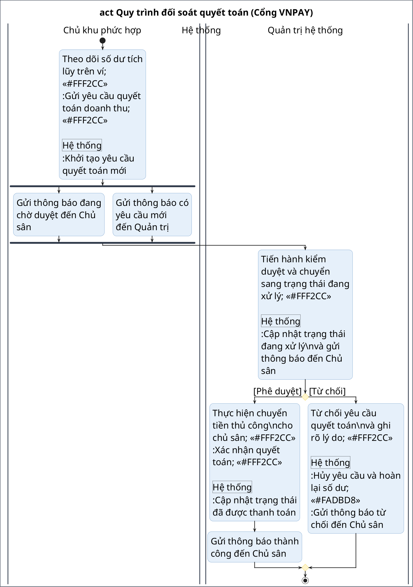

Dưới đây là kết quả rà soát toàn bộ dự án (cả frontend và backend) kết hợp cấu trúc use case chi tiết trong tệp `baocao/diagram_labels.txt` để xây dựng chính xác các quy trình nghiệp vụ cốt lõi của đồ án:

### === THÔNG TIN HỆ THỐNG ===
*   **Tên hệ thống:** Nền tảng quản lý và đặt sân thể thao đa chủ phức hợp (Multi-tenant Sports Facility Booking and Matchmaking Platform).
*   **Mô tả:** Hệ thống hỗ trợ người chơi tìm kiếm và đặt sân trực tuyến (đơn lẻ hoặc định kỳ), tích hợp thanh toán trực tuyến và mua kèm dịch vụ vật phẩm. Hệ thống cung cấp mạng lưới ghép cặp giao lưu (matchmaking) giúp kết nối người chơi qua các kèo đấu công khai, và hỗ trợ chủ sân quản lý hạ tầng cụm sân đấu cũng như rút tiền quyết toán doanh thu tự động từ nền tảng.
*   **Các actor:** Người chơi (Player), Khách vãng lai (Guest), Chủ khu phức hợp (Complex Owner), Quản trị hệ thống (System Admin)
*   **Các chức năng chính (use case) theo sơ đồ phân rã:**
    *   *Người chơi:* Đặt sân (Đặt sân một lần - Mua kèm vật phẩm, Đặt sân định kỳ), Thanh toán, Đánh giá chất lượng cụm sân, Tham gia & quản lý kèo đấu (Xem kèo công khai - Tham gia kèo, Kèo tôi tạo - Duyệt/xóa thành viên, Kèo tham gia - Rời kèo), Xem lịch sử đặt sân (Hủy đặt sân).
    *   *Chủ khu phức hợp:* Quản lý khu phức hợp (Đăng ký khu phức hợp mới, Thêm sân con, Thêm/sửa bảng giá), Quản lý lịch đặt của sân (Phê duyệt đặt sân, Từ chối/hủy lịch đặt), Quản lý doanh thu, Quản lý vật phẩm.
    *   *Quản trị hệ thống:* Quản lý đăng ký khu phức hợp (phê duyệt hồ sơ), Quản lý công nợ và quyết toán (Xem công nợ, Xem yêu cầu quyết toán - Phê duyệt yêu cầu - Quyết toán, Từ chối yêu cầu), Quản lý thanh toán người chơi.

---

### === YÊU CẦU ĐẦU RA: DANH SÁCH CÁC QUY TRÌNH NGHIỆP VỤ ===

#### 1. Quy trình đặt sân một lần, mua kèm vật phẩm và thanh toán trực tuyến
*   **Các actor tham gia:** Người chơi, Hệ thống.
*   **Các use case được kết hợp:** Tìm kiếm sân, Đặt sân một lần (loại của Tạo lượt đặt sân), Mua kèm vật phẩm (extend), Thanh toán (include).
*   **Mô tả sơ bộ luồng chính:**
    1.  Người chơi tìm kiếm sân con trống theo ngày/giờ, chọn hình thức đặt sân một lần và lựa chọn mua thêm nước uống/thuê dụng cụ đi kèm.
    2.  Hệ thống kiểm tra trùng lịch sân đấu. Nếu trống, hệ thống tạo bản ghi lượt đặt ở trạng thái chờ xử lý (status = PENDING) và khóa giữ sân tạm thời trong 15 phút.
    3.  Hệ thống thiết lập phiên thanh toán dựa trên tổng tiền sân và vật phẩm, chuyển hướng người chơi đến cổng thanh toán bảo mật.
    4.  Người chơi thực hiện nhập thông tin thẻ/tài khoản ngân hàng trực tiếp để trừ tiền thành công.
    5.  Cổng thanh toán gửi phản hồi giao dịch thành công về phía hệ thống.
    6.  Hệ thống cập nhật trạng thái đặt sân thành đã xác nhận (status = COMPLETED), trừ số lượng tồn kho của vật phẩm dịch vụ và gửi thông báo real-time cho chủ sân lẫn người chơi.
*   **Lý do tại sao quy trình này đáng vẽ:** Đây là quy trình nghiệp vụ thương mại cốt lõi sống còn của nền tảng. Quy trình có sự phối hợp của 3 bên (Khách, Hệ thống, Cổng thanh toán ngoài) và có bước rẽ nhánh rủi ro quan trọng: nếu người chơi không hoàn tất thanh toán trong 15 phút, hệ thống (qua Scheduler/Job) phải tự động giải phóng sân đấu bị giữ chỗ và hủy booking để người khác chọn.

#### 2. Quy trình ghép cặp giao lưu (Matchmaking) kết nối người chơi
*   **Các actor tham gia:** Người tạo kèo (Host Player), Người ứng tuyển tham gia (Participant Player), Hệ thống.
*   **Các use case được kết hợp:** Đặt sân một lần, Tạo kèo (extend), Xem kèo đấu công khai, Xem chi tiết kèo (extend), Tham gia kèo (extend), Duyệt/xóa thành viên tham gia (extend).
*   **Mô tả sơ bộ luồng chính:**
    1.  Người chơi tạo kèo thực hiện đặt sân một lần và thanh toán thành công (COMPLETED) và đã được xác nhận (CONFIRMED), sau đó kích hoạt tính năng tạo kèo giao lưu trên lịch đặt sân đó.
    2.  Hệ thống tiếp nhận thông tin thiết lập (số lượng thành viên cần tìm, trình độ) và công khai kèo đấu lên bảng tin cộng đồng.
    3.  Người ứng tuyển duyệt danh sách kèo công khai, xem chi tiết và gửi yêu cầu đăng ký tham gia kèo đấu kèm lời giới thiệu.
    4.  Người tạo kèo nhận thông báo thời gian thực, xem hồ sơ ứng viên và đưa ra quyết định chấp nhận (hoặc từ chối) thành viên tham gia.
    5.  Hệ thống cập nhật số chỗ trống thực tế. Khi số lượng thành viên duyệt đủ hoặc hết thời hạn đăng ký, hệ thống đóng kèo đấu và gửi thông báo hoàn chỉnh lịch chơi cho các thành viên gặp nhau tại sân.
*   **Lý do tại sao quy trình này đáng vẽ:** Quy trình này phối hợp hoạt động năng động cao giữa hai nhóm người chơi khác nhau trong cộng đồng thông qua hệ thống thông báo thời gian thực. Nó tích hợp chặt chẽ nhiều use case thuộc nhóm "Tham gia, quản lý kèo đấu" từ lúc mở kèo cho đến lúc kết nối thành công, thể hiện giá trị gia tăng khác biệt của nền tảng thể thao này.

#### 3. Quy trình đăng ký và kích hoạt cụm sân mới hoạt động
*   **Các actor tham gia:** Chủ khu phức hợp, Hệ thống, Quản trị hệ thống.
*   **Các use case được kết hợp:** Đăng ký khu phức hợp mới (extend của Quản lý khu phức hợp), Quản lý đăng ký khu phức hợp (Admin), Thêm sân con (extend), Thêm/sửa bảng giá (extend).
*   **Mô tả sơ bộ luồng chính:**
    1.  Chủ khu phức hợp đăng ký tài khoản chủ sân, hoàn tất kết nối cổng thanh toán để thiết lập thụ hưởng tài chính và gửi hồ sơ khai báo cơ sở mới (kèm tài liệu pháp lý sở hữu).
    2.  Hệ thống tiếp nhận thông tin đăng ký cụm sân ở trạng thái chờ duyệt (status = PENDING_APPROVAL) và chuyển thông tin đến trang quản lý của ban quản trị.
    3.  Quản trị hệ thống đối soát tính xác thực của tài liệu pháp lý và bấm nút phê duyệt kích hoạt (status = ACTIVE) cho cụm sân.
    4.  Chủ khu phức hợp nhận thông báo được phê duyệt thành công, tiến hành khai báo các sân con (SubField) và thiết lập luật bảng giá chi tiết (PricingRule) theo từng khung giờ và ngày trong tuần.
*   **Lý do tại sao quy trình này đáng vẽ:** Quy trình này là điều kiện tiên quyết để tạo lập hạ tầng dữ liệu hoạt động. Quy trình thể hiện vai trò giám sát, phối hợp chặt chẽ giữa Chủ sân mới và Quản trị hệ thống để đảm bảo tính pháp lý của cơ sở trước khi mở khóa toàn bộ các hoạt động thương mại như cấu hình bảng giá và cho phép người chơi đặt sân.

#### 4. Quy trình đối soát công nợ và quyết toán tài chính chủ sân
*   **Các actor tham gia:** Chủ khu phức hợp, Hệ thống, Quản trị hệ thống.
*   **Các use case được kết hợp:** Quản lý doanh thu, Xem công nợ đối với chủ sân, Xem các yêu cầu quyết toán, Xác nhận phê duyệt yêu cầu (extend), Quyết toán (include), Từ chối yêu cầu (extend).
*   **Mô tả sơ bộ luồng chính:**
    1.  Khách hàng đặt sân thành công, doanh thu thực tế được giữ tại tài khoản trung gian của hệ thống.
    2.  Sau khi trận đấu diễn ra theo lịch trình, hệ thống tự động trích tỷ lệ hoa hồng nền tảng và cộng dồn doanh thu thuần còn lại vào số dư ví của Chủ khu phức hợp.
    3.  Chủ sân theo dõi đối soát công nợ tích lũy và gửi yêu cầu rút tiền quyết toán về tài khoản ngân hàng liên kết.
    4.  Quản trị hệ thống kiểm duyệt các yêu cầu quyết toán chờ xử lý, đối chiếu tính đồng bộ của dòng tiền trên cổng thanh toán và xác nhận phê duyệt yêu cầu (hoặc từ chối nếu có sai sót).
    5.  Khi yêu cầu được duyệt, hệ thống khấu trừ số dư ví chủ sân, gọi API chuyển tiền về tài khoản ngân hàng thực tế của chủ sân và phát hành biên lai quyết toán hoàn thành.
*   **Lý do tại sao quy trình này đáng vẽ:** Đây là quy trình nghiệp vụ kiểm toán - kế toán tài chính tối quan trọng đảm bảo dòng tiền lành mạnh cho các bên. Quy trình thể hiện dòng xử lý tự động của hệ thống tích hợp duyệt phê duyệt hai lớp khắt khe từ Admin, đảm bảo sự an tâm tối đa của chủ sân khi tham gia mô hình kinh doanh đa chủ phức hợp (multi-tenant).

---

### === BIỂU ĐỒ HOẠT ĐỘNG TỔNG QUÁT (ACTIVITY DIAGRAMS) ===

#### 1. Quy trình đặt sân và thanh toán

##### a. Sơ đồ hoạt động PlantUML tổng quát
```plantuml
@startuml
skinparam ActivityBorderColor #2B6CB0
skinparam ActivityBackgroundColor #E6F0FA
skinparam ActorBorderColor #2D3748
skinparam ActorBackgroundColor #EDF2F7
skinparam NoteBackgroundColor #FEFCBF
skinparam NoteBorderColor #ECC94B
skinparam StartColor #2E7D32
skinparam EndColor #C62828
skinparam ActivityDiamondBackgroundColor #FFF5CC
skinparam ActivityDiamondBorderColor #E6B800
skinparam ActivityBarColor #2D3748
skinparam swimlaneBorderColor #2D3748
skinparam swimlaneBorderThickness 2.5
skinparam nodeSep 15
skinparam rankSep 15
skinparam wrapWidth 250
skinparam DiagramBorderColor #2D3748
skinparam DiagramBorderThickness 2.5
skinparam ArrowThickness 2
skinparam DefaultFontSize 40
skinparam TitleFontSize 40


title act Quy trình đặt sân và thanh toán

|Người chơi|
|Cổng thanh toán|
|Hệ thống|
|Chủ sân|

|Người chơi|
start
:Tìm kiếm sân; <<#FFF2CC>>
:Gửi yêu cầu đặt sân;

|Hệ thống|
:Kiểm tra tính khả dụng của sân;
if () then ([Còn trống])
  :Tạo lịch đặt sân tạm thời;
  
  |Người chơi|
  :Thực hiện thanh toán; <<#FFF2CC>>
  
  |Cổng thanh toán|
  :Xử lý giao dịch thanh toán;
  if () then ([Thành công])
    :Xác nhận giao dịch thành công;
    
    |Hệ thống|
    :Ghi nhận thanh toán;
    fork
      :Gửi thông báo đến Người chơi;
    fork again
      :Gửi thông báo đến Chủ sân;
    end fork
    
    |Chủ sân|
    :Xác nhận lịch đặt; <<#FFF2CC>>
    
    |Hệ thống|
    :Hoàn tất đặt sân;
    stop
  else ([Thất bại])
    :Thông báo giao dịch thất bại; <<#FADBD8>>
    
    |Hệ thống|
    :Hủy lượt đặt tạm thời; <<#FADBD8>>
    stop
  endif

else ([Trùng lịch])
  :Thông báo lỗi trùng lịch đặt; <<#FADBD8>>
  stop
endif
@enduml
```

##### b. Các bước tổng quát của quy trình
1. **Bước 1: Chọn sân và dịch vụ:** Người chơi lựa chọn sân con trống, khung giờ đặt và các dịch vụ hoặc vật phẩm đi kèm.
2. **Bước 2: Tạo lịch đặt sân:** Hệ thống kiểm tra điều kiện trùng lịch và khởi tạo lịch đặt sân tạm thời để giữ chỗ.
3. **Bước 3: Thực hiện thanh toán:** Người chơi thực hiện giao dịch trực tuyến qua cổng thanh toán Stripe hoặc VNPay.
4. **Bước 4: Chủ sân phê duyệt:** Chủ sân tiếp nhận thông tin thanh toán thành công và thực hiện xác nhận lịch đặt.
5. **Bước 5: Tự động dọn dẹp (Ngoại lệ):** Hệ thống tự động hủy lượt đặt sân và khôi phục tồn kho vật phẩm nếu giao dịch không hoàn tất đúng thời hạn.

---

#### 2. Quy trình ghép cặp giao lưu (Matchmaking) kết nối người chơi

##### a. Sơ đồ hoạt động PlantUML tổng quát
```plantuml
@startuml
skinparam ActivityBorderColor #2B6CB0
skinparam ActivityBackgroundColor #E6F0FA
skinparam ActorBorderColor #2D3748
skinparam ActorBackgroundColor #EDF2F7
skinparam NoteBackgroundColor #FEFCBF
skinparam NoteBorderColor #ECC94B
skinparam StartColor #2E7D32
skinparam EndColor #C62828
skinparam ActivityDiamondBackgroundColor #FFF5CC
skinparam ActivityDiamondBorderColor #E6B800
skinparam ActivityBarColor #2D3748
skinparam swimlaneBorderColor #2D3748
skinparam swimlaneBorderThickness 2.5
skinparam swimlaneWidth same
skinparam nodeSep 15
skinparam rankSep 15
skinparam wrapWidth 250
skinparam DiagramBorderColor #2D3748
skinparam DiagramBorderThickness 2.5
skinparam DefaultFontSize 30
skinparam TitleFontSize 30
skinparam ArrowThickness 2

title act Quy trình tạo, tham gia kèo

|Người tạo kèo|
|Hệ thống|
|Người tham gia|

|Người tạo kèo|
start
:Đặt sân và thanh toán thành công; <<#FFF2CC>>
:Yêu cầu tạo kèo trên lịch đặt; <<#FFF2CC>>

|Hệ thống|
:Lưu thông tin kèo đấu;
:Hiển thị kèo lên trang tìm kiếm; <<#FFF2CC>>

|Người tham gia|
:Xem danh sách kèo và gửi yêu cầu tham gia; <<#FFF2CC>>

|Hệ thống|
:Gửi thông báo đến Người tạo kèo;

|Người tạo kèo|
:Xem ứng viên; <<#FFF2CC>>
if () then ([Chấp nhận])
  |Hệ thống|
  :Thêm thành viên và cập nhật số chỗ trống;
  :Gửi thông báo chấp nhận đến Người tham gia;
  if () then ([Đủ người])
    :Cập nhật trạng thái kèo sang FULL và đóng kèo;
  else ([Chưa đủ])
    :Kèo đấu tiếp tục hiển thị;
  endif
else ([Từ chối])
  |Hệ thống|
  :Gửi thông báo từ chối đến Người tham gia; <<#FADBD8>>
endif
stop
@enduml
```

##### b. Các bước tổng quát của quy trình
1. **Bước 1: Tạo lịch chơi:** Người tạo kèo hoàn tất quy trình đặt sân và thanh toán trực tuyến thành công.
2. **Bước 2: Công khai kèo:** Người tạo kèo thiết lập yêu cầu giao lưu (trình độ, số lượng thành viên), hệ thống tiến hành mở kèo lên bảng tin cộng đồng.
3. **Bước 3: Đăng ký tham gia:** Người tham gia duyệt danh sách kèo công khai và gửi yêu cầu xin ứng tuyển kèm lời giới thiệu.
4. **Bước 4: Kiểm duyệt hồ sơ:** Người tạo kèo xem xét thông báo, kiểm tra hồ sơ ứng viên và đưa ra quyết định chấp nhận hoặc từ chối.
5. **Bước 5: Chốt danh sách:** Hệ thống tự động cập nhật số chỗ, gửi thông báo phê duyệt đến người tham gia, và chuyển trạng thái kèo đấu sang FULL khi đã đủ người.

---

#### 3. Quy trình đăng ký và kích hoạt cụm sân mới hoạt động

##### a. Sơ đồ hoạt động PlantUML tổng quát
```plantuml
@startuml
skinparam ActivityBorderColor #2B6CB0
skinparam ActivityBackgroundColor #E6F0FA
skinparam ActorBorderColor #2D3748
skinparam ActorBackgroundColor #EDF2F7
skinparam NoteBackgroundColor #FEFCBF
skinparam NoteBorderColor #ECC94B
skinparam StartColor #2E7D32
skinparam EndColor #C62828
skinparam ActivityDiamondBackgroundColor #FFF5CC
skinparam ActivityDiamondBorderColor #E6B800
skinparam ActivityBarColor #2D3748
skinparam swimlaneBorderColor #2D3748
skinparam swimlaneBorderThickness 2.5
skinparam swimlaneWidth same
skinparam nodeSep 15
skinparam rankSep 15
skinparam wrapWidth 250
skinparam DiagramBorderColor #2D3748
skinparam DiagramBorderThickness 2.5
skinparam DefaultFontSize 30
skinparam TitleFontSize 30
skinparam ArrowThickness 2

title act Quy trình đăng ký và kích hoạt cụm sân mới

|Chủ khu phức hợp|
|Hệ thống|
|Quản trị hệ thống|

|Chủ khu phức hợp|
start
:Đăng ký tài khoản chủ sân và kết nối ví; <<#FFF2CC>>
:Gửi đăng ký khu phức hợp kèm tài liệu pháp lý; <<#FFF2CC>>

|Hệ thống|
:Ghi nhận trạng thái cụm sân là PENDING;
:Chuyển hồ sơ đến trang quản lý của quản trị;

|Quản trị hệ thống|
: Xác thực tính hợp lệ của tài liệu pháp lý; <<#FFF2CC>>
if () then ([Hợp lệ])
  :Phê duyệt kích hoạt hồ sơ; <<#FFF2CC>>
  
  |Hệ thống|
  :Cập nhật trạng thái ACTIVE;
  :Gửi thông báo thành công đến Chủ khu phức hợp;
  
  |Chủ khu phức hợp|
  :Khai báo thông tin các sân con; <<#FFF2CC>>
  :Thiết lập luật bảng giá theo khung giờ và ngày; <<#FFF2CC>>
else ([Không hợp lệ])
  |Quản trị hệ thống|
  :Từ chối phê duyệt hồ sơ; <<#FFF2CC>>
  
  |Hệ thống|
  :Cập nhật trạng thái REJECTED;
  :Gửi thông báo từ chối kèm lý do; <<#FADBD8>>
endif
stop
@enduml
```

##### b. Các bước tổng quát của quy trình
1. **Bước 1: Nộp hồ sơ đăng ký:** Chủ khu phức hợp đăng ký tài khoản chủ sân, hoàn tất ví thụ hưởng và gửi hồ sơ pháp lý cơ sở lên hệ thống.
2. **Bước 2: Lưu vết hồ sơ:** Hệ thống tự động tiếp nhận thông tin cụm sân ở trạng thái chờ duyệt và thông báo cho ban quản trị.
3. **Bước 3: Kiểm định hồ sơ:** Quản trị hệ thống tiến hành đối soát tính xác thực của tài liệu pháp lý và thực hiện phê duyệt (hoặc từ chối).
4. **Bước 4: Kích hoạt cụm sân:** Hệ thống cập nhật trạng thái hoạt động chính thức và mở khóa các chức năng cấu hình cho cơ sở.
5. **Bước 5: Cấu hình hạ tầng:** Chủ khu phức hợp hoàn tất cấu hình hạ tầng sân con và thiết lập bảng giá biểu phí khung giờ hoạt động.

---

#### 4. Quy trình đối soát công nợ và quyết toán tài chính chủ sân (Áp dụng cho cổng VNPAY)

Nền tảng hỗ trợ song song hai mô hình xử lý giao dịch tài chính tùy thuộc vào cổng thanh toán người dùng lựa chọn:
*   **Mô hình tự động chia tiền (Áp dụng cho cổng Stripe):** Hệ thống sử dụng giải pháp **Stripe Connect (Destination Charge)**. Khi người chơi hoàn tất thanh toán, Stripe tự động khấu trừ ngay 10% phí nền tảng (`application_fee_amount`) chuyển về tài khoản của hệ thống, và tự động chuyển khoản trực tiếp 90% còn lại đến tài khoản Stripe liên kết của Chủ sân (`stripe_account_id`). Quy trình này diễn ra hoàn toàn tự động ở tầng hạ tầng cổng thanh toán và không thông qua luồng quản lý công nợ thủ công của Admin.
*   **Mô hình quyết toán thủ công (Áp dụng cho cổng VNPAY):** Dành cho các giao dịch thẻ ngân hàng nội địa qua VNPAY. Dòng tiền thanh toán từ người chơi được VNPAY chuyển toàn bộ về tài khoản ngân hàng doanh nghiệp trung gian của hệ thống. Vì thế, hệ thống sẽ tự động ghi nhận công nợ tích lũy cho chủ sân và thực hiện quy trình rút tiền quyết toán thủ công theo sơ đồ dưới đây.

##### a. Sơ đồ hoạt động PlantUML tổng quát


##### b. Các bước tổng quát của quy trình
1. **Bước 1: Tạm giữ doanh thu và trích phí:** Ngay khi khách đặt sân thanh toán thành công qua cổng VNPay, hệ thống tự động trích 10% phí dịch vụ nền tảng và ghi nhận doanh thu thuần còn lại vào số dư tích lũy (chờ rút) của chủ sân.
2. **Bước 2: Cấu hình thụ hưởng:** Chủ sân thực hiện thiết lập và cập nhật thông tin tài khoản ngân hàng nội địa để làm căn cứ nhận tiền quyết toán.
3. **Bước 3: Yêu cầu quyết toán:** Chủ sân gửi yêu cầu rút tiền. Hệ thống tự động gom toàn bộ các khoản doanh thu tích lũy thành một đợt quyết toán mới ở trạng thái chờ duyệt, đồng thời gửi thông báo real-time cho cả chủ sân và ban quản trị.
4. **Bước 4: Kiểm tra và xử lý:** Quản trị hệ thống tiến hành đối soát dòng tiền trên cổng thanh toán, chuyển yêu cầu quyết toán sang trạng thái đang xử lý để bắt đầu thực hiện kiểm duyệt.
5. **Bước 5: Hoàn tất quyết toán:** Ban quản trị đưa ra quyết định: phê duyệt giải ngân (thực hiện chuyển khoản ngân hàng, cập nhật mã giao dịch, và chuyển trạng thái đợt quyết toán sang đã thanh toán) hoặc từ chối yêu cầu (ghi nhận lý do từ chối, hủy đợt quyết toán, và hoàn trả toàn bộ số dư doanh thu về trạng thái tích lũy ban đầu để chủ sân có thể rút lại sau).